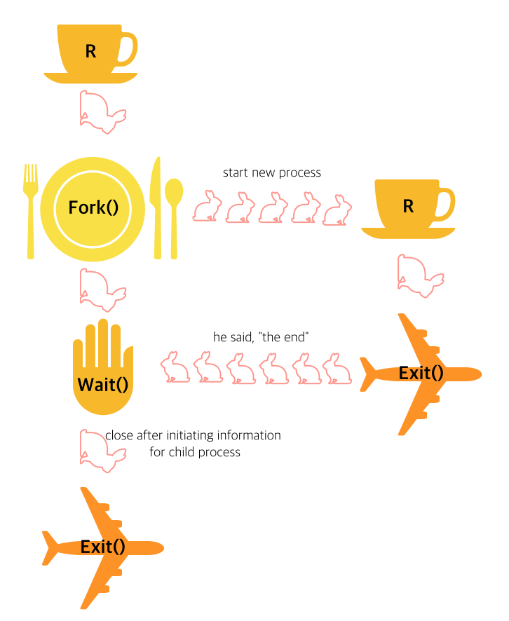
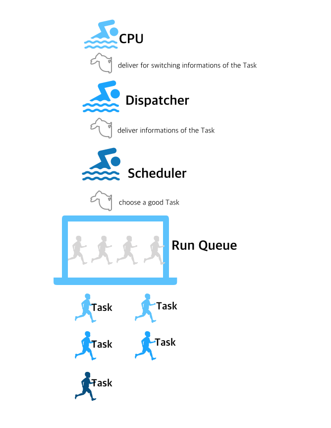
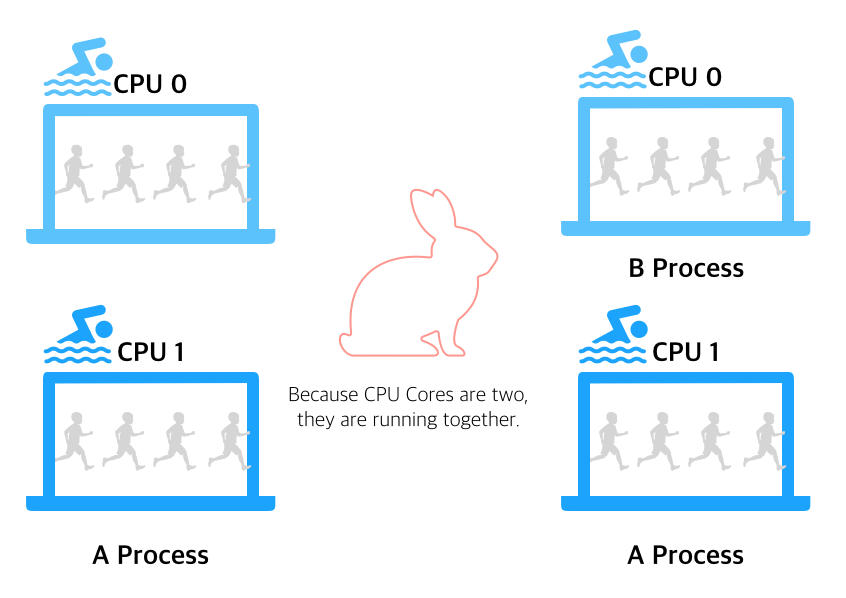

#2. top를 통해 살펴보는 프로세스 정보들

***

리눅스에는 시스템의 상태를 살펴볼 수 있는 다양한 명령이 있다. <br/>
top 명령은 시스템의 상태를 전반적으로 가장 빠르게 파악할 수 있는 명령 중 하나이다. 
<br/><br/>

 ##2-1. 시스템의 상태 살피기

***

top명령은 옵션없이 입력하면 주어진 Interval(기본 3초)으로 화면을 갱신하면서 정보를 보여준다. 
<br/>
순간의 top정보를 확인하기 위한 옵션으로 -b를 사용한다. 
<br/>

```
#top -b -n 1
```

* 조회 결과
<br/>
top -23:13:15 up 15 days,[^1] 6:55, 1 user, load average: 0.00, 0.00, 0.00[^2] <br/>
Tasks: 88 total, 1 running, 87 sleeping, 0 stopped, 0 zombie[^3] <br/>
Cpu(s): 0.1%us, 0.0%sy, 0.0%ni, 99.8%id, 0.0%hi, 0.0%si, 0.0%st <br/>
Mem: 8194380k total, 4914016k used, 3280363k free, 313084k buffers <br/>
Swap: 10485752k total,	0k used, 10485752k free, 3660448k cached[^4] <br/>
<br/>
PID  USER  PR[^5]   NI[^6]    VIRT[^7]   RES[^8]   SHR[^9]   S[^10]   %CPU   %MEM    TIME+   COMMAND <br/>
1    root  20       0         19228      1512      1224      S         0.0   0.0     0:00:96   init <br/>
2    root  20       0         0          0         0         S         0.0   0.0     0:00.00   kthreadd	

<br/>
***
[^1] : 현재 서버의 시간과 서버가 얼마나 구동되었는지 구동시간이 나와있다. 이 시스템은 구동한지 15일정도 되었다. <br/>
[^2] : 몇명의 사용자가 로그인해있는지, 시스템의 Load Average는 어느 정도인지 보여준다. Load Average는 현재 시스템이 얼마나 많은 일을 하고 있는지 보여주는 데이터로, Load Average가 높으면 서버가 많은 일을 하고 있다고 볼 수 있다.<br/>
[^3] : 현재 시스템에서 구동중인 프로세스의 개수를 나타낸다. 출력 결과에는 Tasks로 표현되어 있는 부분이 프로세스 수와 관련된 정보이다.  <br/>
[^4] :  각각 CPU, Mem, swap 메모리의 사용량이다. swap 메모리가 상단에 있다는 것은 swap 메모리의 사용 여부가 시스템의 상태에 중요한 영향을 끼친다는 뜻으로 해석할 수 있다 <br/>

[^5] : PR은 프로세스의 실행우선 순위, 즉 다른 프로세스들보다 먼저 실행해야하는지 여부를 보여준다.<br/>
[^6] : NI는 PR을 얼마만큼 조절할 것인지를 결정한다. 기본 PR값에 NI값을 더해서 실제 PR의 값이 결정된다. <br/>  
[^7], [^8], [^9] : VIRT, RES, SHR은 프로세스가 사용하는 메모리양이 얼마인지 확인할 수 있는 정보로 이를 통해 프로세스에 메모리 누수가 있는지를 확인할 수 있어 중요한 정보 중 하나이다. <br/>
[^10] : S는 프로세스의 상태를 나타내는 정보이다. 현재 CPU를 사용하면서 작업하는 상태인지, I/O를 기다리는 상태인지, 아니면 아무 작업도 하지 않는 유휴 상태인지를 나타낸다. 역시 시스템의 성능과 관련된 중요한 정보이다.  <br/> 


<br/><br/>

 ##2-2. VIRT, RES, SHR...?

***

프로세스와 관련된 항목 중에 눈이 띄는 것이 있다면 VIRT, RES, SHR을 꼽을 수 있다. <br/>
이 세가지 항목은 현재 프로세스가 사용하고 있는 메모리와 관련된 값이다. <br/> 
(명령어의 출력 결과 중 더 살펴보고 싶은 내용이 있다면 man명령을 활용하는 것이 좋다.) <br/>

* VIRT

man에서는 VIRT를 다음과 같이 정의하고 있다. <br/>
보통 프로세스라고 부르는 task가 사용하는 virtual memory의 전체 용량이라고 설명한다. <br/>

```
The total amount of virtual memory used by the task. It includes all code, 
data and shared libraries plus pages that have been swapped out.
```

<br/>
* SHR

```
The mount of shared memory used by a task. It simply reflects memory that
could be potentially shared with other processes.
```
SHR은  다른 프로세스와 공유하고 있는 shared memory의 양을 의미한다고 정리했다. 
<br/><br/>
VIRT는 Task, 즉 프로세스에 할당된 가상 메모리 전체의 크기이며, RES는 그중 실제로 메모리에 올려서 사용하는 물리 메모리의 크기, <br/>
그리고 SHR은 다른 프로세스와 공유하고 있는 메모리의 크기를 말한다. <br/>

SHR의 구체적인 예에는 라이브러리가 있다. 대부분의 리눅스 프로세스들은 glibc라는 라이브러리를 참조하기 때문에 사용하는 프로세스마다 glibc의 내용을 
메모리에 올려서 사용하는 것은 공간 낭비다. <br/>
커널은 이런 경우를 대비해서 공유 메모리라는 개념을 도입했고, 다수의 프로세스가 함께 사용하는 라이브러리는 공유 메모리 영역에 올려서 함께 사용하도록 구현했다. <br/>
VIRT는 실제로는 할당되지 않은 가상의 공간이기 때문에 해당 값이 크다고 해도 문제가 되지 않는다. <br/>
실제 사용하고 있는 메모리는 RES 영역이기 때문에 메모리 점유율이 높은 프로세스를 찾기 위해서는 RES 영역이 높은 프로세스를 찾아야한다. <br/>

<br/><br/>

 ##2-3. VIRT와 RES 그리고 Memory Commit의 개념

***

그렇다면 왜 메모리는 VIRT와 RES로 구분되어 있을까? 둘다 프로세스가 사용하는 메모리를 표현하는 것이지만 차이점이 있다. <br/>
VIRT로 표현되는 가상 메모리는 프로세스가 커널로부터 사용을 예약받는 메모리라고 생각할 수 있다.<br/>
프로세스는 malloc()과 같은 시스템콜로 자신이 필요로 하는 메모리의 영역을 할당해줄 것을 요청한다. <br/>
이에 대해 커널은 가용한 공간이 있다면 성공 메세지와 함께 해당 프로세스가 사용할 수 있도록 가상의 메모리 주소를 전달해준다. <br/>

하지만 기억해야할 것은 이때에도 물리 메모리에 해당 영역이 할당된 상태는 아니라는 점이다. <br/>
이런 동작 방식을 Memory Commit이라고 하며, 커널 파라미터 중에 vm.overcommit_memory를 통해서 동작 방식을 정의할 수 있다.<br/>
그 후 프로세스가 할당받은 메모리 영역에 실제로 쓰기 작업을 하면 Page fault가 발생하며, 그제서야 커널은 실제 물리 메모리에 프로세스의 가상 메모리 공간을 매핑한다. <br/>
이것은 Page Table이라고 불리는 커널의 전역 변수로 관리된다. <br/>
그리고 이렇게 물리 메모리에 바인딩된 영역이 RES로 계산된다. <br/>
<br/>
* malloc 테스트 코드

```c
#include <stdio.h>
#include <string.h>
#include <stdlib.h>

int main(){
   void *myblock = NULL;
   int count = 0;

  while(1){
	myblock = (void *) malloc(MEGABYTE);
	if(!myblock){
		printf("Error!");
		break;
 	}

     	 printf("Currently allocating %d MB\n", (++count)*MEGABYTE);
 	 memset(myblock, 1, MEGABYTE);
	 sleep(1);
  }

  exit(0);
}

```

이 예제에서는 malloc()으로 메모리 영역을 요청한 후 아무것도 하지 않는다. <br/>
memset()함수를 주석처리한 후 이 예제를 실행하고,
터미널을 하나더 띄워서 top명령으로 해당 프로세스의 변화과정을 살펴보면, <br/>
시간이 지나면서 VIRT는 계속해서 높아지지만, RES는 늘어나지 않는 것을 볼 수 있다.<br/>
주석처리를 해제하고 돌려보면, 할당받은 메모리를 받은 순간에 바로 사용한다. <br/>
아까와는 다르게 RES영역이 VIRT영역의 늘어나는 비율과 비슷하게 늘어난다. <br/>
그렇기 때문에 메모리 사용과 관련하여 중요한 부분은 VIRT가 아니라 실제로 메모리를 쓰고 있는 RES임을 확인할 수 있다. <br/>
VIRT는 malloc()등의 시스템 콜을 사용하면 늘어나게 되는데, 한도 끝도 없이 늘어나게 될까? <br/>
할당 받고 사용한 메모리는 RES 영역으로 계산이 되고, 이것은 물리 메모리와 관련이 있기 때문에 더이상 줄 수 있는 메모리 영역이 없다면
swap을 사용하거나 OOM으로 프로세스를 죽이는 방법 등으로 메모리를 확보하게 될 것이다. 
<br/>
그렇다면 VIRT와 같이 실제 사용하지 않는 영역의 경우에는 어떻게 될까?<br/>
대답은 그렇게 할 수도, 그렇게 하지 못하게 막을 수도 있다. <br/>
이 동작은 커널 파라미터 중 vm.overcommit_memory 파라미터에 의해 결정된다. <br/>
Memory commit에 대해 알아보자. 프로세스는 자신만의 작업 공간이 필요하고, 그 공간은 메모리에 존재한다. <br/>
프로세스가 커널에 필요한 만큼의 메모리를 요청하면, 커널은 프로세스에 사용 가능한 메모리 영역을 주고 실제로 할당은 하지 않았지만,<br/>
해당 영역을 프로세스에 주었다는 것을 저장해둔다. <br/>
이 일련의 과정을 Memory Commit이라고 부른다. <br/>
그럼 왜 커널은 프로세스의 메모리 요청에 따라 즉시 할당하지 않고, Memory commit과 같은 기술을 써서 요청을 지연시키는 것일까?<br/>
여러가지 이유가 있겠지만, 가장 큰 이유는 fork()와 같은, 새로운 프로세스를 만들기 위한 콜을 처리해야하기 때문이다. <br/>
fork()시스템 콜을 사용하면 커널은 현재 실행 중인 프로세스와 똑같은 프로세스를 하나더 만들게 되는데, <br/>
대부분은 fork()후 exec() 시스템 콜을 통해서 전혀 다른 프로세스로 변한다. <br/>
따라서  이때 확보한 메모리 영역이 대부분 쓸모 없어질 수도 있다. <br/>
그래서 COW(Copy-On-Write)라는 기법을 통해서 복사된 메모리 영역에 실제 쓰기 작업이 발생한 후에야 실질적인 메모리 할당을 시작한다. <br/>
그리고 이런 작업을 지원하기 위해 Memory Commit이 필요하다. <br/>
만약 Memory Commit을 하지 않고 바로 할당한다면 COW와 같은 기술도 사용할 수 없기 때문이다. <br/>
<br/>

* sar 모니터링 툴

현재 시스템의 Memory Commit 상태는 어떻게 확인할 수 있을까?
<br/>
sar라는 모니터링 툴을 이용하면 확인할 수 있다. 

```
# sar -r

```

실행결과 %commit의 숫자는 시스템의 메모리 커밋 비율을 나타낸다. <br/>
할당만 해주고 실제 사용하지 않는 메모리의 양이 전체 메모리의  3.00% 정도라는 것이다. <br/>
저 메모리에 순간적으로 쓰기 작업이 들어가도 시스템 전체적으로는 전혀 문제가 없는 상황이다. <br/>
하지만 커밋된 메모리의 비율이 높다면 순간적으로 시스템에 부하를 일으키거나 최악의 경우에는 커널 응답 불가 현상을 일으킬 수 있다. <br/>
그렇기 때문에 커널은 메모리 커밋에 대한 동작 방식을 vm.overcommit_memory 라는 파라미터로 제어할 수 있게 해두었다. <br/>
<br/>

 vm.overcommit_memory 파라미터 값은 0, 1, 2 세가지로 세팅될 수 있다. 
<br/>
<br/>
* vm.overcommit_memory가 0일 때의 처리 로직

 커널에서 사용하고 있는 기본값이다. <br/>
디폴트값이며, overcommit할 수 있는 최대값은 page cache와 swap영역, slab reclaimable 이 세가지의 값을 합한 값이 된다. 
<br/>
현재 메모리에 가용 공간이 얼마인지는 고려하지 않고, 저기서 합산된 값보다 작으면 계속해서 commit할 수 있게 된다. 
<br/>

```c
if(sysctl_overcommit_memory = OVERCOMMIT_GUESS){
	unsigned long n;
	
	free = global_page_state(NR_FILE_PAGES);
	free += get_nr_swap_pages();

	/* 
	 * Any slabs which are crated with the 
	 * SLAB_RECAIM_ACCOUNT flag claim to have contents
         * which are reclaimable, under pressure. The dentry
	 * cache and most inode caches should fall into this
	 */

	free += global_page_state(NR_SLAB_RECLAIMABLE);

	/*
	 * Reserve some for root
 	 */

	if(!cap_sys_admin)
		free -= sysclt_admin_reserve_kbytes >> (PAGE_SHIFT - 10);

	if(free > pages)
		return 0;

```
<br/><br/>

* 파라미터 값이 1일 때 처리로직

 1은 무조건 commit을 진행한다. 아무것도 계산하지 않고 요청온 모든 메모리에 대해 commit이 일어난다. 이렇게 되면 가용 메모리보다 훨씬 큰 메모리를 요청하는 일이 발생할 수 있다. 메모리 누수가 있는 프로세스가 있다면 시스템 응답 불가 현상을 일으킬 수도 있다. 
<br/>

```c
if(sysctl_covercommit_memory == OVERCOMMIT_ALWAYS)
	return 0;

```

<br/><br/>

* 파라미터 값이 2일 때 처리 로직

  2는 제한적으로 commit을 진행한다. 값이 0일 때와 같이 계산식이 잇으며, vm.overcommit_ratio에 설정된 비율과 swap영역의 크기를 토대로 계산된다. <br/>
이 값은 /proc/meminfo에서도 확인할 수 있다. <br/>

```c
allowed = vm_commit_limit();

/* Reserve some for root */
if(!cap_sys_admin)
	allowed -= sysctl_admin_reserve_kbyets >> (PAGE_SHIFT - 10);

/* Don't let a single process grow too big : 
   leave 3% of the size of this process for other processes  */

if(mm)
	allowed -= mm->totla_vm / 32;

if(percpu_counter_Read_positive(&vm_committed_as) <allowed)
	return 0;

```

커널은 어찌 되었든 overcommit을 지원한다. <br/>
다만 overcommit할 수 있는 최댓값을 결정하는 방법을 세가지로 나누어서 관리한다. <br/>
0, 2번에서도 본 것처럼 swap영역은 commit메모리를 결정하는데 큰 역할을 한다. <br/>
즉, 시스템의 안정성을 유지하는데에 큰 역할을 한다고 볼 수 있다. <br/>
이렇게 vm.overcommit_memory 파라미터를 이용해서 커널의 메모리 커밋 동작 방식을 제어할 수 있으며 프로세스에게 할당하는 VIRT메모리의 양도 제어할 수 있다. <br/>
<br/>

  ##2-4. 프로세스의 상태 보기

***

프로세스의 상태는 SHR 옆에 있는 S항목으로 볼 수 있다. 어떤 항목들이 있을지 man페이지를 통해서 확인해보자. <br/>

```c
S -- Process Status
	The status of the task which can be one of:
	  'D' = uninterruptible sleep
	  'R' = running
	  'S' = sleeping
	  'T' = traced or stopped
	  'Z' = zombie
```

* D : uninteruptible sleep 상태로 디스크 혹은 네트워크 I/O를 대기하고 있는 프로세스를 의미한다. <br/>
  이 상태의 프로세스들은 대기하는 동안 Run Queue에서 빠져나와 Wait Queue에 들어가게 된다. <br/>

* R : 실행 중인 프로세스를 의미한다. 실제로 CPU자원을 소모하고 있는 프로세스이다. <br/>

* S : sleeping 상태의 프로세스로, D상태와 가장 큰 차이점은 요청한 리소스를 즉시 사용할 수 있는지 여부이다. <br/>

* T : traced or stopped 상태의 프로세스로, strace 등으로 프로세스의 시스템 콜을 추적하고 있는 상태를 보여준다. 보통의 시스템에서는 자주 볼 수 없는 상태의 프로세스이다. <br/>

* Z : zombie 상태의 프로세스이다. 부모 프로세스가 죽은 자식 프로세스를 의미한다. <br/><br/>

먼저, Uninterruptible sleep 상태에 대해 알아보자. <br/>
프로세스가 디스크 혹은 네트워크 작업을 하게 되면 디스크 디바이스 혹은 네트워크 디바이스에 요청을 보낸다. <br/>
디스크를 예로 든다면 어느 블록에 있는 어느 데이터를 읽어달라고 요청하는 것이다. <br/>
프로세스의 입장에서 보면 보낸 요청이 도착할 때까지 아무것도 할 수 없기 때문에, CPU에 대한 사용권을 다른 프로세스에 넘기고 자신을 UNINTERRUPTIBLE 상태로 마킹한 후 대기 상태로 빠진다. 이렇게 요청 후에 그에 대한 응답을 기다려야하는 상태를 Uniterruptible sleep 상태, 즉 D 상태라고 말할 수 있다. <br/>

[프로세스 상태 변화]


<br/>

반면에 sleep() 시스템 콜 등을 호출해서 타이머를 작동시키거나, 콘솔 입력을 기다리는 프로세스들은 Interruptible sleep 상태가 된다. <br/>
이 상태는 특정 요청에 대한 응답을 기다리는 상태가 아니며, 언제 어떻게 시그널이 들어올지 모르기 때문에 언제든 시그널을 받아서 처리할 수 있도록  Interruptible 상태로 마킹하고 대기상태에 빠진다. <br/>
이때의 상태를 S상태라고 한다. <br/>
사실 S상태의 프로세스가 많은 것은 시스템에 큰 영향을 끼치지 않는다. <br/>
하지만 D상태의 프로세스가 많으면 특정 요청이 끝나기를 기다리고 있는 프로세스가 많다는 뜻이고, 이 프로세스들은 요청이 끝나면 R상태로 다시 돌아가야 하기 때문에 시스템의 부하를 계산하는데 포함된다. <br/>
그렇다면 Z 상태는 어떤 경우에 발생할까? <br/>
모든 프로세스는 fork()를 통해서 만들어지기 때문에 부모와 자식 관계가 되고, 보통 부모 프로세스는 자식이 완료될 때까지 기다리게 된다. <br/>

<br/>
[프로세스의 생성과 종료]


<br/>
하지만 그러지 못한 경우, 즉 부모 프로세스가 죽었는데도 자식 프로세스가 남아있거나 자식 프로세스가 죽기 전에 비정상적인 동작으로 부모 프로세스가 죽는 경우가 발생할 수 있다. <br/>
이런 경우 좀비 프로세스가 만들어진다. <br/>
<br/>
[좀비 프로세스가 되는 경우]

<br/>

사실 좀비 프로세스는 시스템의 리소스를 차지하지 않기 때문에 그 존재 자체는 큰 문제가 되지 않는다. <br/>
스케줄러에 의해 선택되지 않기 때문에 당연히 CPU를 사용하지 않고, 좀비 프로세스 자체는 이미 사용이 중지된 프로세스이기 때문에 메모리를 사용하지도 않는다. <br/>
그런데 왜 문제가 될까? 바로 좀비 프로세스가 점유하고 있는 PID 때문이다. <br/>
좀비 프로세스가 사용한 PID가 정리되지 않고 쌓이면 새로운 프로세스에 할당할 PID가
 모자라게 되고, 이는 결국 더이상 PID를 할당하지 못하는 고갈상태를 일으킬 수 있다. <br/>
<br/>
* 생성가능한 최대 PID 확인하기 

  리눅스 상의 모든 프로세스들은 PID를 가지며, 이것은 integer 형태의 숫자로 구성되어 있다. <br/>
그리고 리눅스 커널에는 kernel.pid_max라는 커널 파라미터를 통해서 PID의 최대값을 정의하고 있다. <br/>

```
# sysctl -a | grep i pid_max
kernel.pid_max = 65536

```

이 시스템에서 생성되는 프로세스가 가질 수 있는 PID의 최대값은 65536이다. 
<br/>
그래서 이 시스템에서 생성되는 모든 프로세스는 1~65566사이의 임의의 값을 PID로 배정받는다. 또한 최대값이 65536이기 때문에 프로세스 갯수도 65536개 이상 존재할 수 없다. 
<br/>
<br/>

  ##2-5. 프로세스의 우선순위

***

마지막으로 top을 통해 볼 수 있는 항목 중 PR과 NI 값을 살펴보자. PR과 NI는 커널이 프로세스를 스케쥴링할 때 사용하는 우선순위를 나타내는 값이다. <br/>
프로세스 스케줄링이 진행되는 구조는 다음 그림과 같다.<br/>
CPU마다 Run Queue라는 것이 존재하며, Run Queue에는 우선순위 별로 프로세스가 연결되어 있다. <br/>
스케줄러는 유휴상태에 있던 프로세스가 깨어나거나 특정 프로세스가 스케줄링을 양보하는 등의 경우에 현재 Run Queue에 있는 프로세스들 중 가장 우선순위가 높은 프로세스를 꺼내서 디스패처에 넘겨준다. <br/>
디스패처는 현재 실행중인 프로세스의 정보를 다른 곳에 저장한 후 넘겨받은 프로세스의 정보를 가지고 다시 연산을 하도록 요청한다. <br/>
사실 내부적으로 살펴보면 더 복잡하지만, 개념적으로 이렇게 정리할 수 있다. <br/>

[스케줄러의 기본 동작]


<br/>
* PR 의 개념

```
#man top

PR -- Priority 
	The priority of the task

```

이 값은 커널에서 인식하는 해당 프로세스의 실제 우선순위 값을 의미한다. 

<br/><br/>

* NI의 개념

```
NI - Nice value

the nice value of the task. a negative nice value means highter priority, 
whereas a positive nice value means lower priority.
Zero in this field simply means priority will not be adjusted in determining a task's dispatchchability.

```

NI는 nice값이라고 부르며, 명령어를 통해서 우선순위를 낮출 때 사용된다. <br/>
우선순위는 값이 낮을수록 우선순위가 높은 것으로, nice명령을 이용해서 PR값을 낮출 수 있다. <br/>
그러면 더 높은 우선순위를 가지기 때문에 더 많은 스케줄링이 될 수 있는 기회를 얻게 된다. <br/>
<br/>
기본적으로 모든 프로세스들은 20의 우선순위 값을 갖는데, 여기에 nice 값을 주면 우선순위 값이 바뀐다. nice값이 -4가 되면 PR값은 20에서 16이 되어 다른 20인 프로세스보다 더 자주 실행된다. <br/>
<br/>

* nice 명령 테스트를 위한 파이썬 스크립트

```python

#!/usr/bin/python

import datetime

start_time = datetime.datetime.now()
print "START : " + str(start_time)
sum = 0

for i in range(1,500000000):
	sum = sum + i
	#print(i)
print sum

end_time = datetime.datetime.now()
print "END : " + str(end_time)
elapsed_time = end_time - start_time
print "Elapesd :" + str(elapsed_time)

```

1부터 5천만까지의 합을 구하는 간단한 파이썬 스크립트이다. <br/>
처음에는 두개의 터미널을 열어서 각자 실행해보자. <br/>
첫번째 터미널에서는 ` nice -n -10 ` 으로 우선순위를 낮춰서 실행시키고, 나머지 터미널에서는 그냥 실행시키면 재미있는 결과가 나온다. <br/>

nice로 우선순위를 낮춘 프로세스가 먼저 끝나지 않는다. <br/>
얼핏 생각하기에는 먼저 끝나는게 맞는데 먼저 끝날 때도 있고, 더 늦게 끄날 때도 있다. <br/>
그 이유는 바로 CPU Core수와 관련이 있다. <br/>

[nice의 효과를 받지 못하는 경우]


<br/>

nice로 우선순위를 낮췄다고 해도 CPU Core 수(테스트용 시스템은 CPU Core가 두개 있다)와 동일한 수의 프로세스가 돌아가고 있다면 CPU경합을 벌일 필요가 없기 때문에 nice로 우선순위를 낮춰도 비슷한 시간에 끝나게 된다. <br/>
이번에는 터미널을 하나 더 열어서 동시에 3개의 프로세스를 실행시켜 보자. <br/>
이번엔 첫번째 터미널에서 nice로 우선순위를 낮춘 프로세스가 확실히 먼저 끝나게 된다. <br/> nice값으로 우선순위를 낮춘 프로세스가 CPU 1개를 독차지하고 나머지 두개가 하나의 CPU를 나눠서 사용한다. <br/>그래서 무조건 우선순위를 낮춘 프로세스가 먼저 끝나게 된다. 
<br/><br/>

동작 중인 프로세스가 빨리 실행되어야 한다면 renice 명령을 통해 우선순위를 낮출 수 있다.<br/>
다만, 그 경우에도 CPU core수와 프로세스의 수가 동일하다면 효과를 볼 수 없기 때문에 잘 계산해서 우선순위를 조절해야한다. <br/>
<br/>
* RT 프로세스

  그 외에 우선순위와 관련된 출력값을 보면 재밌는 값이 하나 보이는데 바로 RT로 표현되는 프로세스들이다. <br/>
사실 RT(RealTime)스케줄러는 일반적인 사용자가 생성한 프로세스에 적용되는 스케줄러가 아니다. 이름에서도 알 수 있듯이 반드시 특정 시간안에 종료되어야하는 중요한 프로세스들, 바로 커널에서 사용하는 데몬들이 대상이다. <br/>
RT 스케줄러의 적용을 받게 되는 프로세스들은 CFS(Ccompletely Fair Scheduling) 스케줄러보다 더 먼저 실행된다. <br/>
이는 시스템의 안정적인 운영을 위한 것이다. <br/>
메모리가 부족한 상태에서 사용하지 않는 메모리를 회수하고 관리하는 프로세스가 일반적인 사용자 프로세스보다 더 중요함은 따로 설명할 필요가 없을 정도로 자명한 일이다. 
<br/><br/>


