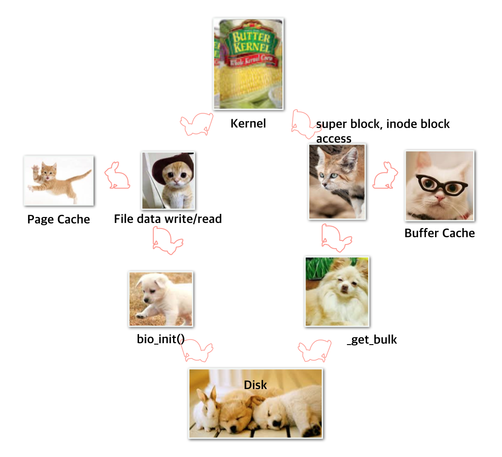
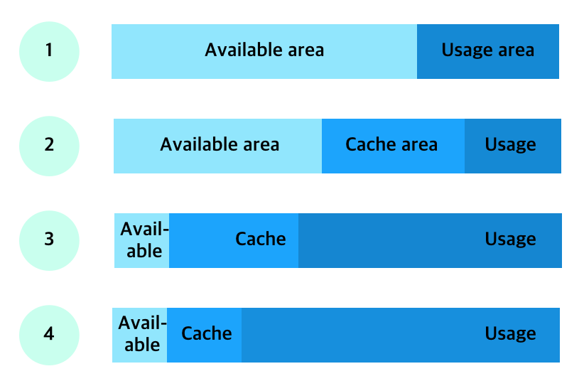
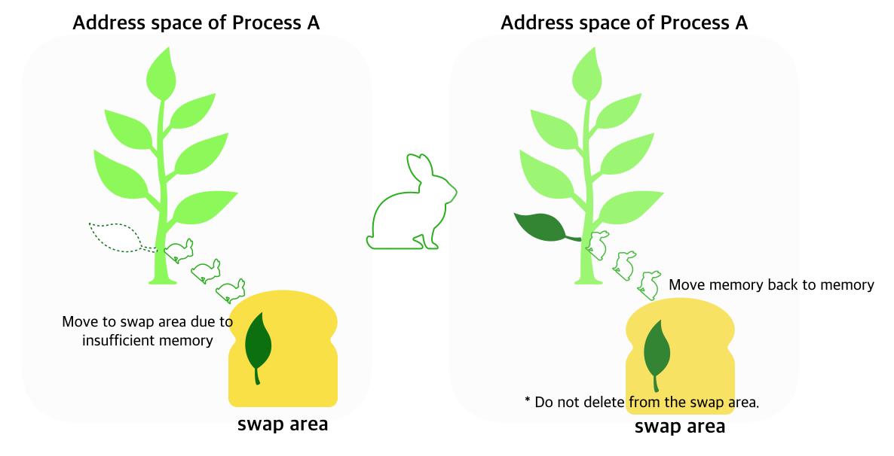
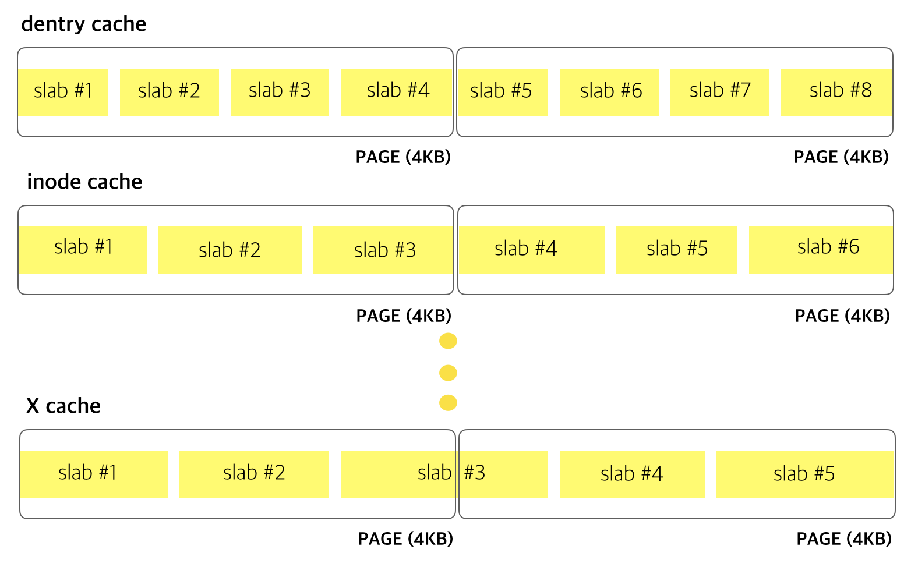

#4. free명령이 숨기고 있는 것들

***

메모리는 커널이 제공하는 중요한 리소스 중 하나이다. <br/>
CPU가 프로세스의 연산 과정에 필요한 리소스라고 한다면, 메모리는 프로세스가 연산할 수 있는 공간을 제공해주는 리소스라고 할 수 있다. <br/>
프로세스는 메모리라는 공간에 자신이 필요한 함수를 넣어 두거나 변수에 값을 저장하거나 하는 방식으로 연산을 위한 공간을 확보하고 작업을 진행한다. <br/>
메모리가 부족하다면 프로세스는 더이상 연산을 위한 공간을 확보할 수 없고, 이는 시스템 응답 불가 현상 또는 큰 성능 저하를 일으킬 수 있다. <br/>

그렇기 때문에 메모리가 어떻게 활용되고 있는지를 파악하는 것은 CPU사용률과 Load Averge만큼 중요한 포인트이다. <br/>

이번 장에서는 free명령을 통해 시스템의 메모리 사용량을 확인하고, 각각의 의미하는것이 무엇인지, free만으로 살펴볼 수 없는 상세한 정보는 어떻게 볼 수 있는지 살펴볼 것이다. 

<br/><br/>

 ##4-1. 메모리 사용량 확인하기

***

리눅스 시스템에서 메모리의 전체적인 현황을 가장 빠르게 살펴 볼 수 잇는 명령은 free 명령이다. <br/>
free명령은 전체 메모리 용량과, 사용중인 용량, 그리고 buffers와 cached로 명명되는 캐싱 영역의 용량을 확인하는데 사용된다. <br/> 


* free 명령의 출력결과이다. 
 
```
# free -m 
           total   used    free    shared   buffers   cached
Mem :       7872    1365    6507         0      152      865
-/+ buffers/cache :  347    7525
Swap :     10239      0    10239             

```

<br/>
<br/>

* 메모리 정보 각 항목의 의미


Mem :  (total) 7872[^1]   (used) 1365[^2]   (free) 6507[^3]   (shared)  0[^4]     (buffers) 152[^5]   (cached) 865[^6]

<br/>
***

[^1]: 현재 시스템에 설치되어 있는 전체 메모리 양을 의미한다. -m을 옵션으로 주었기 때문에 MB단위로 표시한다. <br/>
[^2]: 시스템에서 사용하고 있는 메모리양을 의미한다. 이 시스템은 7872MB 메모리 중에서 1365MB를 사용하고 있다. <br/>
[^3]: 시스템에서 아직 사용하고 있지 않는 메모리 양을 의미한다. 그야말로 아무도 사용하고 있지 않기 때문에 애플리케이션이 사용할 수도 있고, 커널이 사용할 수도 있다. <br/>
[^4]: 프로세스 사이에서 공유되고 있는 메모리의 양이다. 출력에는 MB 단위라서 0으로 출력되었지만, 단위를 더 낮추면 값이 보일 수 있다. <br/>
[^5]: 버퍼 용도로 사용되고 있는 메모리의 양을 의미한다. 프로세스가 사용하는 메모리 영역이 아니고 시스템의 성능 향상을 위해서 커널에서 사용하고 있는 영역이다. <br/>
[^6]: 페이지 캐시라고 불리는 캐시 영역에 있는 메모리 양을 의미한다. I/O 관련 작업을 더 빠르게 진행하기 위해서 커널에서 사용하고 있는 영역이다. 
<br/>
<br/>

* 두번째줄 버퍼/캐시 정보 의미

-/+ buffers/cache: [^7]   347[^8]    7525[^9]
<br/>

***
[^7]: 아주 중요한 구문이다. 첫번째 줄의 결과에서 buffers와 cache영역을 제외한 양을 보여준다는 의미이다. <br/>
[^8]: buffers와 cache영역을 제외하고 사용하고 있는 영역을 의미한다. 이 시스템에서 buffers와 cache를 빼면 347MB를 사용하고 있다. <br/>
[^9]: buffers와 cache 영역을 제외하고 사용하지 않는 영역을 의만다. 첫번째 줄에서 볼 수 있는 free영역보다 더 큰 값을 볼 수 있다. <br/>

<br/>

이렇게 free 명령은 현재 시스템의 메모리 사용량에 대한 종합적인 정보를 보여준다. 전체 메모리가 어느 정도 크기이고, 그중 어느 정도를 사용하고 있는지, 또 swap 영역을 사용하고 있는지 여부를 가장 빠르고 간단하게 살펴볼 수 있다.  왜 free명령은 두번째 줄을 통해서  buffer와 cache를 제외한 영역에 대한 결과를 다시 한번 보여주는 것일까?

<br/><br/>

 ##4-2. buffers와 cached 영역

***

free명령은 두번째 줄을 통해서 buffer와 cache영역을 제외한 가용 영역을 출력한다. 그래서 첫번째 줄에서 확인한 가용영역보다 훨씬 큰 영역을 가용 영역으로 출력하는 경우가 많다. <br/>
과연 어떤 값이 진짜 가용 영역인가? 그에 대한 이야기를 하기전에 buffer와 cached영역에 대해 알아보자. 
<br/><br/>

커널은 블록 디바이스라고 부르는 디스크로부터 데이터를 읽거나 사용자의 데이터를 디스크에 저장한다. <br/>
하지만 디스크는 다른 장치들에 비해 매우 느리기 때문에 디스크에 대한 요청을 기다리는 시간이 상당히 많이 소요되고, 이로 인해 시스템에 부하가 일어나기도 한다. <br/>
커널은 이렇게 상대적으로 느린 디스크에 대한 요청을 좀더 빠르게 하기 위해 메모리의 일부를 디스크 요청에 대한 캐싱 영역으로 할당해서 사용한다. <br/>
즉 한번 읽은 디스크의 내용을 메모리에 저장해 두어서, 동일한 내용을 읽고자 하면 디스크로 요청하지 않고 메모리로 요청하게 된다. <br/>

이런 캐싱 기능을 통해서 커널은 다수의 디스크 요청을 좀더 빠르게 처리할 수 있다. <br/>
그리고 이때 사용되는 캐싱영역을 buffers,cached라고 부른다. 그럼 두 영역의 차이점이 무엇인지 살펴보자. <br/><br/>

[커널에서 사용하는 Page Cache와 Buffer Cache의 관계도]


<br/>
위 그림은 Page Cache와 Buffer Cache가 사용되는 과정을 보여준다. <br/>
앞에서도 이야기한 것처럼 커널은 블록 디바이스에서 데이터를 읽을 때 데이터가 위치한 특정 블록의 주소를 넘겨주고, 블록 디바이스는 해당 블록 주소의 데이터를 커널에 전달한다. <br/>
이 과정에 디바이스 드라이버가 있지만 간단한 설명을 위해 위 그림에서는 생략했다. <br/>
커널이 읽어야할 데이터가 파일의 내용이라면 커널은 bio구조체를 만들고 해당 구조체에 Page Cache 용도로 할당한 메모리 영역을 연결해준다. <br/>
그리고 bio 구조체는 디바이스 드라이버와 통신해서 디스크로부터 데이터를 읽어서 Page Cache에 파일의 내용을 채운다. <br/>
super block, inode block처럼 파일의 내용이 아닌 파일 시스템을 관리하기 위한 메타 데이터를 읽어올 때는 bio구조체를 사용하지 않고 _get_blk()와 같은 내부 함수를 통해 블록 디바이스와 직접 통신한다. <br/>
 
그리고 이때 가져온 블록 디바이스의 특정 블록 내용을 Buffer Cache 영역에 저장해둔다. <br/>
정리하자면 Page Cache는 파일의 내용을 저장하고 있는 캐시, Buffer Cache는 파일의 내용을 저장하고 있는 캐시, Buffer Cache는 파일 시스템의 메타 데이터를 담고 있는 블록을 저장하고 있는 캐시라고 할 수 있다. 그리고 각각이 free에서 표현하고 있는 cached, buffers 영역이다. <br/>

그렇다면 free영역은 왜 이 두 영역을 제외한 영역을 가용한 영역으로 계산해서 다시 보여주는 걸까?
<br/>

[시간의 흐름에 따른 메모리 사용 영역의 변화]


<br/>
서버의 운영 기간이 그리 길지 않을 때는 아마도 위 그림의 1번과 같은 메모리 사용 현황을 볼 수 있을 것이다. <br/>
아무 곳에서도 사용하지 않는 가용 영역에 있는 free메모리와 애플리케이션에서 사용하고 있는 영역으로 나뉜다. <br/>
하지만 시간이 조금 지나면 커널은 가용 영역 중 일부를 cache영역으로 사용하게 된다. (2) <br/>
그리고 시간이 흐를수록 애플리케이션에서 사용하게 되는 영역이 점점 넓어진다. <br/>어느 순간까지는 가용영역의 메모리를 가져다가 사용하게 될 것이다.(3)<br/>Cache영역이 충분히 있어야 I/O 성능 향상의 효과를 받을 수 있기 때문이다. <br/>
하지만 사용 영역이 점점 커져서 일정 수준 이상이 되면 커널은 Cache영역으로 사용하던 영역을 애플리케이션이 사용할 수 있도록 메모리 관리 시스템에 반환한다. (4). <br/> 3번에 비해 Cache영역이 줄고 애플리케이션의 사용영역이 늘어난다. <br/> 이런 과정을 거치다보면 더이상 반환할 메모리도 없고 가용할 메모리가 없는 순간이 발생하게 되는데, 시스템은 이때부터 swap이라는 영역을 사용하게 되고 시스템의 성능이 줄어든다. <br/> 
이처럼 buffer와 cached 영역은 시스템의 I/O 성능 향상을 위해서 커널이 사용하는 영역이다. <br/> 메모리가 부족한 상황이 되면, 커널은 해당 영역을 자동으로 반환하기 때문에, free명령에서도 해당 영역을 제외한 영역을 실제 사용 가능한 영역으로 계산하게 된다. <br/>

<br/>

 ##4-3. /proc/meminfo 읽기

***

free명령보다 더 자세하게 메모리의 사용현황을 알 수 있는 방법은 없는 것일까?
<br/> free명령은 시스템이 사용하고 있는 전체 메모리와 앞으로 가용한 메모리의 용량을 볼 수 있지만, 각 메모리가 시스템의 어느 부분에 사용되고 있는지 자세하게 볼 수는 없다. <br/>
그래서 리눅스에서는 /proc/meminfo를 통해서 자세한 메모리 현황을 볼 수 있는 방법을 제공하고 있다 <br/>
출력값은 커널 버전에 따라 조금씩 다르기 때문에 대부분의 커널에서 출력하는 공통적인 부분만 알아보려 한다. <br/>

* /proc/meminfo의 결과

SwapCached : 0kB [^10]   <br/>
Active(anon) : 181196 kB [^11] <br/>
Inactive(anon) : 164 kB [^12]  <br/>
Active(file) : 383076 kB [^13]  <br/>
Inactive(file) : 679736 kB [^14] <br/>
.... <br/>
Dirty : 60 kB [^15] <br/>

<br/>

free명령을 통해 볼 수 있는 정보보다 훨씬 많은 정보가 출력된다. <br/>
일부 값들은 free 명령을 통해서도 확인할 수 있다. <br/>
여기서는 그 외에 중요한 메모리 영역을 살펴볼 것이다. <br/>

***

[^10]: Swap Cached 영역은 swap으로 빠진 메모리 영역 중 다시 메모리로 돌아온 영역을 의미한다. <br/>
<br/>

[Swap Cached 영역이 발생하는 경우]


위 그림과 같은 상황을 가졍해보자. 시스템에 메모리가 부족하면 커널은 프로세스 주소 공간 중 swap영역으로 이동시킬 수 있는 메모리를 선택해서 swap 영역으로 이동시킨다. 이 과정에서 I/O가 일어나기 때문에 성능 저하가 발생한다.<br/> 그후 메모리가다시 확보되어 swap영역으로 빠졌던 영역이 다시 메모리로 돌아가게 되더라도 커널은 swap영역에서 해당 메모리 내용을 삭제하지 않는다. <br/>
이후에 또다시 메모리 부족 현상이 일어날 경우를 대비하는 것이다. 해당 메모리 영역이 다시  swap영역으로 내려와야하는 일이 생긴다면 swap영역으로 다시 복사하는 것이 아니라 이전에 참고한 메모리 영역을 삭제하지 않고 그대로 다시 활용한다. <br/>
 이를 통해서 swap이 발생하더라도 조금이나마 I/O를 줄일 수 있다. <br/>
<br/>

[^11]: Active(anon)- anon이란 표현은 anonymous의 줄임말이다. Anonyous가 익명이라는 뜻이 있어서 오해의 소지가 있지만, 여기서는 특정 파일의 내용을 저장하고 있는 Page Cache영역을 제외한 메모리 영역을 의미한다. 주로 프로세스들이 사용하는 메모리 영역을 지칭할 때 많이 사용한다. <br/> 그 중에서 비교적 최근에 메모리 영역이 참조되어 swap영역으로 이동되지 않을 메모리 영역을 의미한다. <br/>

[^12]: Inactive(anon) - Active와 같이 영역을 의미하지만,비교적 참조된지 오래되어 Swap영역으로 이동될 수 있는 메모리 영역을 의미한다. <br/>

[^13]: Active(file) - anon과는 다르게 file로 되어있는 이 영역은 커널이 I/O 성능 향상을 위해 사용하는 영역을 의미한다. buffers와 cached 영역이 여기에 속한다. <br/> Active라는 이름에서 알수 있듯 비교적 최근까지 메모리 영역이 참조되어 Swap영역으로 이동되지 않을 메모리 영역이다. <br/>

[^14]: Inactive(file) - 4번과 마찬가지로 I/O 성능향상을 위해 커널이 캐시 목적으로 사용하고 있는 영역이다. 참조된지 오래되어서 swap영역으로 이동될 수 있는 메모리 영역이다.<br/>

[^15]: Dirty : 4,5번과 비슷한 용도로 I/O 성능 향상을 위해 커널이 캐시 목적으로 사용하는 영역 중 쓰기 작업이 이루어져서 실제 블록 디바이스의 블록에 씌어져야할 영역을 의미한다. <br/>
커널은 기본적으로 I/O 쓰기 요청이 발생했을때 바로 블록 디바이스로 명령을 내리지 않고 일정량이 될때까지 모았다가 한번에 쓰는 일종의 지연쓰기 작업을 한다. <br/> 이 메모리는 이 과정에서 사용되는 메모리 영역이다. <br/>

<br/>
이렇게 /proc/meminfo에서 확인할 수 있는 몇가지 정보들을 살펴봤는데, 아직 풀리지 않는 궁금증이 있다. <br/>
바로 Active영역과Inactive 영역을 구분하는 방법이다. 두 영역은 어떤 기준으로 구분될까? 이쯤에서 간단하게 커널의 소스 코드를 살펴보자 <br/>
<br/>

* fs/proc/meminfo.c 

```c
seq_printf(m, 
...(중략)...
	"Active(anon):  %8lu  kB\n"
	"Inactive(anon):   %8lu  kB\n"
	"Active(file):	%8lu	kB\n"
	"Inactive(file):	%8lu	kB\n"
...(중략)...
	K(pages[LRU_INACTIVE_ANON]),
	K(pages[LRU_ACTIVE_FILE]),
	K(pages[LRU_INACTIVE_FILE]),

```

코드 중 Active, Inactive 메모리를 표현하는 부분만 가져왔다. 각각을 보면 이름 그대로 메모리 페이지 중 LRU_ACTIVE_XXX, LRU_INACTIVE_XXX의 페이지들을 가져오는 것을 볼 수 있다. 그렇다면 LRU_ACTIVE, LRU_INACTIVE는 무엇을 의미하는 것일까?<br/>

커널이 직접 사용하는 메모리 영역을 제외하고 대부분의 메모리는 프로세스가 사용하거나, 캐시 영역으로 사용된다. <br/> 위의 결과에서 보면 이 메모리들이 각각 anon과 file을 의미한다. <br/>

anon, file영역의 메모리는 LRU 기반의 리스트로 관리되고, 이 리스트는 다시 Active, Inactive 두개의 리스트로 나뉜다.<br/>
anon, file 영역은 방식은 조금 다르긴 하지만 결과적으로는 자주 사용되는 메모리 영역이 Active 리스트에 남게 되고 자주 사용되지 않는 영역은 Inactive 리스트에 남게 된다. <br/>
이후 free영역으로 이동한다. <br/>
그렇다면 Active리스트와 Inactive리스트 사이의 이동은 어떻게 결정될까? <br/>
기본적으로 프로세스가 메모리 할당을 요청하면 해당 메모리의 페이지가 Active 리스트에 연결된다.<br/>
그후 메모리 할당이 실패하거나 메모리가 부족하게 되면, kswapd 혹은 커널 내부에서 try_to_free_pages()함수를 통해서 LRU리스트에 잇는 메모리들을 확인한다. <br/> 이 과정에서 Active 리스트에 있던 페이지가 Inactive 리스트로 옮겨가거나 Inactive 리스트에 있던 페이지가 해제되어 다른 프로세스에게 할당되는 작업이 이뤄진다. <br/>

<br/>
* 메모리 영역 테스트를 위한 프로그램


2장에서 사용한 malloc()함수 테스트용 코드를 살짝 바꿔서 간단하게 테스트해보자.
<br/>

```c
#include <stdio.h>
#include <string.h>
#include <stdlib.h>

#define MEGABYTE 1024*1024

int main(){
	void *myblock = NULL;
	int count = 0;
	
	while(1){
		myblock = (void *) malloc(MEGABYTE);
		if(!myblock){
			printf("Error!");	
			break;
		}
	
		printf("Currently allocation %d MB\n", (++count)*MEGABYTE;
		memset(myblock, 1, MEGABYTE);
		sleep(1);
		
		if(count == 10){
			break;
		}

	}

		sleep(600);

	exit(0);
}

```
2장에서 사용한 코드에 if 구문과 sleep구문이 추가 되었다. <br/>
10번 할당한 후 더이상 할당하지 않고 10분간 쉬었다가 종료되는 스크립트이다. 
<br/>
10분간 쉬는 이유는 malloc()을 통해 할당 받은 메모리 영역에 아무런 작업을 하지 않으면 과연 Inactive영역으로 돌아갈 것인가를 확인해보는 것이다. <br/>

```
# cat /proc/meminfo | grep -i anon
Active(anon):   8108 kB
Inactive(anon) : 9196 kB
(위 명령 반복 실행해서 메모리 체크)
```

위 결과를 보면 Active(anon) 메모리 영역이 계속해서 증가하는 것을 볼 수 있다. <br/> 그리고 10번의 할당이 끝난 후에 sleep함수를 통해 아무것도 하지 않아도 메모리 영역은 계속 Active 영역에 남아있다. 단순히 시간이 지난다고 해서 Active 메모리가 Inactive로 이동하지 않는다는 것을 확인할 수 있다. <br/>

그럼 Active에 있는 페이지는 언제 Inactive로 이동할까? <br/>
위에서도 언급했지만 메모리 부족 현상이 발생해서 해제해야할 메모리를 찾아야하는 순간이 와야 커널은 비로소LRU리스트를 살펴보게 된다.  <br/>
그럼 kswapd를 강제로 실행시켜 보자. 커널 파라미터 중에는 vm.min_free_kbytes라는 파라미터가 있다. <br/>
해당 파라미터는 이름에서 알 수 있는 것처럼 시스템에서 유지해야하는 최소한의 free메모리 양이다. 이값을 조금 높게 설정해 보겠다. <br/>

```
# sysctl -w vm.min_free_kbytes=6553500
vm.min_free_kbytes = 6553500
```

그리고 top를 통해 살펴보면 kswapd가 실행되는 것을 확인할 수 있다. 

```
# top -b -n 1

top - 23:00:39 up 48 days, 5:48, 2 users, load average: 0.08, 0.04, 0.07
Tasks: 115 total, 1 running, 114 sleeping, 0 stopped, 0 zombie
Cpu(s): 0.2%us, 4.3%sy, 0.0%ni, 88.2%id, 7.3%wa, 0.0%hi, 0.1%si, 0.0%st
Mem: 8061404k total, 360896k used, 7700508k free, 156840k buffers
Swap: 10485756k total, 193944k used, 10291812k free, 81204kj cached

PID   USER   PR   NI  VIRT   RES   SHR   S   %CPU   %MEM   TIME+   COMMAND
46    root   20   0     0    0     0     D    5.8   0.0    0:03:16   kswapd0

```

kswapd데몬이 열심히 일을 하면서 Active 영역에 있는 페이지 중 오래된 페이지를 우선적으로 Inactive로 옮긴 후 메모리를 해제하는 작업을 진행하고 있다. <br/>
<br/>

```
# cat /proc/meminfo | grep -i anon

Active(anon) : 348 kB
Inactive(anon) : 1380 kB

# free -k 

	       total    used     free   shared   buffers  cached
Mem :        8061404  360268  7701136      0     156840   81336
-/+ buffers/cache :   122092  7939312
Swap:       10485756  193744  10292012

```

거의 12MB에 달하던 active(anon)영역이 348KB수준으로 내려갔고, free영역이 vm.min_free_kbytes에 설정한 값 이상으로 올라간 것을 볼 수 있다. <br/>vm.min_free_kbytes값을 원래대로 설정하면 kswapd가 더는 실행되지 않는다. <br/>
그리고 해당하는 메모리들이 대부분 Swap 영역으로 빠진다. <br/>
그래서 위의 kswapd 데몬 상태가 D 상태로 보인다. <br/>
메모리 재할당에 대해서는 다음장에서 자세히 다룰 것이다. <br/>
이번 절에서는 간단한 테스트를 통해서  Active와 Inactive영역 사이의 움직임에 대해서만 살펴봤다. <br/>
 결과적으로 /proc/meminfo에서 보이는 Inactive(anon), Inactive(file)영역의 크기는 각각 영역에서 자주 사용되지 않은, 누군가 참조한 지 오래된 메모리의 양을 의미하며, 메모리가 부족할 경우 반환될 수 있다. <br/>

<br/><br/>

 ##4-4. slab 메모리 영역

***

지금까지 우리는 buffers와 cached라고 부르는 캐싱 영역과 anon이라고 부르는 프로세스의  메모리 영역을 살펴봤다. 아직 이야기하지 않은 중요한 영역이 있다. <br/>

바로 커널이 내부적으로 사용하는 영역이다. 커널 역시 프로세스의 일종이기 때문에 메모리를 필요로 하며, 조금 특별한 방법으로 메모리를 할당 받아서 사용한다. <br/>
그리고 우리가 앞절에서 본 /proc/meminfo의 내용 중 아직 언급하지 않은, Slab으로 표시되는 영역이 바로 커널이 사용하는 영역이다.<br/>
아까의 결과 중 일부분을 다시 가져와 살펴보자. <br/>
<br/>
Slab : 73128 kB [^16] <br/>
SReclaimable : 48076 kB [^17] <br/>
SUnreclaim : 25052 kB [^18] <br/>
<br/>
***

[^16]: Slab - 메모리 영역 중 커널이 직접 사용하는 영역을 Slab영역이라고 한다. 이 영역에는 dentry cache, inode cache 등 커널이 사용하는 메모리가 포함된다. <br/>

[^17]: SReclaimable - Slab 영역 중 재사용될 수 있는 영역이다. 캐시 용도로 사용하는 메모리들이 주로 여기에 포함된다. 다음장에서도 이야기하겠지만 메모리 부족 현상이 일어나면 해제되어 프로세스에 할당될 수 있는 영역이다. <br/>

[^18]: SUnreclaim: Slab영역중 재사용될 수 없는 영역이다. 커널이 현재 사용 중인 영역이며, 해제해서 다른 용도로 사용할 수 없다. <br/>
<br/>
그럼 Slab 영역은 어떻게 구성되어 있을까?<br/>
그리고 프로세스의 메모리 할당과 어떻게 다를까?<br/>
그에 대한 이야기를 하기 전에 Slab 영역에 대한 더 자세한 정보를 확인하는 방법을 알아보자.<br/>
친절하게도 리눅스에서는 slabtop 명령을 통해 현재 시스템에서 사용 중인 Slab의 정보를 살펴볼 수 있다. <br/>
<br/>
```
# slabtop -o

```
<br/>
그럼 Slab은 어떤 영역이기에 다른 영역과 구분되는 걸까?<br/>
모든 프로세스는 작업을 하기 위해 메모리가 필요하고 이는 커널도 예외가 아니다. 
<br/>
I/O 작업을 조금이라도 더 빠르게 하기 위해 inode cache, dentry caceh 등을 사용하거나, 네트워크 소켓을 위한 메모리 영역을 확보하거나 하는 작업들은 커널( 좀더 엄밀히 말하자면 디바이스 드라이버)이 하게 되는데 이 과정에서 메모리가 필요하다. <br/> 하지만 메모리를 할당해주는 버디 시스템은 4KB의 페이지 단위로 메모리를 할당한다. 사실 커널 입장에서는 이렇게 큰 영역을 할당 받을 필요가 없다. <br/>
또한 영역이 크다면 실제 사용하는 영역과 할당 받은 영역의 차이가 커지면서 메모리 단편화 현상도 발생할 수 있다. <br/> 
그렇기 때문에 커널이 사용하려는 메모리 영역은 좀더 작고 효율적으로 사용할 수 있어야 한다. <br/>
이를 충족시키기 위해 커널은 Slab할당자를 통해서 원하는 메모리 영역을 확보한다.
<br/>
 
[slab 할당자의 메모리 사용 개념도]

<br/>

위 그림은 slab 할당자가 메모리에 어떻게 저장되는지를 보여준다. <br/>
물론 이것보다 복잡하게 관리되고 있지만, 메모리의 기본 단위인 4KB의 영역을 slab 할당자가 어떻게 나눠서 사용하는지를 간단히 정리한 것이다. <br/>
그림을 보면 Slab할당자는 각각의 목적에 맞는 캐시별로 영역을 할당 받아 사용한다. <br/>
이렇게 버디 시스템을 통해서 페이지 크기인 기본 4KB의 영역을 할당받은후에 각각의 캐시 크기에 맞게 영역을 나눠서 사용한다. <br/>
그래서 경우에 따라서는 페이지 크기의 배수로 딱 떨어지지 않는 경우도 존재할 수 있다.
<br/>

간단한 테스트를 통해 Slab영역이 늘어나는 것을 확인해보자. <br/>
Slab영역 중 가장 많이 사용되는 캐시가 dentry와 inode_cache다. <br/>
각각은 디렉터리의 계층 관계를 저장해 두는 캐시, 파일의 inode에 대한 정보를 저장해 두는 캐시다. <br/>

```
# slabtop -o | grep dentry

# cd /boot

# ls -al

# slabtop -o | grep dentry

```

위 예제처럼 간단하게 cd로 이동해서 ls명령으로 디렉터리를 살펴보는 것만으로 dentry 값은 증가한다. 만약 파일에 자주 접근하고 디렉터리의 생성/삭제가 빈번한 시스템이 있다면  Slab 메모리가 높아질 수 있으며, 그중에서도 Dentry, inode_cache가 높아질 수 있다. <br/>

또한 Slab할당자는 free 명령에서는 used로 계산된다. <br/>
커널이 사용하는 캐시 영역이기 때문에  buffers/cached 영역에 포함될 것이라고 생각할 수 있지만, used 영역으로 계산된다. <br/>
그래서 간혹 프로세스들이 사용하는 메모리 영역을 모두 더하고도 used와 맞지 않을 경우 Slab 메모리에서 누수가 발생하는 것일 수도 있다. <br/><br/>


 ##4-5. Case Study - Slab 메모리 누수

***

이번에는 운영중 실제로 발생한 메모리 누수(leak)와 관련된 이슈를 살펴보자.<br/>
운영하던 서버에서 지속적으로 메모리의 사용량이 증가하는 이슈가 있었다. <br/> 
free 명령을 입력하면 20GB가 넘게 확인되었지만 ps명령을 통해 확인한 프로세스들이 메모리 사용량을 합한 값은 10GB도되지 않았다. <br/>
어디서 메모리를 사용하고 있는지 정확히 파악되지 않던 상황에서 /proc/meminfo를 확인해보니 재미있는 결과를 볼 수 있었다. <br/>
<br/>

* /proc/meminfo 조회 결과

```

MemTotal : 32740576 kB
MemFree : 2261328 kB
MemAvailable : 31815432 kB
Buffers : 40 kB
Cached : 3016504 kB
Slab : 27048772 kB
SReclaimable : 26988056 kB
SUnreclaim : 60716 kB

```

Slab 메모리 영역이 무려 27GB 가량을 사용하고 있었다. <br/>
Slab 영역 중에서 어떤 영역이 문제가 있는지 slabtop명령을  통해 확인해봤다. <br/>

<br/><br/>

* slabtop 명령 실행 결과 

```
OBJS     ACTIVE   USE  OBJ  SIZE   SLABS    OBJ/SLAB  CACHE   SIZE   NAME
140358414   140358272        8%     0.19K    6683734    21  26734936K dentry 

```

dentry cache가 무려 26GB 정도를 사용하고 있었다. dentry cache는 파일 시스템의 디렉터리 엔트리를 저장하고 있는 캐시로, 디렉터리간의 부모/자식 관계 등을 저장하고 있어서 디렉터리 간 이동을 더 빠르게 할 수 있도록 도와주는 캐시이다. <br/>
사실 저 캐시가 26GB 정도나 되는 것은 정상적인 상황이 아니다. <br/>
메모리 점유율이 높아지는 원인이 프롯스가 아닌 Slab메모리에 있다는 것을 확인한 후 취할 수 있는 조치는 drop cache를 이용한 캐시 영역 강제 플러싱이 있다. <br/>

```
echo 2 > /proc/sys/vm/drop_cached

```

시스템에서 문제가 발새한 부분은 dentry cache 영역이기 때문에 dentry cache를 날릴 수 있도록 echo 2를 이용한다. <br/>
3을 이용하면 dentry cache 뿐 아니라 page cache까지 모두 플러싱할 수 있지만, 불필요한 작업으로 CPU 자원을 낭비할 필요는 없기 때문이다. <br/>
하지만 캐시를 플러싱한 후에도 일정 기간이 지나면 또 똑같이 메모리 릭이 발생했다. <br/> 이번에도 Slab영역에서 dentry cache의 용량이 커지는 것을 확인할 수 있었다. <br/> 이제 문제의 본질로 들어가서 dentry cache가 왜 증가하는지 원인을 파악해야 했다. <br/> lsof 명령으로 참조하고 있는 디렉터리들의 정보를 확인해 보았지만, 문제가 될만한 수준은 아니었다. <br/>

```
# lsof | grep DIR | wc -l

```

결국 시간을 두고 slabtop의 기록을 바탕으로 확인하는 방법밖에 없었다. <br/>
하루정도의 시간을 두고 slabtop의 내용을 살펴보니 dentry cache의 값이 일정한 간격을 두고 증가하는 것을 확인할 수 있었다. <br/>
일정한 간격을 두고 증가한다는 것은 스케줄링되어 있는 작업이 영향을 끼치는 것이라고 생각했다. <br/>
살펴본 결과 cron에 설정해놓은 curl과 관련된 작업이 영향을 끼친 것으로 확인되었다. <br/>
실제로 해당 스크립트를 실행하자 약 1MB 수준의 dentry cache가 증가했다. <br/>
curl과 dentry cache와 관련된 내용을 살펴보니, curl에서 http에 대한 요청을 처리할 때 사용하는 nss-softokn라이브러리에 버그가 있었다. ... 결국 시스템은 라이브러리의 작은 버그로 인해 메모리가 가득차기를 반복하는 상황이었다. <br/>
이번 경우처럼 Slab영역에서 메모리 누수가 발생하는 것은 추적하기 어려운 이슈였다. <br/> 프로세스에서 사용하는 메모리의 영역에서 누수가 발생한다면 코드를 살펴보거나 사용하는 라이브러리들을 살펴보면 되지만 지금처럼 범용적으로 사용하는 시스템 라이브러리에서 버그가 있어 Slab영역에서 누수가 발생하면 추적하기가 어렵다 <br/>
하지만 해당 영역의 메모리 사용량이 어떤 경우에 올라가게 되는지 추적하기 위한 데이터를 잘 수집해서 분석하면 해결하기가 좀더 수월하다. <br/>
메모리 사용량이 올라가는 경우에 단순하게 free명령으로만 확인했다면 위와 같은 Slab영역의 메모리 누수는 잡을 수 없었을 것이다. <br/>

메모리의 동작이 이상하다고 생각될때에는 /proce/meminfo를 통해서 좀더 정확한 정보를 수집하는 것도 필요하다. 

