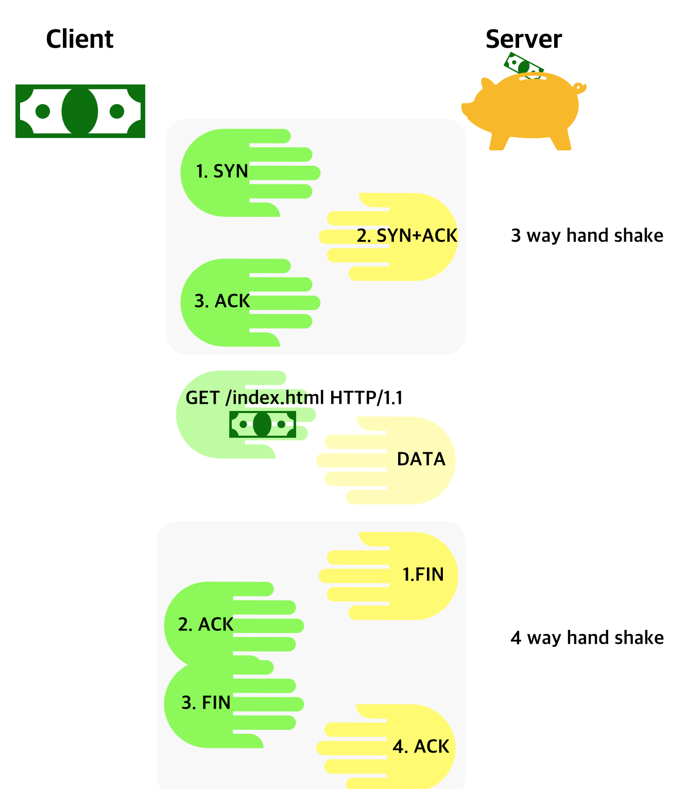
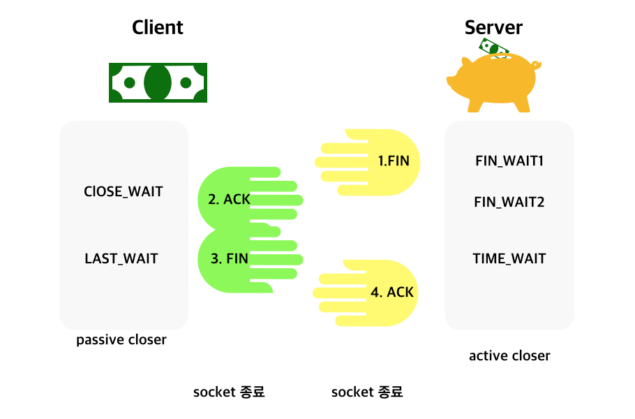
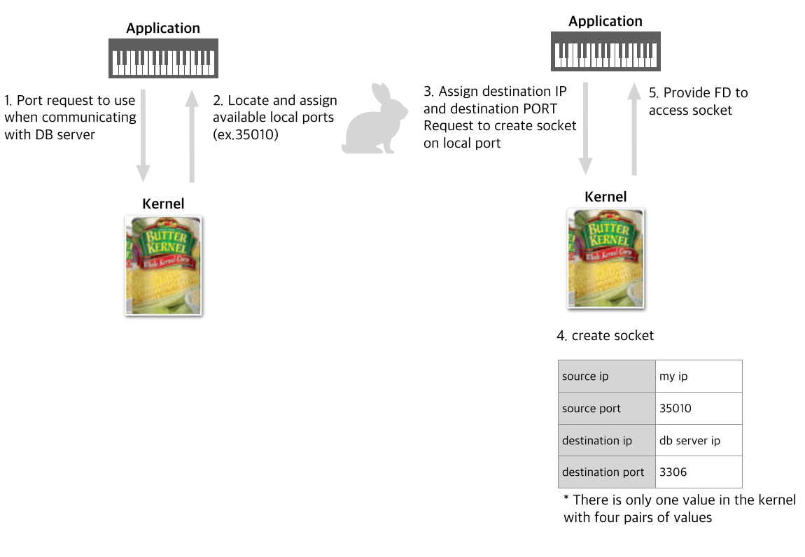

#7. TIME_WAIT 소켓이 서비스에 미치는 영향

***

이번 장에서는 TIME_WAIT 소켓에 대해 알아보려 한다. <br/>
TIME_WAIT 상태가 무엇을 의미하고 왜 발생하는지, 그리고 서비스에는 어떤 영향을 끼칠 수 있는지 살펴볼 것이다. 

<br/><br/>

 ##7-1. TCP 통신 과정

***

TIME_WAIT 소켓에 대해 이야기 하기 전에 먼저 TCP의 통신과정을 살펴보자. <br/>
그림 7-1을 보면 통신을 시작하기 전에 최조의 연결을 맺게 되는 과정을 ** 3-way handshake**라고 한다. <br/>
클라이언트는 서버로 통신을 시작하겠다는 ** SYN ** 을 보내고, <br/>
서버는 그에 대한 응답으로 ** SYN + ACK ** 를 보낸다. <br/>
마지막으로 클라이언트는 서버로부터 받은 패킷에 대한 응답으로 ** ACK ** 를 보낸다. <br/>
<br/>
이렇게 3-way handshake 를 정상적으로 마친 다음 클라이언트는 서버에 데이터를 요청한다. <br/>
그림 7-1을 보면 HTTP 통신일 경우 GET /index.html과 같이 요청하고, 통신을 모두 마친 후에는 연결을 종료한다. <br/>
이 과정을 ** 4-way handshake ** 라고 한다. <br/>
<br/>
[그림 7-1. TCP 통신 과정]


<br/>
연결을 맺을 때는 연결을 맺고자하는 쪽에서 먼저 SYN 을 보내며, 연결을 끊을 때는 연결을 끊으려는 쪽에서 먼저 FIN을 보낸다. 그림 7-1에서는 서버가 먼저 연결을 끊었다. <br/> 클라이언트는 ACK를 보내고 사용한 소켓을 정리한 다음 마지막 FIN을 보낸다 <br/> 서버는 클라이언트가 보낸 마지막 FIN에 대한 ACK를 전송하고 소켓을 정리한다. <br/>

그림 7-1에서 본 과정이 실제로 어떻게 일어나는지 tcpdump를 통해서 확인해보자. <br/> 먼저 서버에서는 nginx를 설치한 후 기본 옵션으로 실행키킨다. <br/>
그리고 클라이언트에는 서버로 80포트를 요청한다. <br/>
서버에서 tcpdump는 코드 7-1과 같이 입력한다. 포트를 지정함으로써 더 정확한 덤프 파일을 생성할 수 있다. <br/>

* [코드 7-1 서버에서 tcpdump 명령을 통해 덤프 파일 생성하기]

```
* nginx(엔진엑스)설치하고 기본 옵션으로 실행시키기.

# apt-get update
# apt-get install nginx

* 덤프 파일 생성하기
root@vagrant-ubuntu-trusty-64:~/test# tcpdump -A -vvv -nn port 80 -w server_dump.pcap
tcpdump: listening on eth0, link-type EN10MB (Ethernet), capture size 262144 bytes
Got 0

```

그리고 클라이언트에서 telnet 명령을 통해서 서버에 접속한다. <br/>

* [코드 7-2 클라이언트에서 telnet 명령으로 서버에 접속하기]

```
# telnet server 80

```

통신이 완료된 후 Wireshark를 이용해서 생성된 pcap 파일을 연다. <br/>
<br/>
* wireshark로 pcap 파일 분석

1. 43367->80 [SYN] Seq = 1... Win = 1.. Len = 0 MSS ..
<br/> 클라이언트는 목적지 포트 80인 SYN 패킷을 서버로 보낸다. 

2. 80->43367 [SYN, ACK] Seq=176782.. Ack=14...
<br/> 서버는 클라이언트의 패킷에 대한 응답으로 SYN+ACK 패킷을 보낸다. 

3. 43367->80 [ACK] Seq=50... Ack=17... Win= ..
<br/> 클라이언트는 서버의 패킷에 대한 응답으로 ACK 패킷을 보낸다. 이 과정까지 끝내면 3-way handshake가 끝나고 클라이언트와 서버는 데이터를 주고 받을 준비를 끝낸다. 

4. GET / HTTP/1.1
<br/> 클라이언트가 서버로 HTTP GET 요청을 보낸다. 

5. 80->43367 [FIN, ACK] Seq = 17... Ack = 16..
<br/>서버는 응답을 주고 연결을 끊기 위해 FIN 패킷을 보낸다. 

6. 43367->80 [ACK] Seq=15... Ack=17.. Win=
<br/> 클라이언트는 서버에서 보낸 패킷에 대한 응답으로 ACK패킷을 보낸다. 

7. 43367->80 [FIN, ACK] Seq=150... Ack= 15...
<br/>클라이언트는 자신이 사용한 소켓을 정리하며 통신을 완전히 끝내도 된다는 의미로 FIN 패킷을 보낸다. 

8. 80->43367 [ACK] Seq=1767..  Ack=150... Win=..
<br/> 서버는 클라이언트 패킷에 대한 응답으로 ACK패킷을 보낸다. 
<br/><br/>

** 와이어샤크는 패킷 덤프를 분석하는 프로그램이며, https://www.wireshark.org 에서 무료로 다운받아서 사용가능하다. **

<br/>
여기까지가 HTTP GET 요청에 대한 실제 덤프 내용이다. 이 내용을 살펴본 다음 그림 7-2를 보면 쉽게 이해할 수 있을 것이다. 그럼 이제 TIME_WAIT 소켓을 살펴보자. 

<br/><br/>

 ##7-2. TIME_WATI 소켓의 문제점

***

연결을 끊는 과정을 조금 더 자세히 살펴보자. 그림 7-3을 보면 active closer와 passive closer가 있는데 단어 그대로 먼저 연결을 끊는 쪽을 active closer라고 하고 그 반대를 passive closer라고 한다. <br/>
누가 먼저 연결을 끊느냐가 중요한 이유는 active closer 쪽에 TIME_WAIT 소켓이 생성되기 때문이다. <br/>
주의해야할 부분은 TIME_WAIT 소켓은 서버에서 생기는 것이 아니고 먼저 연결을 끊는 쪽에서 생성된다는 점이다. <br/>
클라이언트에서도 TIME_WAIT 소켓이 생길 수 있고, 서버에서도 TIME_WAIT 소켓이 생길 수 있다. <br/>

[TCP에서 연결을 끊는 과정]


<br/>
그럼 서버에서도 TIME_WAIT 소켓이 몇개나 있는지 어떻게 확인할 수 있을까?<br/>
netstat 명령으로 확인할 수 있다. <br/>

* 코드 7-3 netstat 명령으로 TIME_WAIT 소켓 확인하기 

```
# netstat -napo | grep -i time_wait
tcp 0 172.16.33.136:32002 172.17.246.27:6379 TIME_WAIT timewait (21.45/0/0)

```

코드 7-3에서 볼 수 있듯이 이 서버에서는 출발지 IP가 173.16.33.136, 출발지 포트가 32002이며 목적지 IP가 172.17.246.27, 목적지 포트가 6347인 소켓이 있는데 현재 TIME_WAIT 상태이기 때문에 타이머가 종료되어 커널로 다시 돌아갈 때까지는 사용할수 없다. 
<br/>
이처럼 TIME_WAIT 소켓이 많아지면 어떤 문제가 발생할까? 먼저 로컬 포트 고갈에 따른 애플리케이션 타임아웃이 발생할 수 있다. <br/>
리눅스에는 net.ipv4.ip_local_port_range라는 커널 파라미터가 있는데, 이 파라미터는 외부와 통신하기 위해 필요한 로컬 포트의 범위를 지정하는 역할을 한다. <br/>
커널은 프로세스가 외부와 통신하기 위해 소켓의 생성을 요청할 때 해당 소켓이 사용하게 될 로컬 포트에 net.ipv4.ip_local_port_range에 정의한 값들 중 하나를 넘겨준다. 이때 모든 로컬 포트가 TIME_WAIT 상태에 있다면 할당할 수 있는 로컬 포트가 없기 때문에 외부와 통신을 하지 못하게 되고, 이로 인해 애플리케이션에서는 타임아웃이 발생할 수 있다. 이에 대한 문제는 다음절에서 더 자세히 다룰 것이다.<br/>

그리고 잦은 TCP 연결 맺기/끊기로 인해 서비스의 응답속도 저하도 일어날 수 있다. <br/> TIME_WAIT 소켓은 어찌 되었든 연결을 끊기 때문에 발생하는 것인데, 지속적으로 통신량이 많을 때도 연결의 맺고 끊기를 반복한다면 그만큼 많은 양의 TOP 3-way handshake가 필요하게 되고 이는 전체적인 서비스의 응답속도 저하를 야기할 수 있다. <br/>

이런 현상을 막기 위해 대부분의 애플리케이션에서는 Connection Pool과 같은 방식을 사용해서 한번 맺어놓은 TCP연결을 계속해서 재사용할 수 있게 구현하고 있다. <br/>
이를 통해서 불필요한 TOP 3-way handshake를 줄일 수 있어서 성능 향상에도 도움이 된다. <br/>
이렇게 너무 많은 양의 TIME_WAIT 소켓은 서비스에 문제를 일으킬 수 있기 때문에 어떤 상황에 TIME_WAIT 소켓이 쌓이게 되는지 좀더 알아보고 그에 대한 해결방안을 알아볼 것이다. 


<br/><br/>

 ##7-3. 클라이언트에서의 TIME_WAIT

***

앞절에서도 이야기했지만 TIME_WAIT은 서버에 생기는 것이 아니라 먼저 연결을 끊는 쪽에서 생긴다. HTTP기반의 서비스는 대부분 서버가 먼저 연결을 끊는 경우가 많기 때문에 서버에서 TIME_WAIT가 생긴다고 오해할 수 있지만 그렇지 않다는 사실을 꼭 기억해야한다. <br/>
그럼 클라이언트 입장에서의 TIME_WAIT는 어떻게 발생할 수 있을까?<br/>
대부분의 시스템들은 독립적으로 동작하지 않는다. <br/>
데이터 저장 및 가공을 위해 데이터베이스, 메모리 기반의 캐시 시스템들과 연동하기도 하고 외부 서비스와의 연동을 위해 API를 호출하기도 한다. 이런 과정에서 서비스를 제공하는 서버는 연동하는 시스템에 대해서는 클라이언트가 될 수 있다. 
<br/>

[그림 7-4 일반적인  2 tier 구조의 시스템 구성]

<br/>

그림 7-4와 같은 과정을 가정해 보자. 사용자는 POST method를 이용해 웹서버에 데이터를 업로드하고 데이터를 받은 웹서버는 DB서버에 해당 데이터를 저장한다. <br/>
1번 과정을 보게 되면 클라이언트는 USER, 서버는 WEB server이다. 하지만 2번 과정을 보면 클라이언트는 web server, 서버는 db server가 된다. <br/>
즉, 통신하는 과정에 따라 서버의 역할을 했던 서버는 반대로 클라이언트 역할을 하기도 한다. <br/>
그리고 이과정에서 클라이언트의 역할을 하는 서버가 먼저 연결을 끊는다면 클라이언트 입장의 TIME_WAIT 소켓이 발생할 수 있다. <br/>
클라이언트 입장에서 TIME_WAIT가 발생했을 때 가장 큰 문제는 로컬 포트가 고갈되는 것이다. <br/>
클라이언트는 요청을 보내기 위해 소켓을 만드는데, 이때 가용한 로컬 포트 중 하나를 임의로 배정받아서 나가게 된다. <br/>

[그림 7-5 애플리케이션이 소켓을 할당받는 과정]


<br/>
그림 7-5와 같은 상황을 가정해보자.<br/>

1. 애플리케이션은 DB서버와의 통신을 위해 커널에 소켓 생성을 요청한다. <br/>
2. 커널은 자신이 관리하고 있는 로컬 포트 목록 중에 사용할 수 있는 포트 번호 한개를 애플리케이션에 할당한다. <br/>
3. 애플리케이션은 할당 받은 번호로 커널에 소켓 생성을 요청한다. <br/>
4. 커널은 해당정보로 소켓을 생성한다. 소켓은 출발지 IP, 출발지 PORT, 목적지 IP, 목적지 PORT 이 4개의 값을 한 묶음으로 해서 생성하며, 해당 소켓은 커널 내부에 유일하게 존재한다. 즉 4개의 값이 동일한 또다른 소켓은 존재하지 않는다. <br/>
5. 소켓 생성이 정상적으로 완료되면 커널은 애플리케이션에서 소켓 접근에 사용할 FD(File Descriptor)를 전달해준다. <br/>
<br/>
이렇게 사용된 소켓을 Active close하게 되면 TIME_WAIT 상태로 남는다. 그렇기 때문에 정상적인 상황이라면 해당 소켓은 TIME_WAIT 상태가 풀려서 커널로 다시 돌아갈 때까지 다시 사용할 수 없다. 이런 식으로 다량의 로컬 포트가 TIME_WAIT 상태로 쌓이고 더이상 사용할 수 있는 포트가 없어지면 로컬 포트가 고갈되며 서버와 통신할 수 없게 된다. 
<br/>

간단하게 테스트해보자. 서버에서 다음과 같이 curl명령을 입력한다. <br/>

* 코드 7-4 TIME_WAIT 생성 테스트

```
# curl http://www.xxx.com > /dev/null
# netstat -napo | grep 80
tcp 0 0 172.16.33.136:44482(1)  110.76.141.122:80(2) TIME_WAIT TIME_WAIT (51.80/0/0)

```
<br/>
(1).외부로 요청할 때 사용한 서버의 source IP: Source Port이다. 즉 172.16.33.136 IP에 44482 로컬 포트를 사용해서 나갔음을 알 수 있다. <br/>
<br/>
(2).목적지 정보다. 110.76.141.122 IP에 목적지 포트 80으로 나갔음을 알 수 있다. <br/>

코드 7-4를 보면 www.xxx.com에 HTTP 프로토콜로 GET을 요청할 때 이 요청을 처리할 소켓이 필요한데 (172.16.33.136:44482, 110.76.141.122:80)을 하나의 쌍으로 만들어서 나갔다. <br/> 이것은 TIME_WAIT 상태가 풀릴 때까지 동일한 목적지 IP,PORT를 사용할 수 없다는 뜻이다. <br/>

정말로 그런지 테스트해보도록 하자. <br/>
우선 서버에서 사용할 로컬 포트의 범위를 좁혀보자. <br/>
32768 포트 하나만 사용할 수 있도록 아래와 같이 sysctl 명령을 통해 수정한다. <br/> 그리고 curl 명령을 연달아 입력한다. 
<br/>

* 코드 7-5 로컬 포트 바인딩 실패 테스트

```
#sysctl -w "net.ipv4.ip_local_port_range=32768 32768"
# curl http://www.xxx.com > /dev/null
# curl http://www.xxx.com > /dev/null
curl : (7) Failed to connect to ... 
```

코드 7-5를 보면 첫번째 요청에서 이미 32768을 통해 나갔으며 이 포트를 사용한 소켓은 TIME_WAIT상태이기 때문에 다음번에 다시 사용할 수 없다. <br/>
이런 식으로 외부로의 요청에 TIME_WAIT 소켓이 쌓이면 더이상 할당할 수 있는 로컬 포트가 없어서 사용자의 요청을 처리할 수 없게 된다. <br/>
그럼 이런 일이 발생했을 때 어떻게 조치할 수 있을까?<br/>
 <br/><br/>

 ##7-4. net.ipv4.tcp_tw_reuse

***

첫번째로 로컬 포트 고갈에 대응할 수 있는 방법은 커널 파라미터를 이용하는 방법이다. <br/> TIME_WAIT 소켓을 처리하는 커널 파라미터 중 net.ipv4.tcp_tw_reuse는 외부로 요청할 때 TIME_WAIT 소켓을 재사용할 수 있게 해준다. <br/>
조건은 아까와 같이 net.ipv4.local_port_range를 32768 32768로 고정시키고 net.ipv4.tcp_tw_reuse 값을 1로 설정한 다음 이전절에서의 테스트와 마찬가지로 curl 명령을 두번 연달아서 입력한다. <br/>

```
# sysctl -w "net.ipv4.tcp_tw_reuse=1"

```

<br/>

이전 절에서의 테스트 결과와는 달리 에러 메세지 없이 잘 실행된다. 
<br/>

** 첫번째로 curl 명령을 입력한 후 약 1초 정도 후에 입력해야한다. 입력하고 난 직후에는 소켓은 TIME_WAIT 상태가 아닌 FIN_WAIT 상태가 되기 때문이다. **
<br/>
그럼 net.ipv4.tcp_tw_reuse는 어떤 방식으로 동작하게 되는 걸까?<br/>

kernel은 net.ipv4.local_port_range 범위 안에서 임의의 값을 선택한 다음 TW Socket Array에 해당 값을 사용하는 동일한 쌍의 소켓이 있는지 확인한다. <br/>
이때 net.ipv4.tw_reuse 값이 켜져 있으면 해당 값을 사용하도록 그대로 리턴하고, 꺼져있으면 다른 값을 선택해서 확인하는 과정을 다시 진행한다. <br/>
이를 통해서 net.ipv4.tcp_tw_reuse를 사용하면 TIME_WAIT 상태의 소켓을 재사용해서 외부로 요청을 보낸다. <br/>

** net.ipv4.tcp_tw_reuse는 timestamp기능과 함께 사용해야하고 net.ipv4.tcp_timestamps 값이 반드시 1이어야 한다. **

<br/><br/>

 ##7-5 ConnectionPool방식 사용하기

***

앞절에서 net.ipv4.tcp_tw_reuse를 사용하면 TIME_WAIT 상태의 소켓을 재사용할 수 있다는 것을 확인했다. 이제 로컬 포트가 고갈되어 발생하는 장애는 처리할 수 있다. <br/> 하지만 좀더 근본적인 문제 해결 방법이 있다. 이번에는 이 방법을 살펴보려고 한다. <br/>

앞에서도 언급했지만 TIME_WAIT 소켓이 쌓이는 문제는 active close때문에 생긴다. <br/>
즉, 먼저 연결을 끊기 때문에 TIME_WAIT 소켓이 발생하고, 이후의 통신을 위해서 다시 연결을 맺어야 해서 리소스 낭비가 발생한다. <br/>
그럼 연결을 먼저 끊지 않으면 어떻게 될까?<br/>
이럴 때 Connection Pool방식의 접근 방법을 사용한다. <br/>

클라이언트의 동작 방식은 크게 두가지로 나눌 수 있다. 
<br/>
첫번째, Connection Less 방식은 HTTP가 많이 사용하는 방식으로, 요청할 때마다 소켓을 새로 연결하는 방식이다. <br/>
두번째, Connection Pool 방식은 미리 소켓을 열어놓고 요청을 처리하는 방식이다. <br/>
미리 열어놓기 때문에 불필요한 TCP 연결 끊기/맺기 과정이 없어서 더 좋은 애플리케이션 응답 속도를 구현할 수 있다. <br/>

같은 일을 하는 두가지의 파이썬 스크립트로 간단히 테스트해보자. <br/>
조금 극단적인 예제일 수 있으나 Connection pool 방식의 이점을 충분히 확인할 수 있을 것이다.  <br/>


* 코드 7-7 Connection Less 방식의 테스트 스크립트

```python

#!/usr/bin/python
import redis
import time

count = 0
while True:
	if count > 10000:
		break;
	r= redis.Redis(host='redis.server', port=6379, db=0)
	print "SET"
	r.setex(count,count,10)

```

<br/>

* 코드 7-8 Connection Pool 방식의 테스트 스크립트

```python
#!/usr/bin/python
import redis
import time

count = 0
pool = redis.ConnectionPool(host='infra-redis.redis.iwilab.com', port=6379, db=0)
while True:
	if count > 10000:	
		break;
	r = redis.Redis(connection_pool=pool)
	print "SET"
	r.setex(count, count, 10)

```
<br/>

두 스크립트 모두 특정 키를 설정하는 작업을 하지만 코드 7-7은 키를 설정할 때마다 Redis 서버로의 세션을 새로 연결하고, 코드 7-8은 미리 Redis 서버로의 세션을 열어놓고 키를 설정할 때마다 가져다가 사용한다. <br/>
코드 7-7을 실행시키고 나면 코드 7-9와 같이 TIME_WAIT 소켓이 1초단위로 생성되는 것을 볼 수 있다. <br/>

<br/>

* 코드 7-9 Connection Less 방식에서의 TIME_WAIT 소켓 생성 확인하기

```
# netstat -napo | grep -i 6379
tcp 0 0 172.16.33.136:55077  172.17.246.27:6379  TIME_WAIT - timewait (56.42/0/0)
tcp 0 0 172.16.33.136:55077  172.17.246.27:6379  TIME_WAIT - timewait (56.26/0/0)
...

```

<br/>
하지만 코드 7-8의 스크립트를 실행시키고 나면 시간이 흘러도 하나의 EST 소켓만 존재한다. <br/>
<br/>

* 코드 7-10 Connection Pool 방식에서의 TIME_WAIT 소켓 생성 확인하기

```
#netstat -napo | grep -i 6379
tcp 0 41 172.16.33.136:55098 172.17.246.27:6379  ESTABLISHED 12954/python on (0.20/0/0)

```

몇개의 요청을 처리할 때는 큰 차이가 없겠지만 초당 수십에서 수백개의 요청이 들어오는 대규모의 시스템이라면 분명히 응답속도에 영향이 있다.  <br/>
Connection Pool방식은 이렇게 로컬 포트의 무분별한 사용을 막을 수도 있고, 서비스의 응답속도도 향상시킬수 있기 때문에 가능한 한 사용하는 것이 좋다. <br/>
하지만 Connection Pool 방식도 단점이 있다 <br/>
이에 대한 내용은 TCP Keepalive와 연관이 있으면 8장에서 더 자세히 다룰 것이다. <br/><br/>

 ##7-6. 서버 입장에서의 TIME_WAIT 소켓

***

이번에는 서버입장에서 TIME_WAIT소켓을 살펴보자. 서버쪽에서 보면 클라이언트와는 상황이 조금 다르다. <br/>
서버는 소켓을 열어놓고 요청을 받아들이는 입장이기 때문에 로컬 포트 고갈과 같은 문제는 일어나지 않는다. <br/>
하지만 클라이언트와 마찬가지로 다수의 TIME_WAIT 소켓이 있으면 불필요한 연결 맺기/끊기의 과정이 반복된다. <br/>
어떤 경우에 서버에서 TIME_WAIT가 생길 수 있을까?<br/>

nginx를 설치하고 keepalive_timeout을 0으로 해서 서버를 올린다음 클라이언트 역할을 하는 서버에서 다음과 같이 curl로 간단하게 웹페이지를 요청한다. <br/>

` #curl -s http://server/ `

그리고 서버에서 netstat을 통해 확인해보면 사용하고 있는 80에 다수의 TIME_WAIT 소켓이 있는 것을 확인할 수 있다. <br/>

<br/>
* 코드 7-11 서버에서 TIME_WAIT 소켓 확인하기

``` 
# netstat -napo | grep -i :80
tcp 0 0 172.16.33.136:80 172.16.33.137:52496 TIME_WAIT - timewait (46.22/0/0)
...

```

keepalive를 켰기 때문에 웹서버가 먼저 연결을 끊는다. <br/>
즉, 웹서버가 active close했기 때문에 웹서버에서 TIME_WAIT 소켓이 생긴다. <br/>
tcpdump를 통해서 살펴본다. <br/>


* 와이어샤크로 덤프파일 확인하기

1. HTTP/1.1 200 OK (text/html)
<br/> 서버는 200 OK로 응답을 내려준다. 응답 헤더를 한번 살펴보면 Connection:close라는 헤더가 내려온 것을 볼 수 있다. 이 헤더가 내려오면 먼저 연결을 끊는다는 의미이다. <br/>

2. 80->52731 [FIN, ACK] Seq=20825... Ack=2217...
<br/> 응답을 내려준 후 먼저 클라이언트에 FIN을 내려준다. 이를 통해서 서버에서 먼저 active close한 것을 확인할 수 있다. <br/>

그럼 서버 입장에서 TIME_WAIT 소켓을 줄일 수 있는 방법은 무엇이 있을까?
<br/><br/>

 ##7-7. net.ipv4.tcp_tw_recycle

***

net.ipv4.tw_reuse와 이름은 비슷하지만 전혀 다른 동작 로직을 가진 net.ipv4.tcp_tw_recycle 파라미터를 살펴보도록 하자. <br/>
앞 절에서 net.ipv4.tw_reuse는 나갈 때 사용하는 로컬 포트에서 TIME_WAIT 상태의 소켓을 재사용할 수 있게 해주는 파라미터라고 설명했다. <br/>
net.ipv4.tw_recycle은 그 반대로 서버 입장에서 TIME_WAIT 상태의 소켓을 빠르게 회수하고 재활용할 수 있게 해주는 파라미터이다. <br/>

코드 7-12와 같이 파라미터를 수정해보자. 

<br/>
* 코드 7-12 net.ipv4.tcp_tw_reclycle 수정하기

```
# sysctl -w "net.ipv4.tcp_tw_recycle=1"
```

<br/>
그리고 클라이언트에서 다시 시도해보자. 서버에서 netstat를 입력하면 TIME_WAIT 소켓이 하나도 없는 것을 확인할 수 있다. <br/>
앞 절에서는 다수의 TIME_WAIT 소켓이 있었는데 거짓말처럼 TIME_WAIT 소켓이 줄어들었다. 왜 그런걸까?<br/>
<br/>

* net.ipv4.tcp_tw_recycle의 동작 원리
<br/>

 1. FIN 패킷 발송 <br/>
 2. FIN 패킷 발송을 통해 Acitve close한 것을 커널에 알림<br/>
 3. 커널은 해당 소켓 정보를 TW Socket Array에 저장하고, 해당 소켓으로부터 받은 Timestamp 값을 저장<br/>
 4. TW Socket Array에서는 tw_recycle이 켜져 있으면 TW 소켓의 타임아웃을 RTO 기반의 작은 값으로 변경
<br/><br/>
** TIME_WAIT 소켓의 기본 타임아웃은 1분이다. **

<br/><br/>
특히 2번 과정 때문에 TIME_WAIT 소켓이 눈에 보일 새도 없이 사라진다. <br/>
RTO는 보통 ms 단위이기 때문이다. <br/>
하지만 1번 과정 때문에 서비스에 문제가 생길 가능성이 있다. <br/>
C1과 C2가 동일한 통신사를 사용하는 클라이언트라고 가정해보자. <br/>
동일한 통신사를 사용하면 동일한 NAT를 사용할 수 있고 S 입장에서는 같은 목적지 IP를 달고 오기 때문에 같은 클라이언트로 보게 된다. <br/>
같은 클라이언트가 출발지 포트만 다르게 해서 요청하는 것과 같다. <br/>
S는 C1과의 통신을 잘 마무리하고 로직상에 구현되어 있는대로 TIME_WAIT 소켓을 RTO 값으로 세팅해서 금방 정리하고, C1의 Timestamp를 저장한다. <br/>
그후 C2가 다시 한번 연결 오픈 요청을 보내는데, 이때 C1과 C2는 동일한 클라이언트가 아니기 때문에 시간이 살짝 다를 수 있으며 이때 Timestamp값이 C1이 보낸 FIN에 기록된 Timestamp보다 작을 수 있다. <br/>
S 입장에서는 동일한 IP를 가진 목적지에서 기존보다 더 작은 Timestamp 를 가지고 통신 연결을 요청하기 때문에 잘못된 연결 요청으로 판단하고 패킷을 처리하지 않고 버린다. <br/>
하지만 C2는 패킷이 버려진 것을 모르고 재전송한다. <br/>
자신이 보낸 SYN에 대한 응답이 오지 않았기 때문이다. <br/>
이렇게 연결은 되지 않고 연결요청만 계속 해서 일어나게 되는 현상이 클라이언트의 요청을 직접 받는 웹서버에서 주로 발생할 수 있기 때문에 웹서버에서는 절대로 tw_recycle을 켜서는 안된다. 

<br/><br/>

 ##7-8. keepalive 사용하기

***
tw_recycle 외에 다른 방법은 없을까? <br/>
TIME_WAIT소켓을 완전히 없앨 수는 없지만 줄일 수 있는 방법이 있다. <br/>
바로 keepalive이다. keepalive는 한번 맺은 세션을 요청이 끝나더라도 유지해주는 기능이다. <br/>
예를 들어 2초 간격으로 GET요청이 들어온다면 2초마다 한번씩 세션을 맺기보다는 하나의 세션을 연결해놓고 그 연결을 유지하면서 지속적으로 요청을 처리하는 것이 서버 리소스 활용면에서도 경제적이고, 서비스 응답속도 측면에서도 훨씬 도움이 된다. <br/> 불필요한 연결 맺기/끊기를 없애면, TPS가 높아질수록 성능이 더욱 좋아진다. <br/>
서버측에서 keepalive를 켜서 테스트해보자. <br/>
이번에는 telnet을 이용한다. <br/>
처음에는 keepalive_timeout을 0으로 지정하고, 두번째는 keepalive_timeout을 10으로 지정해서 요청한다. <br/>

<br/>
* 코드 7-13 nginx.conf에서 keepalive_timeout 수정하기

```
keepalive_timeout 0;
```

<br/>

코드 7-14 와 같이 클라이언트에서 telnet으로 요청한다. <br/>

* 코드 7-14 클라이언트에서 telnet으로 요청하기

```
#telnet server.domain.com 80
Trying 172.16.33.136..
Connected to server.domain.com.
Escape Charactr is '^]'.
GET /index.jsp HTTP/1.1
Host: server.domain.com

HTTP/1/1 200 OK
Server: nginx/1.9.4
Date: Sun, 28 Feb 2016 14:00:02 GMT
Content-Type: text/html;charset=ISO-8859-1
Content-Length:142
Connection:close
Set-Cookie: JSESSIONID=ECAA32374FF56207...; Path=/; HttpOnly

<HTML>
	<HEAD>
		<TITLE>Hello World</TITLE>
	</HEAD>
<BODY>
	<H1>Hello World<H1>
	Today is: Sun Feb 28 23:00:02 KST 2016
<BODY>
</HTML>
Connection closed by foreign host.

```
코드 7-14 를 보면 응답 헤더에 Connection:close가 내려왔고 HTTP클라이언트의 역할을 하는 telnet은 해당 헤더를 읽고 연결을 끊는다. <br/>
그리고 서버에서 확인하면 코드 7-15와 같이 TIME_WAIT 소켓이 생성되어 있음을 볼 수 있다. <br/>

* 코드 7-15 netstat으로 TIME_WAIT 소켓 확인하기

```
#netstat -napo | grep -i time_wait
tcp 0 0 127.0.0.1:8080 127.0.0.1:47055 TIME_WAIT - TIME_WAIT (55.89/0/0)(1)
tcp 0 0 172.16.33.136:80 172.16.33.137:43961 TIME_WAIT - TIME_WAIT (55.89/0/0) (2)
```
<br/>
코드 7-15에서 (2)를 보면 외부에서 들어온 80포트에 대한 요청이 TIME_WAIT 상태가 되었다. 172.16.33.137이 요청할 내용이 더 있다고 해도 서버가 먼저 끊기 때문에 요청마다 새로운 소켓을 열어야 한다. <br/>
만약 10번의 HTTP 요청이 있다면 저 TIME_WAIT 소켓은 10개가 될 것이다. <br/>
keepalive를 켜서 해당 TIME_WAIT 소켓의 생성을 줄일 수 있다면 불필요한 TCP  연결 맺기/끊기 작업이 없어지면서 응답속도가 빨라진다. <br/>

* 코드 7-16 nginx.conf에서 keepalive_timeout 수정하기 

```
keepalive_timeout 10;

```

<br/>
서버의 nginx를 reload하고 클라이언트에서 telnet으로 다시 한번 연결해보자. <br/>

```
# telnet ptom278.dakao.io 80
Trying 172.16.33.136...
Connected to ptom278.dakao.io.
Escape character is '^]'.
GET /index.jsp HTTP/1.1
Host:ptom278.dakao.io

HTTP/1.1 200 OK
Server: nginx/1.9.4
Date: Sun, 28 Feb 2016 14:07:19 GMT
Content-Type: text/html;charset=ISO-8859-1
Content-Length:142
Connection : keep-alive
Set-Cookie : JSESSIONID=B7AD9DD.....; Path=/; HttpOnly
...

```
<br/>
예상대로 첫번째 요청을 끝마쳐도 연결이 끊어지지 않는다. <br/>
계속해서 명령을 입력할 수 있도록 연결이 유지되어 있으며 그 후로 계속 GET 요청을 보내도 끊어지지 않는다. <br/>
keepalive의 타임아웃이 10초로 설정되어 있기 때문에 10초가 지나야만 서버에서 먼저 연결을 끊게 된다. <br/>
이런식으로 서버의 입장에서는 keepalive를 켜서 세션을 유지해주면 TIME_WAIT소켓을 줄일 수 있으며, 불필요한 TCP 연결 맺기/끊기 과정이 사라지기 때문에 서비스의 응답속도도 더 향상시킬 수 있다. 
<br/><br/>

 ##7-9. TIME_WAIT 상태의 존재 이유

***

지금까지 클라이언트/서버입장에서 TIME_WAIT 상태가 어떤 영향을 끼치고 어떻게 하면 문제를 방지할 수 있는지 살펴보았다. 지금까지의 이야기를 살펴보면 TIME_WAIT가 마치 좋지 않은 소켓의 상태이고 없애야할 것처럼 보이겠지만, TCP 통신과정에서 TIME_WAIT 소켓은 반드시 필요하다. <br/>
그렇다면 TIME_WAIT 소켓은 왜 반드시 필요할까?<br/>
TIME_WAIT 소켓의 핵심은 연결이 종료된 후에도 소켓을 바로 정리하지 않고 일종의 연결 종료에 대한 흔적을 남겨 놓는 것에 있다. <br/>
일정 시간동안 연결 종료에 대한 흔적을 남겨서 발생할 수 있는 문제점을 방지하는 것이 TIME_WAIT 소켓의 핵심인 것이다. <br/>
이때 발생할 수 있는 가장 큰 문제점은 패킷 유실에 따른 비정상적인 통신 흐름의 발생이다. <br/>
그리고 그 중에서도 필자의 개인적인 생각으로는 연결 해제시 발생할 수 있는 문제의 방지하는 것이 TIME_WAIT소켓의 가장 큰 필요성이라고 생각한다. <br/>

먼저 TIME_WAIT의 상태가 매우 짧다고 가정해보자. 서버는 FIN을 먼저 보내서 클라이언트와의 통신을 종료한다. <br/>
헌데 서버에서 마지막으로 보낸 ACK가 중간이 유실되어 클라이언트 입장에서는 자신이 보낸 FIN에 대한 ACK를 받지 못한 상황이 된다. <br/>

C의 입장에서는 ACK를 받지 못했기 때문에 FIN을 다시 한번 보내게 되었지만, 서버의 입장에서는 이미 TIME_WAIT 상태의 소켓을 정리해버렸기 때문에 클라이언트로부터 받은 FIN이 정상적인 FIN이라 판단하지 않고 RST를 보낸다. <br/>
C는 자신이 정리해야하는 소켓에 대해 계속해서 정상적인 ACK을 받지 못했기 때문에 소켓이 LAST_ACK상태로 계속해서 남아있게 된다. <br/>
그래서 비정상적으로 LAST_ACK 상태의 소켓이 점점 증가할 수 있다. <br/>
반면에 TIME_WAIT상태가 정상적이라면, S의  ACK가 유실되었다 하더라도 C의 재전송된 FIN을 처리할 만한 충분한 시간동안 소켓이 TIME_WAIT 상태로 살아있기 때문에 자신이 ACK를 보냈다고 하더라도 무언가 통신에 이상이 생겼음을 감지하고 C의 FIN에 대해 한번더 ACK를 보내게 된다. <br/>
즉 패킷 유실로 인해 발생한 FIN과 ACK의 재전송을 처리할 수 있는 기회를 얻게 된 것이다. <br/>
이런 이유 때문에 TCP에서는 연결을 끊은 후에도 일정 시간 동안 소켓을 유지하고 있으며 이때의 소켓 상태를 TIME_WAIT 상태로 정의하는 것이다. 
<br/><br/>

 ##7-10 Case Study - nginx upstream에서 발생하는 TIME_WAIT

***

다수의 TIME_WAIT 소켓으로 인해 발생하는 실제 경우를 살펴보자. 보통 JAVA 기반으로 서비스를 개발하게 되면 웹서버로 톰캣 혹은 네티(netty)를 사용하게 된다.(앱 서버로 통칭) <br/>
 그리고 이런 웹서버를 직접 트래픽을 받게 하지 않고 앞단에 nginx난 apache를 두어서 처리하도록 하는 경우가 많다. (웹서버로 통칭)<br/>
이때 앞단 웹서버와 뒷단 앱서버간에 keepalive를 적용하지 않은 채 서비스하게 되면 웹서버와 앱서버 사이에 TIME_WAIT가 발생하게 된다. <br/>
이렇게 되면 두가지 문제가 발생한다. <br/>
첫번째는 웹서버에서 앱서버로 요청을 넘길 때 로컬 포트를 사용하게 되는데, 웹서버가 사용할 로컬 포트가 부족해서져서 로컬 포트 고갈이 일어날 수 있다 <br/>
하지만 이 경우에는 tw_reuse 커널 파라미터를 통해 해결할 수 있기 때문에 큰 이슈는 되지 않는다. <br/>
두번째는 웹서버에서 앱서버로 보내는 모든 요청에 TCP연결 맺기/끊기의 과정이 필요하기 때문에 불필요한 성능 낭비가 일어나고, 이로 인해 서비스 응답속도에 지연이 발생할 수 있다. <br/>
사실은 이 경우가 가장 큰 문제인데, 대규모의 트래픽을 받지 않는 한 크게 체감되지 않기 때문에 중요한 성능 향상 포인트를 놓칠 가능성이 크다. <br/>

[그림 7-13 nginx upstream 환경에서의 통신 과정]

<br/>
사용자가 nginx를 통해 보낸 GET 요청이 3건이라면 nginx가 play 프레임워크 앱서버로 보내게 되는 GET요청도 3건이 된다.<br/>
 이때 nginx가 play 프레임워크 앱서버로 GET 요청을 보낼 때마다 3번의 TCP handshake가 발생하게 된다. <br/>
사실 nginx와 play 프레임워크 앱 서버 구간은 keepalive로 세션을 열어놓고 사용하는 것이 더 좋은 구간이다. <br/>
성능 차이가 얼마나 발생하는지 확인해보자. <br/>
총 3가지 테스트 환경을 만들어 볼 것이다. <br/>

1. play만 띄워서 서비스하는 경우

2. nginx와 play 프레임워크 앱 서버 사이에 keepalive 없이 서비스하는 경우

3. nginx와 play 프레임워크 앱 서버 사이에 keepalive를 설정하고 서비스하는 경우

간단하게 ab 툴을 이용해서 진행하겠다. <br/>

```
# ab -n 10000 -c 1 http://server.domain.com

```

<br/>

* 표 7-1 ab를 이용한 테스트 결과

|구분|play(keepalive)|nginx(no-keepalive) + play| nginx(keepalive) + play|
|--|--|--|
|소요시간|2.055s|3.175s|2.645s|

<br/>

경우에 따라 더 클 수도 작을 수도 있지만 테스트 결과는 표 7-1과 같다. <br/>
웹서버와 앱서버 사이의 keepalive를 켜는 편이 15% 정도 더 좋은 응답 속도를 보였다. <br/>
그렇다면 여기서 또 궁금증이 생길 수 있다. <br/>
1번의 경우와 비교하면 확실히 3번은 응답 속도가 더 떨어지는데 그렇다면 왜 nginx와 같은 웹서버를 앞단에 두는 걸까?<br/>
HTTPS를 사용할 경우 인증서 설정과 관리 등의 문제가 있고, 그 외에 UserAgent 확인, Referer확인 등과 같이 서비스 외적으로 설정해야 하는 요소들이 많다. <br/>
 이때 nginx와 같이 웹서버를 앞단에 두어서 처리하면 코드 구현에도 훨씬 유리하며 개발 생산성에도 더 유리하다. 
<br/><br/>

 ##7-11. 요약

***

사실 TIME_WAIT 상태 자체가 문제가 있는 상태인 것은 아니다. <br/>
오히려 안정적인 TCP통신을 위해 반드시 필요하다. <br/>
하지만 과유불급이라는 말처럼 너무 많은 양의 TIME_WAIT 상태는 서비스에 좋지 않은 영향을 끼친다. <br/>
언제 TIME_WAIT 소켓이 발생하는지 정확히 파악하고, 튜닝해서 줄일 수 있는 방법은 없는지 연구하고 적용해야한다. <br/>
이번장에서 배운 내용을 정리하면 다음과 같다. <br/>

1. TIME_WAIT 소켓은 먼저 연결을 끊는 쪽에서 발생한다. 

2. 클라이언트 입장에서 TIME_WAIT 소켓은 tw_reuse파라미터를 통해 재사용할 수 있기 때문에 로컬 포트 고갈 문제는 발생하지 않는다. 

3. 하지만 불필요한 TCP 3way handshake가 일어날 수 있기 때문에 가능하면 Connection Pool방식을 적용해 TIME_WAIT 소켓을 줄이도록 한다. 

4. 서버 입장에서의 TIME_WAIT 소켓은 tw_recycle 파라미터를 통해 빠르게 회수할 수 있다. <br/> 하지만 특정 환경에서는 SYN 패킷이 버려지는 문제가 발생할 수 있기 때문에 권하지 않는다. <br/>

5. 서버 입장에서는 keepalive 기능을 켬으로써 불필요한 TCP 3 way handshake를 줄일 수 있고. TIME_WAIT 소켓도 줄일 수 있다. 이를 통해 서비스의 응답 속도 향상이 가능해진다. <br/>

6. TIME_WAIT 소켓은 정상적인 TCP연결 해제를 위해 반드시 필요하다.
<br/><br/>

