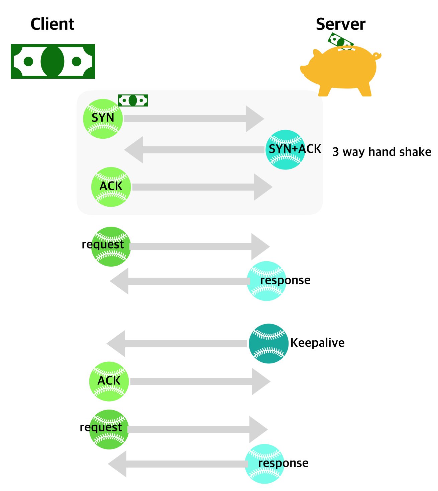
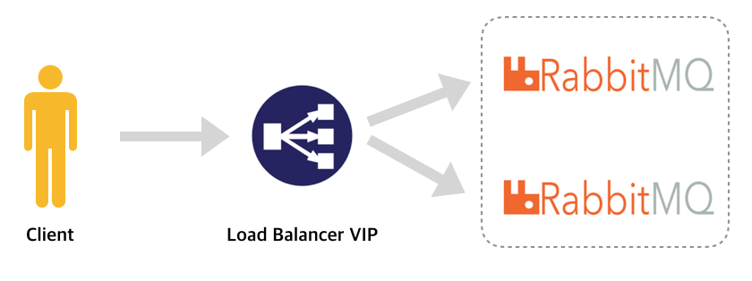
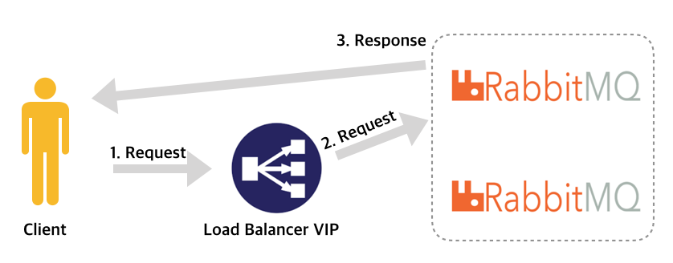
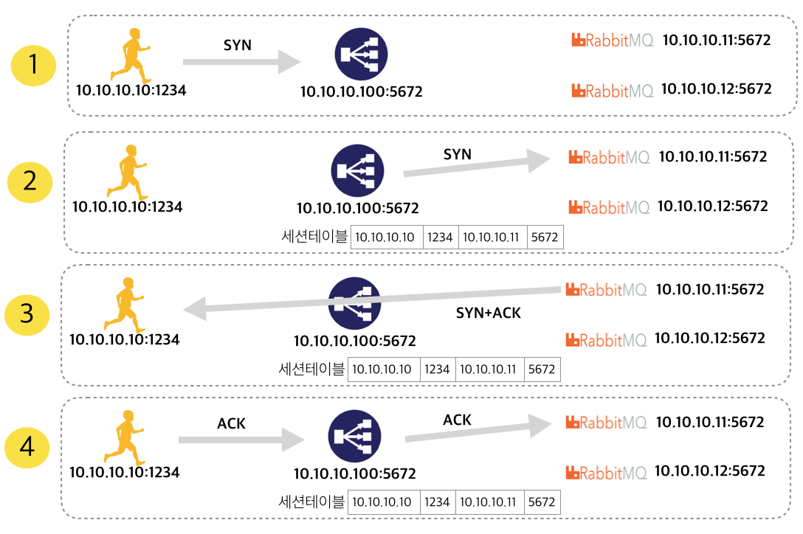
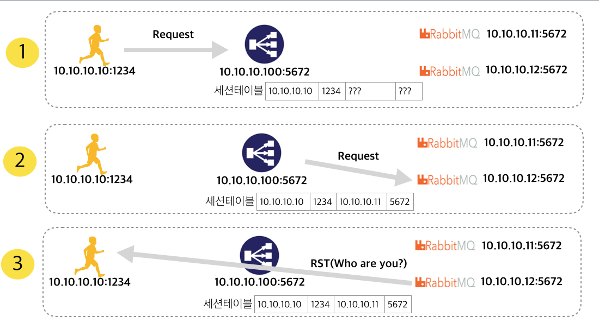

#8. TCP Keepalive를 이용한 세션 유지

***

이번 장에서는 TCP keepalive 옵션을 사용해서 TCP 기반의 통신에서 세션을 유지하는 방법을 알아보려 한다. <br/>
Keepalive라는 단어를 보고 이미 눈치챘겠지만, TCP keepalive는 두 종단 간 맺은 세션을 유지해서 통신이 일어날 때마다 유지중인 세션을 이용하게 한다. <br/>
이를 통해서 시스템이 얻는 것은 무엇인지, 그리고 주의해야할 부분들은 어떤 것이 있는지 알아볼 것이다.
<br/><br/>

 ##8-1. TCP Keepalive란?

***

TCP keepalive란 무엇일까? 7장에서 살펴본 것처럼 TCP 통신을 위해서는 3-way handshake가 필요하다. <br/>
이는 TCP통신을 위해 반드시 지켜야하는 표준 규약이며 회피할 수 있는 방법은 없다. <br/>
하지만 두 종단 간의 통신이 필요할 때마다 3-way handshake를 진행한다면, 통신량이 많고 지속적인 경우에는 상당히 불편할 것이다. <br/>
통신이 지속적으로 이뤄진다면 처음 만들어놓은 세션을 없애지 않고 계속 사용할 수는 없을까? 이런 생각에서 출발한 것이 바로 TCP Keepalive이다. <br/>

[그림 8-1 TCP Keepalive환경에서의 패킷 흐름]


<br/>
그림 8-1을 보면 TCP Keepalive는 일정 시간이 지나면 연결된 세션의 두 종단이 서로 살아있는지를 확인하는 아주 작은 양의 패킷을 하나 보낸다. 양쪽 모두에서 이 패킷을 보낼 필요는 없다. <br/> 연결을 유지하는 게 유리한 쪽에서만 진행해도 된다. <br/>
즉, 클라이언트 혹은 서버 둘중에 하나라도 이 기능을 사용한다면 세션은 유지된다. <br/>

서로 Keepalive 확인을 위한 작은 패킷을 주고 받은 후에 타이머는 다시 원래 값으로 돌아가고 카운트를 진행한다. <br/> 이런 방식으로 주기적으로 두 종단 간에 Keepalive를 확인하면서 양쪽의 세션이 끊기지 않고 유지된다.<br/>

현재 사용하고 있는 네트워크 소켓이 keepalive를 지원하는지 확인할 수 있는 방법은 무엇일까?<br/>

netstat 명령을 사용하면 된다. <br/>

* 코드 8-1 netstat을 이용해서 TCP Keepalive 타이머 확인하기 

```
# netstat -napo
root@server1:~# netstat -napo
Active Internet connections (servers and established)
Proto Recv-Q Send-Q Local Address           Foreign Address         State       PID/Program name Timer
tcp        0      0 0.0.0.0:111             0.0.0.0:*               LISTEN      576/rpcbind      off (0.00/0/0)
tcp        0      0 0.0.0.0:465             0.0.0.0:*               LISTEN      1322/master      off (0.00/0/0)
...
tcp        0      0 10.0.2.15:22            10.0.2.2:51040          ESTABLISHED 1787/sshd: vagrant  keepalive (7198.14/0/0)
...
udp        0      0 0.0.0.0:111             0.0.0.0:*                           576/rpcbind      off (0.00/0/0)
....

```
<br/>
제일 마지막 열에 있는 Timer 항목을 통해서 현재 소켓에 설정된 타이머값을 볼 수 있다. <br/>
여기서 확인할 수 있는 소켓의 타이머에는 TIME_WAIT 타이머, FIN_WAIT 타이머 등이 있으며 연결된 ESTABLISHED 상태의 소켓에서는 Keepalive 타이머를 확인할 수 있다. 
<br/>
sshd 데몬이 사용하는 소켓에 keepalive 옵션이 켜져 있고 타이머가 70초 가량 남아있다. <br/>
해당 타이머의 시간이 다 되면 연결이 살아있는지를 확인하는 작은 패킷을 하나 보낸다. <br/>
그럼 TCP Keepalive를 어떻게 사용할 수 있을까?<br/>
소켓을 생성할 때 소켓 옵션을 설정하면 된다. <br/>
소켓 옵션은 setsockopt()함수를 통해서 설정하는데, 함수의 옵션 중에 SO_KEEPALIVE를 선택하면TCP Keepalive를 사용할 수 있다. <br/>
하지만 C 언어를 통해서 직접 클라이언트와 서버를 구현하는 경우가 아니라면 보통 이런 방식을 사용하지는 않는다. <br/>
그래서 대부분의 애플리케이션에는 TCP Keepalive를 설정할 수 있는 별도의 옵션을 제공한다. <br/>
간단하게 Redis 인스턴스를 통해서 확인해보자. <br/>
서버에 직접 Redis 인스턴스를 띄우고 telnet명령을 이용해서 연결한다음 그 후의 소켓상태를 netstat 명령을 통해서 확인하면 된다. <br/>
<br/>
* 코드 8-2 netstat 을 이용해서 TCP keepalive 타이머 확인하기 

```
# netstat -napo | grep -i 6379 | grep -i est
tcp 0 0 127.0.0.1:6379  127.0.0.1:36045  ESTABLISHED 8935/./redis-server off(0.00/0/0) (1)
tcp 0 0 127.0.0.1:36045 127.0.0.1:6379  ESTABLISHED 8979/telnet   off (0.00/0/0)

```
<br/>
코드 8-2의 (1)을 보면 타이머 없이 단순하게 연결되어 있는 것을 볼 수 있다. <br/>
이 상태에서 redis-cli를 통해서 TCP Keepalive 옵션을 적용한다. <br/>
<br/>

* 코드 8-3 redis-cli를 통해서 Redis에서 TCP Keepalive기능 사용하기

```
127.0.0.1:6379> config set tcp-keepalive 100
OK
127.0.0.1:6379> config get tcp-keepalive
1) "tcp-keepalive"
2) "100"

```
<br/>

그리고 다시한번 telenet 명령을 이용해서 연결해 보자. 

* 코드 8-4 netstat을 이용해서 TCP keepalive 타이머 확인하기

```
#netstat -napo | grep -i 6379 | grep -i est
tcp 0 0 127.0.0.1:6379 127.0.0.1:36047 ESTABLISHED 8935/./redis-server keepalive(97.91/0/0) (1)
tcp 0 0 127.0.0.1:36047 127.0.0.1:6379  ESTABLISHED 9056/telnet   off (0.00/0/0)

```
<br/>
코드 8-4의 (1)을 보면 이전과는 다르게 keepalive라는 지시자가 보이며 우리가 설정한 것처럼 100초를 기준으로 타이머가 작동하고 있다. <br/>
이 명령을 입력했을 때는 97초 정도가 남아있는 상태이다. 그럼 100초가 다 지나면 정말로 패킷을 보내게 될까? <br/>
tcpdump로 6379 포트에 대한 패킷 덤프를 생성해보자. <br/>
<br/>
* 코드 8-5 tcpdump를 통해서 6379 포트의 패킷 덤프 생성하기

```
# tcpdump -i any -A -vvv -nn port 6379 -w tcp_keepalive.pcap
```

간단한 테스트를 통해서 실제로 TCP Keepalive가 이뤄지는 과정과 패킷 내용을 확인해보았다. <br/>
TCP Keepalive의 패킷은 68바이트 정도로 매우 작은 크기이기 때문에 종단 간의 세션 유지를 위해 많은 리소스가 필요치 않아서 가능하면 켜져 있는 상태로 통신하는 것이 좋다.  

<br/><br/>

 ##8-2. TCP Keepalive의 파라미터들

***

그렇다면 TCP Keepalive를 유지하는데 필요한 커널 파라미터들은 어떤 것들이 있을까? <br/>
커널에서는 총 3개의 커널 파라미터를 제공하고 있다. 
<br/>

* 코드 8-6 TCP Keepalive와 관련된 커널 파라미터들

```
root@server1:~# sysctl -a |grep -i keepalive

net.ipv4.tcp_keepalive_time = 240 (1)
net.ipv4.tcp_keepalive_probes = 3 (2)
net.ipv4.tcp_keepalive_intvl = 30 (3)
```
<br/>

(1) net.ipv4.tcp_keepalive_time : 가장 중요한 값이라고 할 수 있다. 이름이 의미하는 것처럼 keepalvie 소켓의 유지시간을 의미한다. 위 예제에서는 TCP Keepalive 옵션이 적용된 상태의 소켓은 최소한 240초는 연결을 유지한다. <br/>
타이머는 이 시간을 기준으로 동작하며 이 시간이 지나면 keepalive 확인 패킷을 보낸다. <br/>
하지만 앞절의 Redis 예제에서 살펴본 것처럼 이 값은 직접 지정할 수 있으며, 지정하지 않았을 경우에만 커널 파라미터의 값으로 적용된다. <br/>

<br/>
(2) net.ipv4.tcp_keepalive_probes: 이 값은 keepalive패킷을 보낼 최대 전송 횟수를 정의힌다. <br/>
keepalive 패킷에 한번 응답하지 않았다고 해서 바로 연결을 끊을 수는 없다. <br/>
네트워크 패킷은 다양한 원인으로 손실될 수 있으며 이에 따른 재전송 매커니즘이 있다. <br/> 하지만 그렇다고 무한정 보낼 수는 없기 때문에 tcp_keepalvie_probes 파라미터를 통해서 최대 재전송 횟수를 정의한다. <br/>
위 예제에서는 3으로 설정했기 때문에 최초의 keepalive 패킷을 포함해서 총 3번의 패킷을 보내고 그후에도 응답이 없으면 연결을 끊는다. <br/>
<br/>
(3) net.ipv4.tcp_keepalive_intvl: 이 파라미터는 keepalive 재전송 패킷을 보내는 주기를 의미한다. 처음에 설정한 tcp_keepalive_time 이 지난 후 keepalive 확인 패킷을 보내게 되는데, 이 패킷에 응답이 없으면 몇 초후에 재전송 패킷을 보낼 것인지 그값을 정의한다. <br/>

<br/>

최초 tcp_keepalive_time초 동안 기다린 후 keepalive 확인 패킷을 보내고, 최초 패킷에 대한 응답이 오지 않으면 tcp_keepalive_intvl 간격으로 tcp_keepalive_probes 번의 패킷을 더 보낸다. 그 후에도 응답이 오지 않으면 연결을 끊는다. <br/>
이런 설정은 어떤 경우에 도움이 될까? <br/>
두 종단간의 연결을 끊기 위해서는 FIN 패킷이 필요하다. <br/>
양쪽 모두 정상적으로 FIN을 주고 받아서 연결을 끊는 것이 정상적인 상황이지만, 시스템을 운영하다보면 다양한 이슈를 인해 FIN을 주고 받지 못하고 끊어지는 경우가 생긴다. <br/>
예를 들어 서버가 연결되어 있는 스위치에 장애가 발생하면 두 종단 간 연결이 끊어지지만, FIN을 전달할 방법이 없어서 계속해서 연결된 것처럼 남아있게 된다. <br/>
하지만 TCP keepalive 옵션을 사용한다면 일정 시간이 지난 후에 keepalive 확인 패킷을 보내고, 이에 대한 응답이 없다면 커널이 끊어진 세션으로 판단하고 소켓을 정리한다. 
<br/><br/>

 ##8-3. TCP Keepalive와 좀비 커넥션

***

앞에서 TCP keepalive의 의미와 파라미터를 살펴보았는데, 그렇다면 실제 서비스에서는 TCP keepalive를 어떻게 활용할 수 있을까?<br/>
TCP keepalive는 커널 레벨에서 두 종단 간의 연결을 유지하는 기능이며, 이를 통해서 불필요한 TCP  Handshakeㅇ를 줄일 수 있어 전체적으로 서비스의 품질을 높일 수 있다. <br/> 
하지만 가장 큰 효과를 볼 수 있는 부분은 잘못된 커넥션 유지, 흔히 좀비 커넥션이라고 부르는 소켓을 방지하는 기능이다. <br/>
간단한 테스트를 통해서 좀비 커넥션 방지에 대한 의미를 살펴볼 것이다. <br/>
DB 서버 한대와 애플리케이션 서버 한대가 있다고 가정해보자.<br/>
테스트 시나리오는 다음과 같다. <br/>

1. DB서버와 애플리케이션 서버를 연결한다. <br/>
2. DB서버에서 mysqld를 종료한다. <br/>
3. 다시 한번 두 서버를 연결한다. <br/>
4. iptables를 이용해서 DB 서버에서 애플리케이션으로 가는 모든 패킷을 DROP 시킨다. <br/>
5. DB 서버를 종료한다. <br/>
6. 애플리케이션 서버에서 DB 서버와의 소켓 상태를 확인한다. <br/>
<br/>
과연 어떤 일이 일어나게 될지 살펴보자. 코드 8-7은 테스트에 사용한 코드이다. <br/>
<br/>
* 코드 8-7 테스트용 애플리케이션 소스 코드

```python
#!/usr/bin/python
#-*- coding: utf-8 -*-

import MySQLdb as mdb
import sys
import time
from datetime import datetime

con = mdb.connect('dbserver', 'root', 'password', 'test');

while True : 

	cur = con.cursor()
	cur.execute("SELECT VERSION()")

	ver = cur.fetchone()

	print "Database version : %s " % ver
	time.sleep(600)

```

<br/>
DB 서버에 연결하고 간단한 쿼리를 실행한 다음 10분정도 유휴상태를 유지한다. <br/>
위 스크립트를 실행시키고 난 후 소켓 상태를 확인한다. <br/>
<br/>
* 코드 8-8 netstat으로 연결상태 확인하기

```
# netstat -napo | grep -i 3306
tcp 0 0 10.10.10.10:49480 10.10.10.11:3306 ESTABLISHED 21048/python keepalive(57.98/0/0)
```
<br/>

keepalive가 켜진 상태로 3306 포트와 연결된 것을 확인할 수 있다. <br/>
이번엔 정상적으로 mysqld를 종료시킨다. <br/>

<br/>
* 코드 8-9 mysqld 정상 종료

```
#service mysqld stop
Stopping mysqld :     [OK]
```

클라이언트의 소켓 상태는 코드 8-10과 같다. <br/>

* 코드 8-10 netstat를 통해 연결 상태 확인하기

```
# netstat -napo | grep -i 3306
tcp 1 0 10.10.10.10:49480  10.10.10.11:3306  CLOSE_WAIT 21048/python  keepalive(15.18/0/0)

```

ESTABLISHED 상태의  소켓이 CLOSE_WAIT 상태가 되었다. <br/>
이는 mysql 서버로부터 정상적으로 FIN을 받았다는 의미이다. <br/>

<br/>
** 왜 소켓이 CLOSE 되지 않고 CLOSE_WAIT 상태인 걸까? 스크립트가 sleep()을 만나서 현재 자고 있는 상태이기 때문에 명시적으로 close()를 호출하지 못해서 CLOSE_WAIT 상태에 있는 것이다.**
<br/>

여기까지는 정상적으로 mysql서버와 연결하고 해제되는 과정에 대한 테스트이다. <br/>
아직까지는 keepalive가 큰 역할을 하지는 않지만 iptables를 이용해서 DB서버와의 연결이 의도치 않게 끊어지는 상황을 재현해볼 것이다. <br/>
클라이언트를 다시 DB 서버에 연결하고 DB서버에서 해당 클라이언트로 나가는 패킷을 모두 DROP 시킨 다음 mysql 서버를 종료시킨다. <br/>
<br/>

* 코드 8-11 iptables를 통해 패킷 DROP 설정 후 mysql 종료

```
#iptables -A OUTPUT -p tcp -d 10.10.10.10 -j DROP
#service mysqld stop 
Stopping mysqld :    [OK]

```
<br/>
그러고 나서 다시 클라이언트의 소켓 상태를 살펴보자.
<br/>

* 코드 8-12 netstat를 통해 연결 상태 확인하기

```
# netstat -napo | grep -i 3306
tcp 0 0 10.10.10.10:49482  10.10.10.11:3306  ESTABLISHED 21126/python  keepalive(16.32/0/0)
```

아까와 달리 CLOSE_WAIT 상태가 아닌 ESTABLISHED 상태가 유지되고 있다. <br/>
DB서버는 분명히 종료된 상태이다.<br/>
DB 서버에서 설정된 iptables로 인해 FIN패킷을 받지 못해서, 클라이언트 입장에서는 DB서버와의 연결이 끊어졌는지 알 방법이 없다. <br/>
그래서 소켓이 여전히 ESTABLISHED 상태로 남아있는 것이다. <br/>
하지만 keepalive옵션을 활용한 소켓이기때문에 keepalive 타이머에 설정된 일정 시간이 지나면 keepalive 패킷에 대한 응답을 받지 못했기 때문에 소켓이 종료된다. <br/>


* 코드 8-13 netstat을 통해 연결 상태 확인하기

```
#netstat -napo | grep -i 3306
tcp 0 0 10.10.10.10:49482  10.10.10.11:3306 ESTABLISHED 21126/python keepalive (57.67/0/0)
tcp 0 0 10.10.10.10:49482 10.10.10.11:3306 ESTABLISHED 21126/python keepalive (42.23/0/0)
...

```
<br/>
* 와이어샤크로 패킷 덤프 확인 
<br/>

1. TCP handshake 과정<br/>

2. 마지막 통신에 대한 ACK를 서버에 보냄<br/>

3. 마지막 ACK를 보낸 후 60초 후에 Keepalive 확인 패킷을 보냄<br/>

4. 3번에서 보낸 패킷에 대한 응답을 받지 못했기 때문에 net.ipv4.tcp_keepalive_intvl에 정의된 시간(10초)만큼 경과한 후에 한번더 보낸다. <br/>

5. 6번에선 보낸 패킷의 응답을 받지 못했기 때문에 10초가 지난 후 한번 더 보낸다. 
여기까지 보내면 net.ipv4.tcp_keepalive_probes에 정의한 횟수만큼 보냈기 때문에 keepalive 확인을 위한 마지막 패킷이다. <br/>

6. keepalive에 대한 확인 패킷을 정해진 횟수만큼 보낸 후에도 응답을 받지 못했기 때문에 클라이언트는 연결이 끊어졌다고 인지하고 서버에 RST 패킷을 보낸 다음 자신의 소켓을 닫는다. <br/>
<br/>

책에서의 와이어샤크로 패킷 덤프 확인 그림을(tcp덤프파일) 보면 우리가 의도했던 대로 동작했다.<br/>
통신이 마지막으로 이루어진 90초 후에 문제를 인지하고 소켓을 닫았다. <br/>
이를 통해 클라이언트에서 발생할 수 있는 좀비 커넥션 문제를 방지할 수 있다. <br/>물론 애플리케이션에서 직접 keepalive를 관리할 수도 있다. 주기적으로 연결이 잘 되어있는지를 확인하는 형태의 로직을 추가할 수도 있겠지만 TCP keepalive를 사용하면 별도의 로직을 추가하지 않아도 커널 레벨에서 커넥션 관리를 해주기 때문에 더 편하다. 
<br/><br/>

 ##8-4. TCP Keepalive와 HTTP Keepalive

***

흔히 TCP Keepalive와 HTTP Keepalive를 혼동하는 경우가 많다. 이번절에서는 두 Keepalive의 차이점을 알아볼 것이다. <br/>
apache, nginx와 같은 웹 애플리케이션에도 keepalive timeout 이라는 것이 존재한다. <br/> HTTP/1.1에서 지원하는 keepalive를 위한 설정 항목이다. <br/>
TCP Keepalive와 용어가 비슷해서 햇갈릴 수 있지만 두 항목은 차이가 있다. <br/>
TCP keepalive는 두 종단 간의 연결을 유지하기 위함이지만, HTTP keepalive는 최대한 연결을 유지하는 것이 목적이다. <br/>
만약 두 값 모두 60초라고 한다면 TCP keepalive는 60초 간격으로 연결이 유지되었는지를 확인하고, 응답을 받았다면 계속해서 연결을 유지한다. <br/>
하지만 애플리케이션에서는 60초동안 유지하고 60초가 지난 후에도 요청이 없다면 연결을 끊는다. <br/>

가장 혼동하기 쉬운 부분은 두 값이 서로 다를 때 소켓이 어떻게 관리되는지인데, 간단히 테스트를 통해서 확인해보자. <br/>
이번에는 nginx가 아닌 아파치 웹서버로 테스트한다.<br/>
테스트 시나리오는 다음과 같다. <br/>
우선 TCP keepalive를 Apache Keepalive보다 작게 설정해서 소켓이 어떻게 관리되는지 확인해본 다음 TCP keepalive를 Apache Keepalive보다 더 크게 설정해볼 것이다. 첫번째로 TCP keepalive를 30초로, Apache Keepalive를 60초로 설정한다. <br/>

* TCP Keepalive 타이머와 Apache KeepaliveTimeout 설정하기

```
# sysctl -w net.ipv4.tcp_keepalive_time=30
#cat /etc/httpd/conf/httpd.conf | grep -i  keepalive
KeepAlive On 
KeepAliveTimeOut 60
```
<br/>
클라이언트에서 telnet을 이용해서 서버에 80포트로 연결한 후 GET 요청을 보낸다 <br/>

* 코드 8-15 telnet을 이용해서 HTTP 연결하기

```
#telnet server 80
Trying 10.10.10.10....
Connected to server.
Escape character is '^]'.
GET / HTTP/1.1
Host: server

```
<br/>
Apache의 기본 설정 페이지 내용을 html로 받아오는 것을 볼 수 있다. <br/>
그 다음 서버에서 netstat명령으로 소켓의 상태를 확인한다. <br/>

```
# netstat -napo | grep -i http | grep -i est

```

한가지 재미있는 것은 Apache는 SO_KEEPALIVE 옵션을 켠 상태로 소켓이 바인딩된다는 점이다. <br/>
뒤에 keepalive timer가 보이는 것을 통해 알 수 있다. <br/>
netstat 명령으로 확인해보면 계속해서 타이머가 줄어든다. <br/>
그리고 30초가 지나면 다시 keepalive 타이머가 30초부터 시작해서 동작한다. <br/>
마지막으로 2번째 타이머까지 모두 종료가 되는 시점, 즉 60초가 다 되면 Apache Keepalive Timeout 에 의해 서버가 먼저 클라이언트와의 연결을 종료한다. <br/>
이는 클라이언트의 메세지를 통해서 확인할 수 있다. <br/>

```
</body>
</html>
Connection closed by foreign host.
#
```
<br/>
여기까지의 흐름을 tcpdump(와이어샤크)를 통해서 확인해보자. 
<br/>

1. GET 요청이 패킷에 잡힌 것을 볼 수 있다. <br/>

2. TCP keepalive time이 30초에 한번 keepalive 패킷을 보낸다. <br/>

3. Apache Keepalive time이 60초가 지난 후 서버가 먼저 연결을 정리하기 위해 FIN을 보낸다. <br/>

<br/>
이번엔 반대로 TCP keepalive time을 Apache keepalive Timeout보다 크게 잡아보자. <br/>

```
#sysctl -w net.ipv4.tcp_keepalive_time=120
```
<br/>
역시 telnet으로 연결하고 GET요청을 보낸다.<br/> 
그후의 서버의 소켓상태는 다음과 같다. 
<br/>

```
#netstat -napo|grep -i | grep -i est
```

<br/>
설정한 대로 120초에서 타이머가 시작한다. <br/>
그리고 서서히 줄어들다가 Apache Keepalive timeout에 지정한 60초가 지나면 연결이 끊어진다. <br/>
역시 이번에도 서버가 먼저 연결을 끊는다. <br/>
두개의 테스트를 통해 TCP keepalive가 설정되어 있어도 HTTP Keepalive가 설정되어 있다면 해당 설정값에 맞춰서 동작한다는 것을 확인했다 <br/>
즉, HTTP Keepalive가 설정되어 있다면 해당 설정 값을 기준으로 의도했던 대로 동작하기 때문에 TCP Keepalive와 HTTP keepalive값이 다르다고 해도 걱정하지 않아도 된다. 
<br/><br/>

 ##8-5. Case Study - MQ 서버와 로드 밸런서

***

이번에는 서비스 중인 서버에서 발생한 이슈를 TCP Keepalive로 해결한 경우를 살펴보자. <br/>
흔히 비동기적인 작업을 처리하기 위해 MQ(Message Queue)서버를 이용하는데, MQ서버의 이중화를 위한 여러가지 방법이 있겠지만 로드 밸런서를 이용하는 방법을 택할 것이다. <br/> 
두대 이상의 서버를 클러스터링해서 사용할 수 있겠지만 결국 클라이언트는 클러스터링을 맺은 여러대의 서버 중 한대에 붙어야하고, 해당 서버에 장애가 발생했다면 소프트웨어적인 다양한 방법으로 회피할 수 있게 구현해야한다. <br/>
하지만 로드 밸런서 밑에 MQ 서버들을 둔 상태로 클러스터링을 맺어서 사용한다면, 클라이언트는 로드 밸런서에서 제공해주는 VIP를 통해서 서버에 붙으면 되기 때문에 MQ  서버 중 한두대에 문제가 생긴다고 해도 이를 소프트웨어적으로 회피하도록 구현할 필요는 없다. <br/>

[그림 8-6 로드 밸런서를 이용해서 MQ 클러스터에 연결하기]

<br/>

구성도를 그려보면 그림 8-6과 같은 구조가 된다. 아무런 이슈없이 이중화까지 잘 동작할 것 같은 이 MQ구조에 어떤 문제가 있을까?<br/>
우선 MQ 서버에 사용하지 않는 것으로 보이는 소켓들이 많이 쌓여있다 <br/>
실제로 netstat 등의 명령을 통해서 MQ 서버의 네트워크 소켓 정보를 확인해보면 너무나도 많은 소켓들이 사용되고 있음을 알 수 있다. <br/>

또한 연결되어 있다는 정보를 바탕으로 클라이언트에서 소켓정보를 보면 서버에는 ESTABlISHED로 되어 있는 소켓이 클라이언트에서는 존재하지 않는 경우도 있다.<br/>
그리고 간헐적으로 클라이언트에서 MQ서버와 통신할 때 타임아웃이 발생하는 경우도 있다 <br/>
종합해보면 클라이언트에서는 간헐적으로 타임아웃이 발생하며, 서버에서는 사용하지 않는 것으로 보이는 소켓이 ESTABLISHED 상태로 유지되고 있다는 두가지 이슈가 있다.<br/>

왜 이런 일이 발생했는지 tcpdump로 클라이언트에서 패킷들을 수집해보니 재미있는 현상을 확인할 수 있다 <br/>
타임아웃이 발생하는 순간에 클라이언트에서 서버로 발송한 패킷들에 대해 RST로 응답 패킷이 왔다. <br/>
RST 패킷은 TCP Handshake 없이 바로 데이터 전송 패킷이 전송되는 등 제대로 된 통신 규약을 지키지 않았을 때 발송하는 패킷인데, 잘 연결되어있는 소켓으로 보낸 패킷이 RST를 받는 다는 것이 뭔가 이상해 보인다. <br/>
해당 소켓은 서버에서도 ESTABLISHED로 잘 열려있는 상태이다. <br/>

사실 이 문제의 원인은 로드 밸런서의 IDLE timeout때문이다. <br/>
서버는 로드 밸런서 밑에 붙어있기 때문에 클라이언트와 서버가 통신할 때에는 로드 밸런서를 거치게 된다 <br/>
<br/>

[그림 8-8 로드 밸런서 환경에서 실제로 통신이 이루어지는 과정]

<br/>

그림 8-8과 같이 DSR(Direct Server Return)구조이기 때문에 클라이언트에서 서버로 보내는 요청은 로드 밸런서를, 서버가 클라이언트로 답을 줄때는 직접 보내게 되는데, 클라이언트가 서버로 보내는 요청에서 문제가 발생한 것이다. <br/>
이 문제를 설명하기 위해 로드 밸런서에 대해 조금더 알아보자. <br/>

** DSR(direct server return)은 로드밸런서 환경에서 서버의 응답패킷이 로드 밸런서를 통하지 않고 클라이언트에게 직접 전달되는 구조이다. 이와 반대되는 개념으로 Inline 구조가 있다. Inline구조는 서버로의 요청과 서버에서의 응답패킷이 모두 로드 밸런서를 거치는 구조이다**

<br/>
로드 밸런서는 클라이언트와 서버간 TCP handshake를 끝내고 정상적으로 맺어진 세션들을 세션 테이블에 저장한다 <br/> 그래서 두 종단간에 세션이 정상적으로 맺어져 있음을 기억하고 클라이언트의 요청을 특정 서버로 보낼 수 있다 .<br/>
이미 TCP handshake를 통해서 세션을 맺은 상태의 패킷을 다른 서버로 보내버리면 안되기 때문이다. <br/>
그리고 Idle timeout기능을 통해서 일정시간동안 사용되지 않은 세션을 세션테이블에서 정리하는 기능도 있다 <br/>
Idle timeout이 120초라면 120초 동안 패킷이 흐르지 않은 세션은 로드 밸런서의 세션 테이블에서 지워버린다. <br/>
이때 중요한 점은 로드 밸런서의 세션 테이블에서만 지워진다는 것이고 두 종단의 세션 테이블이 지워졌음을 알리는 역할은 하지 않는다. <br/>
그래서 로드 밸런서의 idle timeout 에 걸리면 클라이언트와 서버는 알아채지 못하지만 둘 사이의 세션 정보는 로드 밸런서에서 사라지게 되는 것이다 <br/>
조금더 이해하기 쉽게 로드 밸런서 환경에서의 TCP Handshake 과정을 그림으로 표현해보면 그림 8-9와 같다.<br/>
접속을 요청하는 클라이언트의 IP는 10.10.10.10, 그리고 사용하는 로컬 포트는 1234라고 가정한다 <br/>
로드밸런서가 제공해주는 VIP는 10.10.10.100, 그리고 하단의 위치한 서버들의 IP는 각각 10.10.10.11, 10.10.10.12라고 가정한다. <br/>

<br/>
[그림 8-9 클라이언트가 MQ 서버와 통신하는 과정]

<br/>
<br/>
1. 클라이언트는 맨처음 MQ를 사용하기 위해 10.10.10.100:5672로 SYN패킷을 보낸다. <br/>
2. 로드 밸런서는 클라이언트의 패킷을 확인한 후 기존 세션 정보가 있는지 확인한다. 당연히 TCP Handshake를 맺기 위해 보낸 SYN이기 때문에 기존 정보는 없다. 그럼 밸런싱 정책에 따라 하단에 위치한 서버들 중 어떤 서버에 연결 요청을 전달할 것인지 결정한다. 이때 세션 테이블에 10.10.10.10 사용자의 1234 포트에서 온 요청을 10.10.10.11 서버에의 5672포트로 전달했다고 기록해둔다. <br/>
3. 서버는 SYN패킷을 받았기 때문에 TCP Handshake를 진행함을 인지하고 SYN+ACK를 클라이언트로 보낸다. DSR 구조이기 때문에 응답 패킷은 로드 밸런서를 통하지 않고 직접 보내진다. 
<br/>
4. 클라이언트는 SYN+ACK를 받았기 때문에 이에 대한 응답으로 ACK를 보낸다. 로드 밸런서는 세션 테이블을 참고하여 기존에 SYN을 보낸 서버로 ACK를 전달하고, 이 과정이 끝나면 10.10.10.10과 10.10.10.11은 ESTABLISHED 상태의 소켓을 얻고 통신한다. (물론 10.10.10.10 입장에서는 VIP인 10.10.10.100과 연결된 것으로 본다). 그리고 로드 밸런서는 이 세션 정보를 자신의 세션 테이블에 저장한다. 
<br/>
위와 같은 과정을 통해서 두 종단간의 세션이 연결되었다면 이후의 데이터 요청 등 실제 MQ서버를 사용하기 위한 프로토콜은 로드 밸런서의 세션 테이블에 있는 정보를 바탕으로 항상 같은 서버로 전달된다. <br/>
즉, 10.10.10.10 클라이언트가 로컬 포트 1234를 사용해서 보내는 모든 요청은 10.10.10.11  서버의 5672 포트로 전달된다. <br/> 이렇게 되면 전혀 문제될 것이 없다.<br/>
하지만 위에서도 언급했지만 로드 밸런서가 가지고 있는 세션 테이블은 무한한 자원이 아니다. <br/>
일정시간 이상으로 패킷이 흐르지 않는 세션에 대해서는 Idle timeout으로 세션 테이블에서 삭제한다. <br/>

<br/>
[그림 8-10 로드 밸런서의 Idle timeout이 지난 후에 발생하는 통신 과정]

<br/><br/>
 
 1. 10.10.10.10 클라이언트는 로드 밸런서에서 세션 테이블이 지워진 상태에서도 로컬 포트 1234를 이용해서 여전히 요청을 보낸다. 클라이언트 입장에서는 세션 테이블이 지워졌다는 것을 알 수 없기 때문에 자연스러운 행동이다. <br/>
 
 2. 로드 밸런서는 세션 테이블을 찾아서 해당 패킷을 전달하려고 하지만 이미 Idle timeout이 지나버려서 저장된 연결 정보를 찾을 수 없다. 결국 밸런싱 정책에 의해 기존 서버가 아닌 다른 서버로 해당 요청을 전달한다. (기존 서버로 전달할 수도 있다. 확률상의 문제다)
<br/>
 3. 10.10.10.12 서버는 TCP handshake도 맺지 않은 서버로부터 데이터 요청 패킷이 들어오기 때문에 비정상적인 패킷이라고 판단하고 RST 패킷을 보낸다. 어떻게 보면 "너 누구니?"라는 의미로 생각할 수 있다. <br/>
<br/>
그림 8-10과 같은 과정을 통해 클라이언트는 요청을 보냈지만 제대로된 응답을 받지 못하고 RST 패킷을 받았기 때문에 TCP Handshake를 맺고 다시 요청을 보내야한다. <br/>
그리고 이때 소요되는 시간이 애플리케이션에서 설정한 타임아웃 임계치를 넘어가게 되면서 Timeout Exception을 경험하게 된다. <br/>
서비스의 특성상 사용자의 요청이 적은 새벽 시간대에는 맺어져 있는 세션으로 패킷이 흐르지 않을 가능성이 크며, 바로 이때 idle timeout에 걸려서 커넥션 풀로 열어놓은 세션들이 로드 밸런서에서 지워지는 일이 발생한다. <br/>
지워진 후에 클라이언트가 다시한번 요청을 보내면 로드 밸런서는 자신에게 연결되어있는 서버 중 아무 서버에게나 이 패킷을 전달한다. <br/> 
아주 운좋게 기존에 연결된 서버에 패킷이 전달되면 문제가 없겠지만, 그렇지 않은 경우라면 서버쪽에서는 연결도 맺지 않은 클라이언트가 데이터를 쓰겠다고 요청하니 당연히 거부 의사를 밝히게 되고, 클라이언트는 타임아웃을 경험하게 된다. <br/>
그러면 클라이언트는 자신이 현재 관리하고 있는 커넥션 풀이 잘못되어 있음을 인지하고 새롭게 커넥션을 열어서 새로운 서버와 연결한다. <br/>
문제는 기존에 연결되어 있던 서버는 클라이언트의 이런 작업을 전혀 알 수 없기 때문에 계속해서 연결되어 있다고 착각하고, 이런 경우 들이 모여서 서버쪽에 다량의 좀비 커넥션이 남게 되는 것이다. <br/>
이런 문제을 해결하기 위해 로드 밸런서의 Idle timeout에 걸리지 않도록 keepalive 관련 파라미터들을 수정했다. <br/> 로드 밸런서의 Idle timeout 은 120초였기 때문에 어떤 경우에도 120초 안에 두 종단간에 패킷이 흐르게 하기 위해서 net.ipv4.tcp_keepalive_time을 60초로 net.ipv4.tcp_keepalive_probes를 3으로, net.ipv4.tcp_keepalive_intvl을 10초로 설정했다. <br/>
이렇게 되면 중간에 패킷 유실까지 포함해도 120초 안에 충분히 체크할 수 있기 때문에 서버 측에 좀비 커넥션이 발생하는 이슈를 막을 수 있다. <br/>
RabbitMQ 서버의 경우 별다른 설정을 하지 않고 서비스를 띄운다면 TCP Keepalive는 기본 설정인 disable 상태가 된다. <br/>

 * 코드 8-20 netstat으로 소켓연결 상태 확인하기

```
#netstat -napo | grep -i est | grep 5672
tcp   0  0  172.17.245.239:5672  172.31.5.250:61921
ESTABLISHED 2015/beam.smp   off(0.00/0/0)
```

이런 설정 상태라면 net.ipv4.tcp_keepalive_time을 아무리 설정해도 영향이 없다. <br/>
소켓 자체가 SO_KEEPALIVE 설정을 하지 않은채 동작하는 설정이기 때문이다. <br/>
그래서 RabbitMQ의 경우 반드시 아래 옵션을 추가해서 실행해야 한다. <br/>
<br/>
* 코드 8-21 RabbitMQ환경 설정에서 TCP Keepalive를 사용하도록 설정하기

```
[ 
 { rabbit, 
	[
	 {tcp_listen_options, [{backlog, 1024}, {keepalive, true}]},
	... 이후는 서비스에 따라 설정..
        ]
  }
].
```
<br/>
다시 확인해보면 keepalive 설정이 다음과 같이 되어있다. (코드 8-22)
<br/>

* 코드 8-22 netstat으로 소켓 연결 상태 확인하기

```
# netstat -napo | grep -i est | grep 5672
tcp   0   0 172.17.245.239:5672   172.31.5.250:61928  ESTABLISHED
11016/beam.smp   keepalive (56.12/0/0)
```

이제 의도대로 TCP_keepalive가 동작하게 되고 로드 밸런서에서도 세션이 유지된다. 
 

<br/><br/>

 ##8-6. 요약

***

이번 장에서는 TCP 종단간의 연결 유지를 위한 TCP Keepalive에 대해 살펴보았다. <br/>
TCP Keepalive는 특히 네트워크 단절 등 여러가지 이유로 발생할 수 있는 좀비 커넥션을 방지하는데 큰 도움이 된다.<br/>
TCP 환경은 언제든지 패킷 손실이 일어날 수 있으며 FIN패킷도 손실될 수 있다. <br/>
물론 재전송을 통해서 손실된 패킷을 다시 보낼 수 있지만, 여러가지 이유로 그마저도 되지 않는 경우도 많다. <br/>
그래서 커널은 TCP keepalive라는 기능을 제공해서 종단 간의 세션을 유지하거나, 비정상적인 소켓이라고 판단되면 정리할 수 있도록 도와준다. <br/>
다양한 애플리케이션들에서 TCP Keepalive를 지원하며, 필요하다고 판단되면 해당 애플리케이션에서 어떻게 TCP Keepalive 옵션을 켤수 있는지 찾아서 설정해주어야한다. <br/>

이번장에서 배운 내용은 다음과 같다. <br/>

1. TCP Keepalive는 커널 레벨에서 종단 간의 세션을 유지시켜주는 기능을 한다. <br/>
2. net.ipv4.tcp_keepalive_time은 두 종단간의 연결이 유지되어있는지를 확인하는 Keepalive패킷을 보내는 주기를 설정한다. <br/>
3.  net.ipv4.tcp_keepalive_probes는 keepalive 패킷에 대한 응답을 받지 못했을 때 추가로 보내는 패킷의 개수를 지정한다. 최초에 보낸 패킷의 개수도 이값에 포함된다. <br/>
4. net.ipv4.tcp_keepalive_intvl은 keepalive패킷에 대한 응답을 받지 못해서 재전송 패킷을 보낼 때 필요한 주기를 설정한다. 최초의 keepalive패킷이 실패하면 intvl에 설정된 시간을 주기로 다시 보내게 된다. <br/>
5. TCP keepalive 설정을 이용하면 연결이 끊어졌는데도 FIN 패킷을 받지 못해 정리되지 않고 남아있는 좀비 커넥션을 없앨 수 있다. <br/>
6. HTTP Keepalive가 설정되어 있다면 TCP Keepalive 설정 값과 다르다고 하더라도 의도한 대로 정상적으로 동작한다. <br/>
7. 로드 밸런서를 사용하는 환경에서 TCP기반의 서비스를 하는 경우에는 반드시 TCP Keepalive를 설정해야한다. <br/>

<br/><br/>


