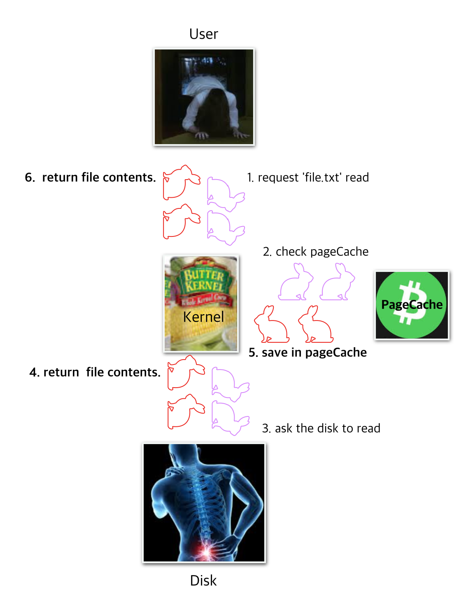
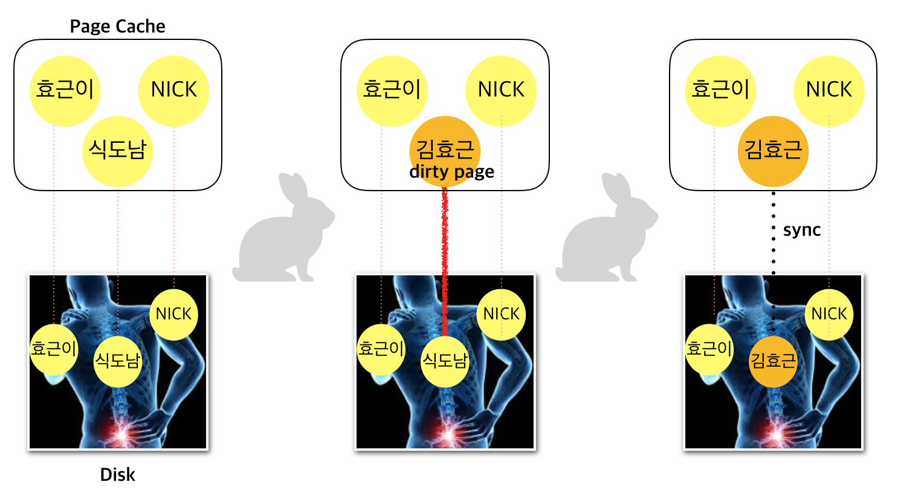
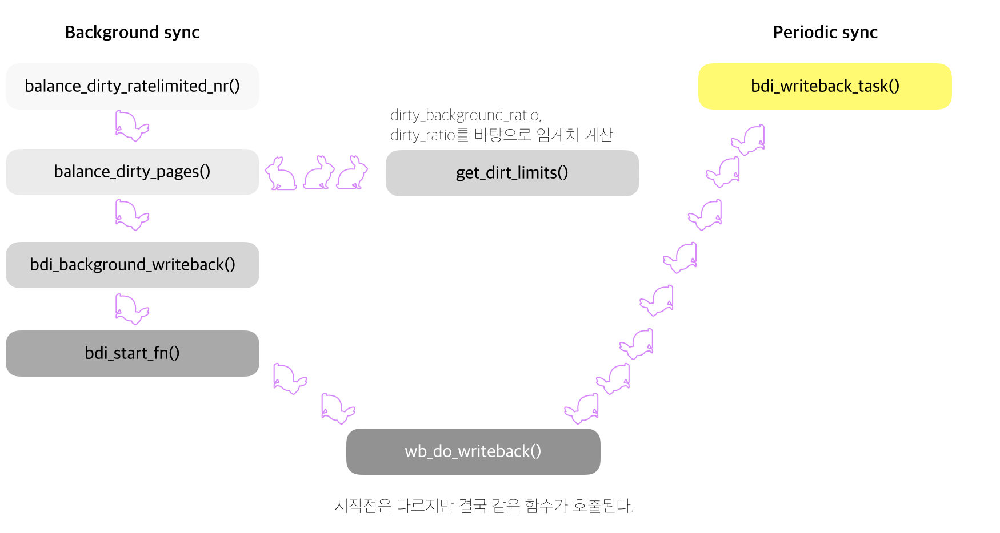

#10. dirty page가 I/O에 끼치는 영향

***

4장에서 /proc/meminfo에 대한 이야기를 할 때 잠깐 언급하고 지나간 내용 중에 Dirty라고 표시된 부분이 있는데 이 영역은 dirty page라 불리는 커널의 메모리 영역 중 일부를 의미한다. <br/> 이번 장에서는 dirty page가 무엇인지, 어떻게 생성되는지 그리고 이 dirty page가 I/O에서 어떤 영향을 끼치는지에 대해 알아볼 것이다.

<br/><br/>

 ##10-1. dirty page란?

***

앞서 배운 내용을 떠올려보자. 리눅스에서 파일 I/O가 일어날 때 커널은 PageCache를 이용해서 디스크에 있는 파일의 내용을 메모리에 잠시 저장하고, 필요할 때마다 메모리에 접근해서 사용한다고  배웠다. 이를 통해서 디스크보다 더 빠른 메모리의 접근 속도를 활용할 수 있고, 전체적으로 시스템의 성능을 향상시킬 수 있다. <br/>
<br/>
[그림 10-1 파일 읽기 작업이 발생할 때의 과정]


<br/>


그림 10-1을 보면 커널은 PageCache를 디스크 내용을 저장하는 일종의 임시 저장공간으로 활용한다. 헌데 10-1은 읽기 작업에 대한 예제인데, 만약 쓰기 작업이 이뤄진다면 어떻게 변할까? <br/><br/>

[그림 10-2 쓰기 작업이 일어날 때 pagecache의 변화]


<br/>

그림 10-2를 보면 세개의 파일이 PageCache에 올라가 있으며 1:1로 대응하고 있다. 물론 실제 구성은 이보다 더 복잡하지만 이해를 돕기 위해 간략하게 표현했다. 이 상태에서 b파일에 쓰기 작업이 이루어졌다고 가정해보자. 식도남 파일의 내용이 김효근으로 바뀌었으며 이 상태에서 보면 식도남 파일의 내용은 디스크와 pagecache의 내용과 서로 다르다. 그래서 커널은 해당 메모리 영역에 대해 디스크의 내용과 달라졌음을 표시하는 Dirty비트를 켜고 바로 이영역을 Dirty page라고 부른다. <br/>

즉, Dirty page는 Pagecache에 있는 페이지 중에서도 쓰기 작업이 이루어진 메모리라고 볼 수 있다. 앞에서도 이야기했지만 이 상태에서는 아직 pagecache와 디스크 사이의 내용이 다르기 때문에 전원 장애등으로 시스템이 꺼져 버린다면 미처 디스크에 쓰지 못한 내용은 날아가게 되며 파일의 내용에 대한 정합성이 깨져 버린다. 하지만 dirty page로 표시된 메모리들을 dirty page가 생성될때마다 디스크에 쓰면 이 또한 상당량의 쓰기 I/O를 일으켜서 성능을 저하시킬 수 있다. <br/>
그래서 커널은 몇가지 조건을 만들어서 해당 조건을 만족시키면 dirty page를 디스크로 동기화한다. <br/>
이 과정을 ** page writeback ** 이라고 부르며, dirty page 동기화라고 한다. <br/>
커널 버전에 따라서 다르겠지만 보통 flush라는 단어가 들어간 커널 스레드( pdflush, flush, bdflush 등)가 이 작업을 진행한다. 
<br/>
그래서 I/O가 많이 발생하는 서버에서는 dirty page를 언제 얼마나 동기화시키느냐가 중요한 성능 튜닝의 요소가 된다. 그리고 커널에서는 서버의 워크로드에 따라 가장 적합한 동기화 전략을 구사할 수 있도록 파라미터로 조절할 수 있는 인터페이스를 제공하고 있다.

<br/>
그럼 다음 절부터 해당 파라미터들을 하나씩 살펴보면서 변경에 따라 커널의 동작이 어떻게 바뀌는지 살펴보자. 
<br/><br/>

 ##10-2. dirty page 관련 커널 파라미터

***

dirty와 관련된 커널 파라미터는 총 6개가 있다. <br/>

```
#sysctl -a | grep -i dirty

vm.dirty_background_ratio = 10
vm.dirty_background_bytes = 0
vm.dirty_ration = 20
vm.dirty_bytes = 0
vm.dirty_writeback_centisecs = 500
vm.dirty_expire_centisecs = 1000

```
<br/>

 첫번째로 살펴볼 파라미터는 vm.dirty_background_ratio이다. dirty page의 내용을 백그라운드로 동기화할 때 그 기준이 되는 비율을 의미한다. 전체 메모리 양에 해당 파라미터에 설정되어있는 비율을 곱해서 나온 기준값보다 dirty page 크기가 커지면 백그라운드에서 dirty page의 내용을 디스크로 동기화한다. 만약 이 값이 10이고 전체 메모리가 16GB라고 가정한다면, dirty page의 크기가 1.6GB가 되었을 때 백그라운드 동기화를 진행한다. <br/>

 두번째로 살펴볼 파라미터는 vm.dirty_background_bytes이다. vm.dirty_background_ratio와 비슷해 보이지만 ratio는 전체 메모리 대비 비율을, bytes는 절대적인 bytes의 값을 의미한다. 만약 이값이 65535라면 dirty page의 크기가 65536bytes가 되었을 때 동기화한다. <br/>

 세번째, vm.dirty_ratio이다. vm.dirty_background_ratio와 비슷하게 전체 메모리를 기준으로 dirty page의 비율을 산정하지만 background라는 단어가 빠져있음을 눈여겨 봐야한다. 만약 이값이 10으로 설정되어 있고 전체 메모리가 16GB라고 가정한다면, A라는 프로세스가 I/O 작업을 하던 중 dirty페이지의 크기가 1.6GB가 되면 해당 프로세스의 I/O 작업을 모두 멈추게 하고 dirty page를 동기화한다. dirty page에 대한 일종의 hard limit라고 볼 수 있다. <br/>

 네번째, vm.dirty_bytes이다. vm.dirty_ratio와 같은 방식으로 사용되지만 비율이 아니라 절대적인 bytes의 양을 기준으로 한다. <br/>

 다섯번째, vm.dirty_writeback_centisecs이다. 이 값은 flush 커널 스레드를 몇초 간격으로 깨울 것인지를 결정한다. 설정되는 값은 1/100초 값이기 때문에 5초로 설정하고 싶다면 500*(1/100)으로 표시한다. 이렇게 하면 5초에 한번 flush 커널 스레드가 깨어나서 동기화하게 된다. <br/>

 마지막으로 살펴볼 파라미터는 vm.dirty_expire_centisecs이다. 이 값도 flush커널 스레드의 동작에 영향을 미친다. vm.dirty_writeback_centisecs 값에 의해 깨어난 flush 커널 스레드가 디스크에 싱크 시킬 dirty page의 기준을 찾을 때 이 값을 사용한다. 이 값도 1/100초 값이며 만약 3000으로 표시되어 있다면 30초를 의미한다. 그래서 dirty page로 분류된 후 30초 동안 디스크로 동기화하지 않은 페이지들을 디스크에 동기화시킨다. <br/>

 이렇게 총 6가지 커널 파라미터를 통해서 dirty 페이지가 디스크에 동기화된다. 사실 이 값들이 완전히 독립적으로 동작하지는 않는다. 예를 들어 vm.dirty_writeback_centisec과 vm.dirty_expire_centisec이 짧다면 flush데몬이 자주 깨어나 대부분의 dirty page를 동기화시키기 때문에 vm.dirty_background_ratio에 설정한 값만큼 커지지 않을 수도 있다.<br/>

그럼 다음 절에서 dirty page 동기화가 일어나는 과정과 그 과정에서 각각의 파라미터가 끼치는 영향을 알아보자. 
<br/><br/>

 ##10-3. 백그라운드 동기화

***

dirty page 동기화는 크게 백그라운드 동기화와 주기적인 동기화, 그리고 명시적인 동기화 세가지로 구분할 수 있다. <br/>
<br/>

 * 백그라운드 동기화 

 동기화 작업이 백그라운드로 진행되는 것을 의미한다. 커널 파라미터 중에 vm.dirty_background_ratio와 vm.dirty_ratio를 통해서 조절할 수 있다. 엄밀히 말하면 vm.dirty_ratio값을 넘어섰을때 발생하는 동기화는 백그라운드 동기화는 아니지만, 명령어에 의해 명시적으로 이루어지는 동기화는 아니기 때문에 함께 분류했다. 이 작업은 애플리케이션이 dirty page를 생성할 때마다 현재까지 생성된 dirty page와 전체 메모리의 비율을 바탕으로 진행된다. <br/>

 * 주기적인 동기화

 동기화 작업이 주기적으로 진행되는 것을 말하며 커널 파라미터 중에 vm.dirty_writeback_centisec, vm.dirty_expire_centisecs를 통해서 조절할 수 있다. 이 값들을 조절해서 dirty page를 동기화하기 위해 필요한 flush 데몬을 깨우는 주기와 깨웠을 때 동기화시키는 dirty page의 기준을 설정할 수 있다. <br/>

 * 명시적인 동기화
 
 명령어를 통해 명시적으로 동기화시키는 것을 말한다. sync, fsync 등의 명령어를 이용하면 현재 생성된 dirty page를 명시적으로 디스크에 쓰는데, 이런 작업을 명시적인 동기화라고 표현한다. 

 이번절에서는 백그라운드 동기화와 주기적인 동기화를 살펴볼 것이다. 커널의 동작을 추적하기 위해 우선 ftrace를 이용할 수 있는 환경을 설정한다. <br/>

<br/>

* 코드 10-2 ftrace 설정하기 

```
# mount -t debugfs debugfs /sys/kernel/debug
tracing# echo function > ./current_tracer   (
```

설정 후에 cat 명령을 통해서 커널 함수가 잘 찍히는지 확인한다. <br/>

* 코드 10-3 trace_pipe 파일을 통해서 커널 함수 호출 확인하기

```
tracingroot@server1:/sys/kernel/debug/tracing# cat -v ./trace_pipe | grep -i irqbalance      

irqbalance-1198  [001] ....  1958.108970: mutex_lock <-irq_lock_sparse
irqbalance-1198  [001] ....  1958.108971: _cond_resched <-mutex_lock
irqbalance-1198  [001] ....  1958.108973: irq_to_desc <-show_interrupts
irqbalance-1198  [001] ....  1958.108975: irq_unlock_sparse <-show_interrupts

```

먼저 백그라운드 동기화를 살펴보기 위해 주기적인 동기화가 일어나지 않도록 vm.dirty_writeback_centisecs 값을 0으로 설정한다. 그리고 백그라운드 동기화가 조금더 빨리 일어날 수 있도록 vm.dirty_background_ratio 값을 1로 설정한다. 
<br/>
<br/>

* 코드 10-4 커널 파라미터 조절하기 

``` 
root@server1:/sys/kernel/debug/tracing# sysctl -w vm.dirty_writeback_centisecs=0vm.dirty_writeback_centisecs = 0
root@server1:/sys/kernel/debug/tracing# sysctl -w vm.dirty_background_ratio=1
vm.dirty_background_ratio = 1

```

테스트에 사용한 프로그램은 코드 10-5와 같다. <br/>
<br/>

* 코드 10-5 dirty page 동기화 테스트 프로그램

```c

#include <stdlib.h>
#include <stdio.h>
#include <fcntl.h>

#define MEGABYTE 1024*1024

int main(){

int output_fd;
char message[MEGABYTE] = "";
char file_name[] = "./test.dump";

int count = 0;

output_fd = open(filename, O_CREAT | O_C_RDWR | O_TRUNC);

for(;;){
 count++;
 write(output_fd, message, MEGABYTE);
 printf("Write File - Current Size : %d KB\n", count*1024);
 sleep(1);
 }

 return 0;
}


``` 

<br/>
코드 10-5의 테스트 프로그램은 초당 1MB의 쓰기 작업을 일으키도록 동작한다. <br/>
그리고 dirty page의 변화도 확인할 수 있는 스크립트도 준비한다. (코드 10-6)
<br/>

* 코드 10-6 dirty page 변화를 확인하는 스크립트 

```
root@server1:~/test# cat show_dirty.sh 
#!/bin/bash

while true
do 
 cat /proc/meminfo | grep -i dirty
 sleep 1

done

```

시스템의 메모리는 8GB이고 vm.dirty_background_ratio 값이 1이기 때문에 80MB 수준의 dirty page가 쌓이면 백그라운드 동기화가 시작된다. 테스트를 통해서 확인해보자. (코드 10-7) <br/>

<br/>
* 코드 10-7 dirty page 변화 확인하기

```
* 터미널 1
#gcc -o test test_dirtypage.c
#./test

* 터미널 2

#./show_dirty.sh
Dirty:              1036 kB
Dirty:              2060 kB
Dirty:              3084 kB
Dirty:                 0 kB
Dirty:              1032 kB
Dirty:              2012 kB
Dirty:              3084 kB
Dirty:                 0 kB

```
테스트 결과를 보면 80MB를 조금 넘긴 후에 백그라운드 동기화가 일어나서 dirty page가 없어진 것을 확인할 수 있다. 당시의 ftrace 결과를 보면 코드 10-8과 같다. 
<br/>
* 코드 10-8 ftrace 결과 확인하기

```
io_test-8834 [001] 13986.088241: balance_dirty_pages_ratelimited_nr <- generic_file_buffered_write
...
io_test-8834 [001] 13987.099072: writeback_in_progress <-balance_dirty_pages
...
```

여기서 재미있는 함수를 확인할 수 있다. balance_dirty_pages_ratelimited_nr()함수와 balance_dirty_pages()라는 함수가 보인다. ftrace의 결과를 grep balance_dirty_pages 명령으로 필터링해보면 다수의 balance_dirty_pages_ratelimited_nr()함수가 호출된 후 중간 중간에 balance_dirty_pages()함수가 호출되는 패턴이다. 그리고 balance_dirty_pages_ratelimited_nr()함수는 generic_file_buffered_write()함수에 의해 호출된다. 그래서 dirty page를 생성하는 모든 프로세스들은 쓰기 작업이 이뤄질 때마다 balance_dirty_pages_ratelimited_nr()함수를 호출하게 되며 이 함수는 내부적으로 balance_dirty_pages()함수를 호출한다는 것을 알 수 있다. <br/>

커널의 소스 코드를 확인해보자. 해당함수는 mm/page-writeback.c 파일에 있다. <br/>

*  코드 10-9 balance_dirty_pages_rate

```c
void balance_dirty_pages_ratelimited_nr(struct address_space *mapping, unsigned long nr_pages_dirtied) 
{
	unsigned long ratelimit;
	unsigned long *p;
	ratelimit = ratelimit_pages;
	if(mapping->backing_dev_info -> dirty_exceeded)
		ratelimit = 8;

	preempt_disable();
	p = &__get_cpu_var(bdp_ratelimits);
	*p += nr_pages_dirtied;
	if(unlikely(*p >= ratelimit)) {
		ratelimit = sync_writeback_pages(*p);
		*p = 0;
 		preempt_enable();
		balance_dirty_pages(mapping, ratelimit);
		return;
	}
	preempt_enable();
}
```
사실 dirty page가 생성될 때마다 시스템의 모든 dirty page를 검사하고 확인하는 과정을 거치면 오버헤드가 크기 때문에 일정 수준이상이 되었을 때만 확인과정을 거치도록 비율을 이용해 제한을 주는 함수이다. 그래서 ratelimit 라는 변수의 값을 이용해 해당 프로세스가 생성하는 dirty page 의 크기가 일정 수준을 넘어서면 그제서야 비로서 balance_dirty_pages()함수를 호출해서 시스템의 모든 dirty page의 크기를 바탕으로 동기화가 필요한지 여부를 확인한다. 아주 적은양의 dirty page를 생성했는데 전체 시스템의 dirty page 크기를 계산해서 비교하게 되면 그것은 그것대로 시스템에 부하를 일으킬 수 있기 때문이다. 그럼 초기 비교대상이 되는 ratelimit_pages의 값은 어떻게 결정될까? 같은 파일 안에 writeback_set_ratelimit()라는 함수를 통해 결정된다. <br/>

* 코드 10-10 writeback_set_ratelimit() 함수의 소스 코드

```c
void writeback_set_ratelimit(void)
{
	ratelimit_pages= vm_total_pages / (num_online_cpus() * 32);
	if(ratelimit_pages <16)
	   ratelimit_pages = 16;
	if(ratelimit_pages * PAGE_CACHE_SIZE > 4096 * 1024)
	   ratelimit_pages = (4096 * 1024) / PAGE_CACHE_SIZE;
}
```

시스템의 CPU 수와 메모리 크기에 따라 다를 수 있겠지만, 특정 값을 넘어서는 큰 값이 될 경우 보통은 1024로 지정된다. PAGE_CACHE_SIZE의 값은 page의 크기와 같은 4KB이기 때문에 ratelimit_pages 값이 1024가 된다면 4MB의 쓰기 작업이 이루어질 때마다 balance_dirty_pages()함수가 호출된다고 볼 수 있다. <br/>

balance_dirty_pages_ratelimited_nr()함수를 통과하고 balance_dirty_pages() 를 성공적으로 호출하게 되면 본격적인 dirty page 크기 확인과 임계치 값을 확인하는 과정이 진행된다. 코드 10-11은 balance_dirty_pages()의 일부다. <br/>
<br/>

* 코드 10-11 balance_dirty_pages()함수의 소스 코드 

```c
static void balance_dirty_pages(struct address_space *mapping, unsigned long write_chunk)
{

  long nr_reclaimable, bdi_nr_reclaimable;
  long nr_writeback, bdi_nr_writeback;
  unsigned long background_thresh;
  unsigned long dirty_thresh;
  unsigned long bdi_thresh;
  unsigned long pages_written = 0;
  unsinged long pause = 1;

  struct backing_dev_info *bdi = mapping->backing_dev_info;
  
  for(;;){
	...
	...
	//설정한 vm.dirty_background_ratio와 vm.dirty_ratio가 사용되는 핵심 부분이다. 
       //get_dirty_limits함수로 백그라운드 동기화를 진행해야하는 dirty page의 수를 가져온다.
        // 이때 설정한 커널 파라미터 값을 이용해 계산한다. 
	get_dirty_limits(&background_thresh, &dirty_thresh, 
			  &bdi_thresh, bdi);

	if(bid_nr_reclaimable + bdi_nr_writeback <= bdi_thresh)
		break;

	...
	...

	// get_dirty_limits()함수로 가져온 값을 바탕으로 백그라운드 동기화 프로세스를 동작시킬지 아니면 프로세스를 잠시 멈추고 dirty page를 동기화 시킬지를 결정한다. 
       // 너무 많은 dirty page가 생성되었다면 즉 백그라운드 동기화로 비우는 속도보다 dirty page가 생성되는 속도가 더 빠르다면 
      //dirty page의 수가 일정 수준 이하로 내려올 때까지 프로세스의 쓰기 동작을 막아서 dirty page를 생성하지 못하도록 한다. 
      // 이 과정에서 성능저하가 가장 많이 일어난다. 
	if(nr_reclaimable + ne_writeback < (background_thresh + dirty_thresh) /2) 
	break;

	if(!bdi-> dirty_exceeded)
		bdi -> dirty_exceeded = 1;

	...
	...

	//위에서 설명한 프로세스 멈춤이 일어나는 부분이다. 
	trace_wbc_balance_dirty_wait(&wbc, bdi);
	__set_current_state(TASK_KILLABLE);
	io_schedule_timeout(pause);

	pause <<= 1;
	if(pause > HZ /10)
		pause = HZ/10;

	if(fatal_signal_pending(current))
		break;

	}
```
<br/>
다음으로 get_dirty_limits()함수를 살펴보자. 위에서 설정한 커널 파라미터들이 실제로 적용되는 부분이기도 하다. (코드 10-12)
<br/>
* 코드 10-12 get_dirty_limits()함수의 소스 코드

```c
void get_dirty_limits(unsinged long *pbackground, unsigned long *pdirty, unsinged long *pbdi_dirty, struct backing_dev_info *bdi)
{ 

   unsigned long background;
   unsigned long dirty;
   unsigned long available_memory = determine_dirtyable_memory();
   struct task_struct *tsk;
   int dirty_ratio = 0;

   if(vm_dirty_bytes) (1)
	dirty = DIV_ROUND_UP(vm_dirty_bytes, PAGE_SIZE);
   else {
	dirty_ratio = vm_dirty_ratio;
	if(dirty_ratio < 5) (2)
		drity_ratio = 5;
	dirty = (dirty_ratio * available_memory) / 100; (3)
   }

  if(dirty_background_bytes) (1)
	background = DIV_ROUND_UP(dirty_background_bytes, PAGE_SIZE);
  else
	background = (dirty_background_ratio * available_memory)/100; (3)

  if(background >= dirty) (4)
	background = dirty /2;
 
  ....

  if(bdi){
	u64 bdi_dirty;
	long numerator, denominator;

	...

  }

}

```

<br/>
(1) 각각 vm.dirty_background_bytes, vm.dirty_bytes 값이 있는지를 확인하는 로직이다. 
이 값들이 있다면 vm.dirty_background_ratio 와 vm.dirty_ratio는 무시된다. 즉 위 값들은 동시에 적용이 불가능하며 하나만 사용할 수 있다. <br/>
<br/>
(2) if문을 통해서 vm.dirty_ratio의 값이 5보다 작아지면 5로 강제 설정된다. <br/>
이 값은 프로세스를 잠시 재우고 dirty page를 강제로 비우게 하기 때문에 성능에 영향을 미칠 수 있다. 그래서 너무 작은 값으로 설정하면 성능이 저하될 수 있어서 최소한 5 밑으로 내려가지 못하도록 일종의 방어 코드를 구현한 것이다. <br/>
<br/>
(3) 실제로 우리가 설정한 값이 전체 메모리에서 몇개의 pages로 구성되는지 계산하는 부분이다. available_memory메모리는 메모리의 크기를 의미하지 않고 전체 메모리의 page 개수를 의미하기 때문에 위에 계산된 값은 page 수를 의미한다. <br/>
<br/>

(4) 이 부분도 중요하다. vm.dirty_background_ratio가 vm.dirty_ratio보다 크게 설정되면 어떻게 될까? 이 코드를 보면 그에 대한 방어 로직이 있다는 것을 알 수 있다. background 값이 dirty 값보다 커지면 background값은 dirty 값의 절반으로 설정된다. 그래서 사용자가 실수로 vm.dirty_background_ratio를 크게 설정해도 로직에 의해 자동으로 vm.dirty_ratio의절반값으로 재설정된다. <br/>

<br/>
다시 balance_dirty_pages()함수로 돌아와서 마지막 부분을 조금더 살펴보자. <br/>

* 코드 10-13 balance_dirty_pages()함수의 소스 코드(일부)

```c
	if((laptop_mode && pages_written) ||
	   (!laptop_mode && ((global_page_state(NR_FILE_DIRTY)
			+ global_page_State(NR_UNSTABLE_NFS))
				> background_thresh)))
	(1)  bdi_start_background_writeback(bdi);
}

```
<br/>

(1) vm.dirty_ratio를 넘지않고 vm.dirty_background_ratio를 넘으면 실행되는 부분이다. bdi_start_background_writeback()함수를 통해 해당 블록 디바이스에 해당하는 inode들이 dirty page를 쓰게 된다. 백그라운드 동기화의 과정에서 사실상 가장 중요한 부분이다. 우리가 설정한 임계치 이상으로 dirty page가 생성되었음을 확인하고, 이를 동기화하기 위해 flush 커널 스레드를 깨우게 된다. <br/>

이번에는 bdi_start_background_writeback()함수를 살펴보자. (코드 10-14)
<br/>
* 코드 10-14 bdi_start_background_writeback()함수의 소스 코드

```c

void bdi_start_background_writeback(struct backing_dev_info *bdi)
{
	__bdi_start_writeback(bdi, LONG_MAX, true, true);
}
```

<br/>

* 코드 10-15  __bdi_start_writeback()함수의 소스 코드

```
static void
__bdi_start_writeback(struct backing_dev_info *bdi, long nr_pages, bool range_cyclic, bool for_background)
{

	struct wb_writeback_work *work;

	work = kzalloc(sizeof(*work), GFP_AOIMIC);
	if(!work){
		if(bdi->wd.task){	
			trace_writeback_nowork(bid);
			wake_up_process(bdi->wb.task); (1)
		}
		return;
	}

	work->sync_mode 	= WB_SYNC_NONE;
	work->nr_pages		= nr_pages;
	work->range_cyclic 	= range_cyclic;
	work->for_background  = for_background;

	bdi_queue_work(bdi, work); (2)

}
```

(1) wake_up_process() 함수를 이용해서 flush 커널 스레드를 깨운다. 
<br/>
(2) 깨운 커널 스레드에 넘겨줄 작업과 관련된 정보를 구조체로 만들어서 큐에 넣는다. <br/>
<br/>
마지막으로 확인할 부분은 wake_up_process()로 깨우는 커널 스레드가 실행하게 될 함수가 무엇인가이다. 소스코드를 flush와 kthread라는 문자열로 grep 명령을 통해 필터링해보면 의미있는 소스 코드를 발견할 수 있다. 바로 mm/back-dev.c 파일에 있는 bdi_forker_task()함수이다. <br/>
<br/>
* 코드 10-16 bdi_forker_task() 함수의 소스 코드(일부)

```c
static int bdi_forker_task(void *ptr)
{
...
	wb->task = kthread_run(bdi_start_fn, wb, "flush-%s", dev_name(bid->dev));
...
}

```

해당 코드를 보면 bdi_start_fn()이라는 함수를 flush 커널 스레드의 시작점으로 설정하는 것을 알 수 있다. 

<br/>

* 코드 10-17 bdi_start_fn()함수의 소스 코드(일부)

```c
static int bdi_start_fn(void *ptr)
{
...
	if(!list_empty(&bdi->work_list))
		wb_do_writeback(wb, 1);

	wb->task = NULL;
	return ret;
}
```

그리고 bdi_start_fn()함수는 wb_do_writeback()함수를 호출한다. 이 함수는 이후에도 나오는 아주 중요한 함수이니 꼭 기억해두자. 이 함수를 통해서 실제로 동기화가 일어난다. <br/>

지금까지 백그라운드로 dirty page가 동기화되는 과정을 살펴보았다. 다른 과정들보다 더 중요하게 다루고 자세히 설명하는 이유는 vm.dirty_background_ratio와 vm.dirty_ratio값들의 활용 방법과 각각의 값에 대한 방어 로직 구성을 파악하는 것이 그만큼 중요하기 때문이다. <br/>
<br/>
다음으로 주기적인 동기화를 살펴보자. 이번에는 백그라운드 작업이 영향을 끼치지 않도록 큰 값으로 설정한 후 테스트해보자. <br/>

* 코드 10-18 커널 파라미터 변경하기

```
# sysctl -w vm.dirty_background_ratio=20
# sysctl -w vm.dirty_background_ratio=40
# sysctl -w vm.dirty_writeback_centisecs=500
# sysctl -w vm.dirty_expire_centisecs=1000

```
<br/>
위와 같이 설정하면 flush 커널 스레드가 5초에 한번 깨어나서 생성된지 10초가 넘은 dirty page들을 동기화 하게된다. 그렇게 동작하는지 살펴보자.
<br/>

* 코드 10-19 dirty page 현황 확인하기 

```
Dirty:               416 kB
Dirty:              1868 kB
Dirty:              3048 kB
Dirty:              4080 kB
Dirty:              5104 kB
Dirty:              6144 kB
Dirty:              7188 kB
Dirty:              8164 kB
Dirty:              9212 kB
Dirty:             10240 kB
Dirty:             11264 kB
Dirty:             12292 kB
Dirty:               396 kB
Dirty:               676 kB
Dirty:              1928 kB
```

1초에 한번씩 1MB씩 쓰기 작업을 하기 때문에 flush 커널스레드가 깨어나는 타이밍과 맞으면 10~15MB 사이에서 dirty page가 유지된다. 이때의 ftrace 결과를 보면 코드 10-20과 같다. <br/><br/>


** flush커널 스레드가 깨어나는 순간 생성된지 10초 이상된 dirty page가 동기화되는데, 동기화작업은 inode를 기준으로 발생하기 때문에 10초 이상된 dirty page가 포함된 파일의 모든 dirty page가 함께 동기화된다. 이는 코드 10-7에서 살펴본 결과에도 함께 적용되는 내용이다. 80MB가 넘는 dirty page가 포함된 파일의 모든 dirty page가 함께 동기화된다. **

<br/><br/>

* 코드 10-20 ftrace 결과 확인하기

```
root@server1:/sys/kernel/debug/tracing# cat -v ./trace_pipe

flush-8:0-1291 [005] 69235.778036 : finish_task_swith <-schedule (1)
...
...
flush-8:0-1291 [005] 69235.778037 : kthread_should_stop <- bdi_writeback_task (2)
flush-8:0-1291 ........   : wb_do_write_back <- bdi_writeback_task (3)

```

결과가 너무 길어서 (cat 저 명령어 실행하면 너무 많은 프로세스가 한꺼번에 디버깅 되고 있음..) 삭제했지만 flush 커널 스레드가 커널 스케줄러에 의해서 깨어나는 것을 확인할 수 있다. (1)
<br/>
그리고 bdi_writeback_task()함수를 호출하고(2) 이 함수가 wb_do_writeback()함수를 호출한다. (3)
먼저 bdi_writeback_task()함수를 살펴보자. <br/><br/>

* 코드 10-21 bdi_writeback_task()함수(일부)

```
int bdi_writeback_task(struct bdi_writeback *wb)
{
	unsigned long last_active = jiffies;
	unsigned long wait_jiffies = -1UL;
	long pages_written;

	trace_writeback_task_start(wb->bdi);

	while(!kthread_should_stop()) {
	(1)	pages_written = wb_do_writeback(wb,0);

	...(중략)...
		
	(2)	if(dirty_writeback_interval){
			wait_jiffies = msecs_to_jiffies(dirty_writeback_interval *10);
			schedule_timeout_interruptible(wait_jiffies);
		} else
			schedule();
		try_to_freeze();
		
	}
	
	trace_writeback_task_stop(wb->bdi);

	return 0;
}

```

이 함수에서도 두군데 중요한 부분이 있다. <br/>

(1) wb_do_writeback()함수를 호출한다. 위 ftrace 예제에서 본 흐름대로 진행하는 것을 볼 수 있다. <br/>

(2) dirty_writeback_interval 값의 유무에 따라 동작이 달라진다. 만약 이 값이 0이라면, 즉 vm.dirty_writeback_centisecs 값이 0이라면 아무것도 하지 않고 schedule()함수를 호출해서 다시 스케줄링되기를 기다린다.  주기적으로 동기화하지 않게 설정하려면 vm.dirty_writeback_centisecs 값을 0으로 설정하면 된다는 것을 확인할 수 있다. <br/>

wb_do_writeback()함수에 대해 조금더 살펴보자. 해당 함수는 fs/fs-writeback.c 파일에 있다. <br/>

* 코드 10-22 wb_do_writeback()함수의 소스코드

```c

long wb_do_writeback(struct bdi_writeback *wb, int force_wait)
{
	struct backing_dev_info *bdi = wb->bdi;
	struct wb_writeback_work *work;
	long wrote = 0;

	set_bit(BDI_writeback_running, &wb->bdi->state);
	while((work= get_next_work_item(bdi, wb)) != NULL) {
		if(force_wait)
			work -> sync_mode = WB_SYNC_ALL;

		trace_writeback_exec(bdi, work);
		
		wrote += wb_writeback(wb, work); (1)

		if(work->done)
			complete(work->done);

		else 
			kfree(work);

	}

	trace_mm_background_writeout(wrote);

	/* Check for periodic writeback, kupdated() style */

	wrote += wb_check_old_data_flush(wb); (2)
	clear_bit(BDI_writeback_running, &wb->bdi->state);
	
	return wrote;
}

```

이 함수에서 중요한 두가지 부분을 확인할 수 있다 (1)번에서 wb_writeback() 함수로 dirty page 동기화를 진행하고 (2)번에서 wb_check_old_data_flush() 함수로 생성된지 일정시간이 지난 dirty page를 동기화한다. 앞에서 백그라운드 동기화에 대해 이야기 할때 기억해둘 함수로 거론한 wb_do_writeback()함수가 등장한다. <br/>
<br/>


[그림 10-3 백그라운드 동기화와 주기적인 동기화의 과정]



<br/>

그림 10-3을 보면 wb_do_writeback()함수는 flush 커널 스레드의 시작점이 되는 함수 이기 때문에 두가지 방식에서 모두 호출되는 함수다. <br/>
즉, 백그라운드 동기화와 주기적인 동기화는 flush 커널 스레드를 깨우는 기준이 다른 것이지 실제로 하는 작업이 다른 것은 아니다. 
vm.dirty_background_ratio로 깨웠다고 해서 오래된 dirty page 파일을 그냥 두는 것이 아니며, vm.dirty_writeback_centisecs로 깨웠다고 해서 오래된 dirty page만 동기화하고 마는 것이 아니다. 
두경우 모두 서로 영향을 끼치고 같은 방식으로 dirty page를 동기화한다. 
그래서 두 값은 시스템의 전체적인 dirty page의 관리 포인트를 설정하는 의미가 있다. 
<br/><br/>


 ##10-4. dirty page설정과 I/O패턴

***

지금까지 커널 소스 코드를 살펴보면서 dirty page와 관련된 커널 파라미터들이 어떻게 구현되어 있고 방어로직은 어떻게 되어 있는지 살펴봤다. 이번절에서는 dirty page 관련된 커널 파라미터 값들을 조금씩 수정해보면서 I/O패턴이 어떻게 바뀌는지 살펴볼 것이다. <br/>

첫번째는 비율을 조금 높게 설정해서 테스트해보자(코드 10-23).
<br/>

* 코드 10-23 dirty page 관련 커널 파라미터 수정하기

```
# sysctl -a | grep -i dirty
vm.dirty_background_ratio = 10
vm.dirty_background_bytes = 0
vm.dirty_bytes = 0
vm.dirty_writeback_centisecs = 500
vm.dirty_expire_centisecs = 3000

```

코드 10-5의 테스트 프로그램을 조금 바꿔서 1GB 단위로 파일을 끊으면서 생성해보자. (코드 10-24)
<br/>
<br/>
* 코드 10-24 수정된 테스트 프로그램

```c
for(;;) {
	count++;
	write(output_fd, message, MEGABYTE);

	if(count%1000 = 0){
		output_fd = open(file_name, O_CREAT | O_RDWR | O_TRUNC);

	}

	if(count >= 5000)
		break;

}

```

vm.dirty_background_ratio 값이 10이기 때문에 8GB 메모리 중 800MB 정도의 dirty page가 생겨야 동기화를 시작한다. <br/>
그래서 iostat 으로 I/O를 살펴보면 대부분 0% 에서 갑자기 100% 에 이르는 패턴을 보인다. flush커널 스레드가 깨어나는 조건이 더 길어지는 대신에 한번에 동기화해야하는 양이 많아지기 때문이다. <br/>

<br/>
이번엔 dirty page를 조금더 빨리 비우도록 설정한다. 

<br/>
*  코드 10-26 dirty page 관련 커널 파라미터 수정하기

```
# sysctl -a | grep -i dirty
vm.dirty_background_ratio = 1
vm.dirty_background_bytes = 0
vm.dirty_ratio = 20
vm.dirty_bytes = 0
vm.dirty_writeback_centisecs = 500
vm.dirty_expire_centisecs = 1000

```

이어서 같은 테스트를 진행한다. <br/>
첫번째에 비하면 1/10 수준으로 dirty page의 크기가 유지되는 것을 볼 수 있다. vm.dirty_background_ratio를 10에서 1로 줄였기 때문에 당연한 결과다. iostat를 확인해보면 더 자주 flush 커널 스레드가 깨어나지만 한번에 동기화시켜야 할 양이 첫번째에 비해 적다. 물론 98%도 높은 수치이긴 하지만 첫번째 테스트에 비해 io util(%)의 최대값이 작아졌다. 동기화해야할 dirty page의 크기가 더 적기 때문이다. <br/>
<br/>
dirty page 동기화와 관련하여 가장 중요한 부분은 flush 커널 스레드를 얼마나 자주 깨울 것인지, 깨울 때 어느정도의 양을 동기화할지를 설정하는 것이다. 위에서 살펴본 것처럼 자주 깨어나면 io util(%)이 비교적 적지만 flush 커널 스레드가 자주 깨어나는 단점이 있고, 늦게 깨우면 flush 커널 스레드는 자주 깨어나진 않지만 io util(%)가 높아지는 단점이 있다. flush커널 스레드가 너무 자주 깨어나면 스케줄링에 대한 오버헤드가 발생할 수 있으며, 멀티 스레트 환경의 애플리케이션의 경우 불필요하게 자주 깨어나는  flush 커널 스레드에 cpu 리소스를 빼앗길 수 있기 때문에 성능 저하가 발생할 수 있다. <br/>

[flush 커널 스레드가 너무 자주 깨어난 경우]


<br/>
<br/>
이렇게 dirty page 동기화를 어떻게 설정하느냐는 각각의 경우에 따라 장단점이 있으며 어떤 것이 더 낫다는 절대적인 기준은 없다.
 따라서 현재 시스템에서 발생하는 워크로드와 디스크의 성능에 다라 결정해야한다. 

예를 들어 똑같이 초당 1MB의 dirty page를 생성하는 애플리케이션이 서로 다른 두개의 시스템에서 동작하고 있다고 가정해보자.
 A시스템의 디스크는 초당 10MB의 쓰기작업을 견딜 수 있고, B시스템의 디스크는 초당 100MB의 쓰기 작업을 견딜 수 있다고 했을 때 두 시스템은 같은 애플리케이션을 동작시키지만 dirty page 동기화에 대해서는 서로 다른 전략을 사용해야한다. 
A시스템에서 한번에 dirty page를 100MB 동기화시키면 backgound 동기화 속도가 애플리케이션이 생성하는 dirty page 속도를 따라잡지 못할 것이고, 이렇게 되면 결국 dirty_ratio까지 dirty_page가 쌓이게 되어 애플리케이션의 성능에 영향을 줄 수 있다. 

그렇기 때문에** A 시스템은 10MB단위로 dirty page를 동기화할 수 있도록 설정하는 것** 이 전체적인 성능에 도움이 된다.  
 
반대로**  B 시스템은 디스크의 성능이 좋기 때문에 굳이 10MB 수준에서 flush 커널 스레드를 깨울 필요가 없다.**

이 경우 오히려 자주 깨어나는 flush 커널 스레드가 성능을 저하시킬 수 있다. B시스템은 100MB의 dirty page가 생성될때까지 충분히 cpu를 사용하고 100MB가 되었을 때 동기화하면 된다. <br/>

이렇게 같은 애플리케이션을 사용하더라도 운영하고 있는 시스템에 따라 dirty page 동기화는 다른 전략을 취해야한다. 다양한 값을 설정해 가면서 모니터링해서 최적의 값을 찾는 방법이 가장 좋다. 

<br/><br/>

 ##10-5. 요약

***

이번 장에서는 dirty page가 무엇이고 왜 발생하는지, 그리고 dirty page 동기화를 컨트롤 할 수 있는 커널 파라미터를 살펴봤다. dirty page는 커널에서 write I/O의 성능을 향상시키기 위해 사용하는 메모리이며 백그라운드 동기화, 주기적인 동기화, 명시적인 동기화 3가지 방법으로 디스크와 동기화할 수 있다. 이번장에서 배운 내용을 정리해보면 다음과 같다. <br/>

<br/>
 
 1. vm.dirty_ratio의 최소값은 5이다. 5보다 작은 값으로 해도 강제로 5로 재설정된다. <br/>
 2. vm.dirty_background_ratio가 vm.dirty_ratio보다 크면 강제로 절반값으로 수정된다. <br/>
 3. vm.dirty_background_bytes, vm.dirty_bytes 값이 설정되어 있다면 각각 vm.dirty_background_ratio, vm.dirty_ratio 값은 무시된다. <br/>
 4. vm.dirty_writeback_centisecs가 0이면 주기적인 동기화를 실행하지 않는다. <br/>
 5. vm.dirty_ratio에 설정한 값 이상으로 dirty page가 생성되면 성능 저하가 발생한다. <br/>
 6. dirty page를 너무 빨리 동기화시키면 flush 커널 스레드가 너무 자주 깨어나게 되며, 너무 늦게 동기화시키면 동기해야할 dirty page가 많아서 vm.dirty_ratio에 도달할 가능성이 커지게 된다. 따라서 워크로드와 시스템 구성에 맞게 dirty page 동기화 수준을 설정해주어야한다. 
<br/><br/>


