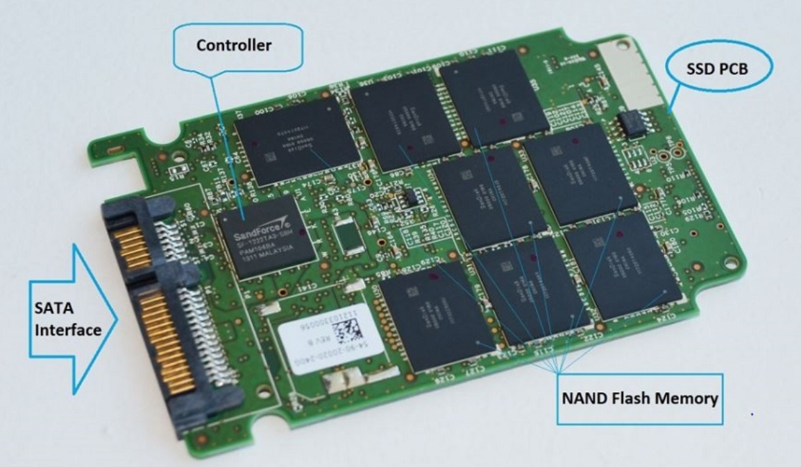
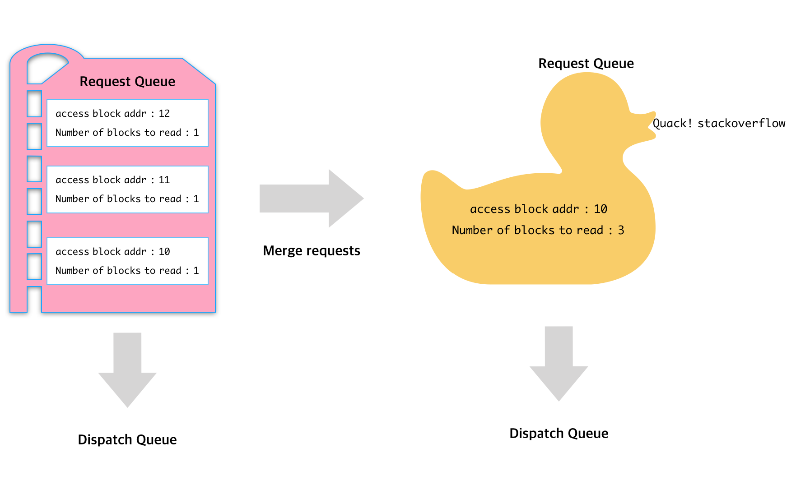
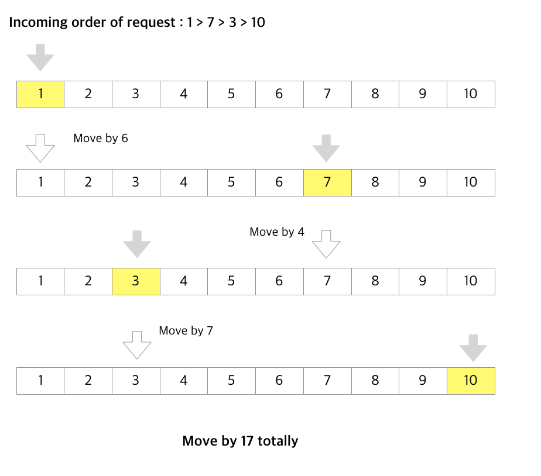
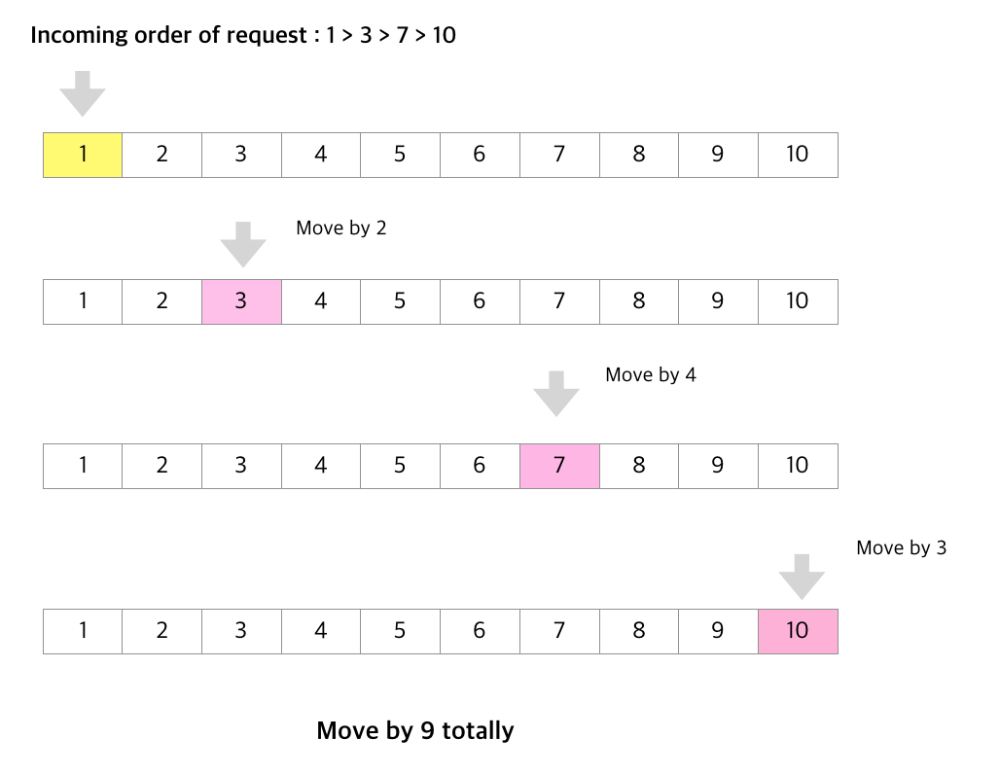
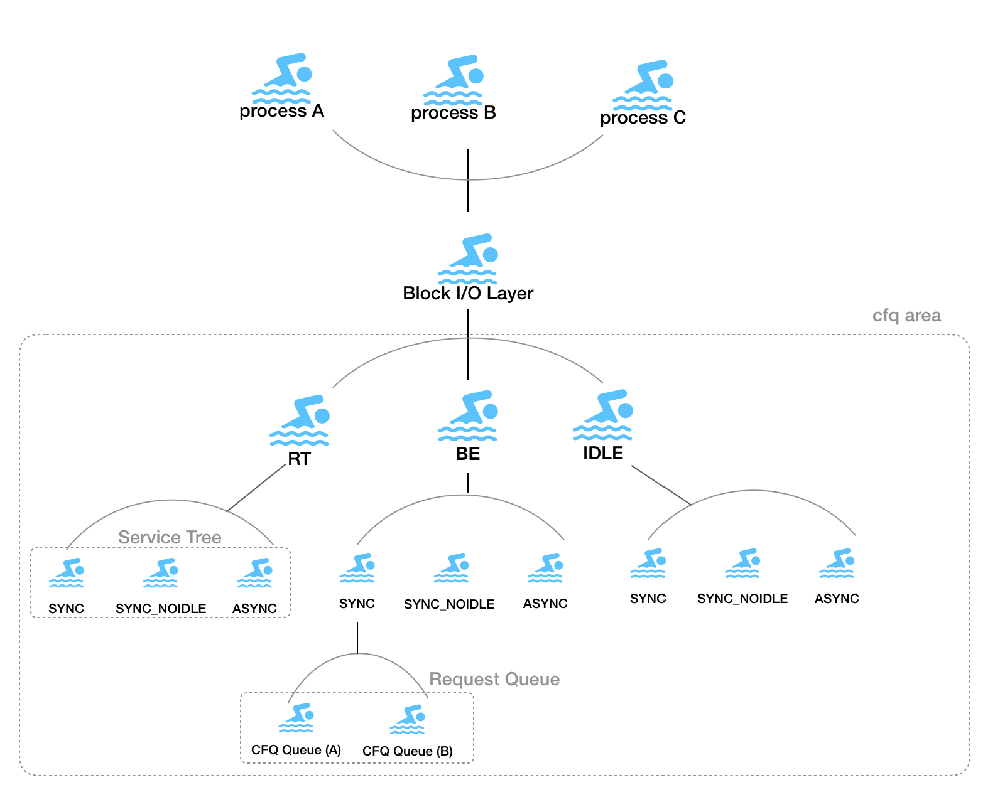
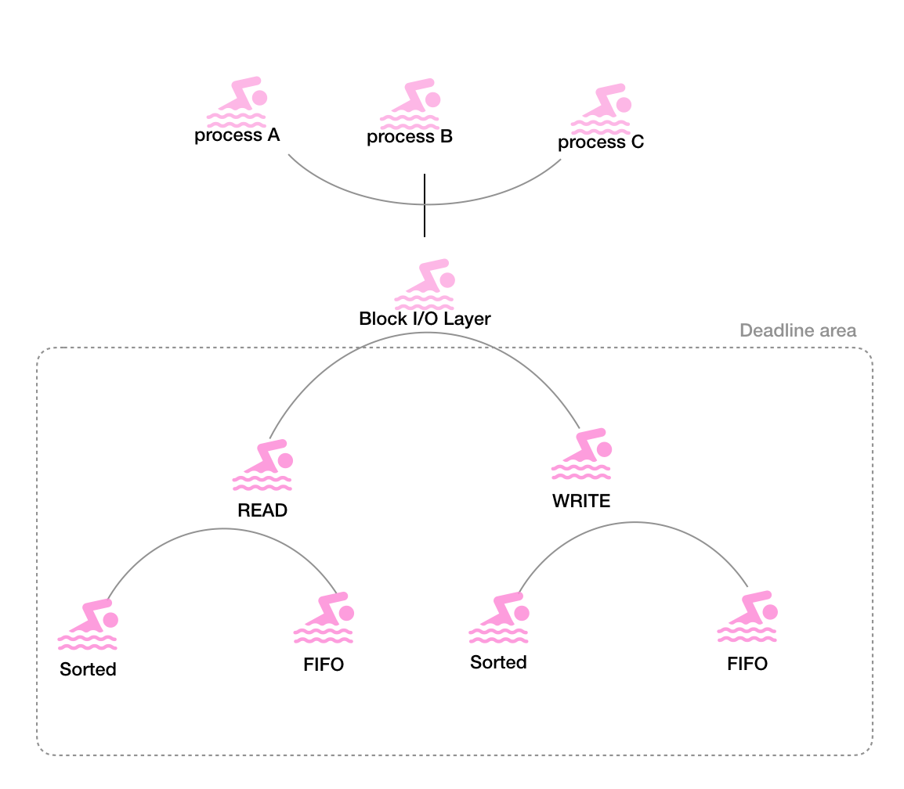
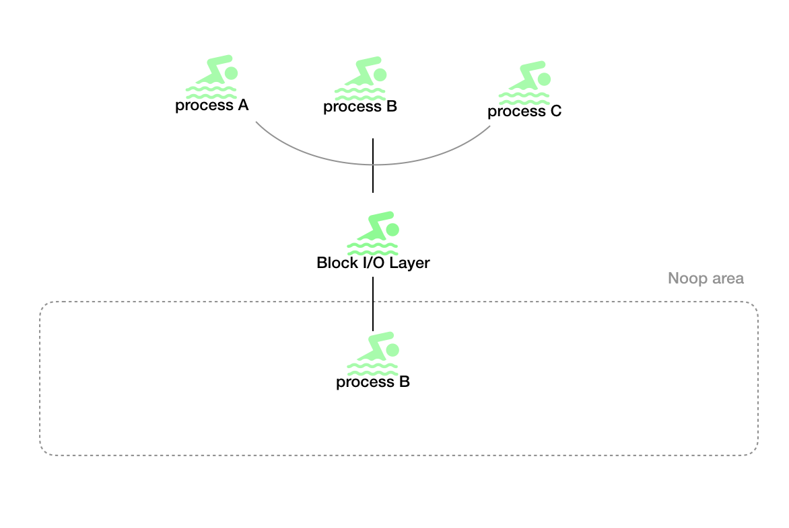
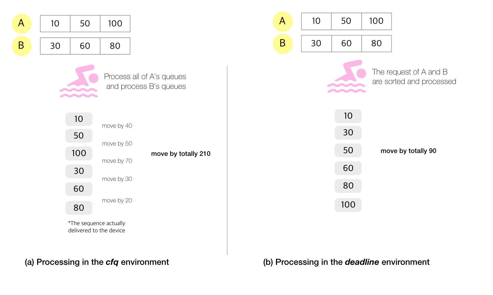

#11. I/O 작업이 지나가는 관문, I/O 스케줄러

***

사용자가 발생시키는 읽기, 쓰기와 같은 I/O 작업은 가상 파일 시스템, 로컬 파일 시스템 등의 경로를 거친 후 블록 디바이스로 전달되기 전에 I/O 스케줄러를 거치게 된다. <br/>
I/O스케줄러는 상대적으로 접근 속도가 느린 디스크에 대한 성능을 최대화하기 위해 구현된 커널의 일부분이다. <br/>
모든 I/O 작업은 이 I/O  스케줄러를 통해서 블록 디바이스에 전달된다. <br/>
I/O스케줄러는 기본적으로 병합과 정렬이라는 두가지 방식을 이용해서 I/O요청을 블록 디바이스에 전달하게 되는데, 서버에서 발생하는 워크로드와 I/O스케줄러의 알고리즘에 따라 성능을 더 좋게 만들 수도 나쁘게 만들 수도 있다. <br/>
이번 장에서는 I/O 스케줄러가 무엇이고 어떤 역할을 하는지, 그리고 어떤 알고리즘이 있는지 살펴보고, 마지막으로 시스템에서 발생하고 있는 I/O 워크로드를 확인하는 방법까지 확인해보려고 한다. 
<br/><br/>

 ##11-1. I/O 스케줄러의 필요성

***

I/O 스케줄러를 알아보기 전에 디스크에 대해 먼저 살펴보자. <br/>
디스크는 크게 두종류로 나눌 수 있다. <br/>
헤드와 플레터 등의 기계식 부품으로 이루어진 하드디스크 드라이브(HDD)와 플래시 메모리를 기반으로 이루어진 솔리드 스테이트 드라이브(SSD)이다. 
<br/>
HDD는 그림 11-1과 같이 구성되어 있다. <br/>

[그림 11-1 HDD의 구성(출처:https://www.techintangent.com/hard-disk-description/)]


<br/>
Platter 라는 원판과 자기 장치가 있으며, 디스크 헤드가 플래터 위를 움직이면서 데이터를 읽거나 쓰는 작업을 한다. HDD에 저장되어 있는 데이터를 읽기 위해서는 디스크 헤드를 플래터의 특정위치로 움직이게 해야한다. 헤드는 기계 장치이기 때문에 시스템의 다른 부품들과 달리 이동하는데에 시간이 걸리고 시스템을 구성하는 많은 부품들 중에서 가장 많은 시간이 소요된다. 그래서 헤드의 움직임을 최소화하고 한번 움직일 때 최대한 처리해야 I/O 성능이 극대화될 수 있다. <br/>

<br/>
반면에 SSD는 그림 11-2와 같이 플래시 메모리를 기반으로 구성되어 있다.  
<br/><br/>
[그림 11-2 SSD의 구성 (출처 : https://fossbytes.com/what-is-ssd-how-ssds-work-features/)

<br/>

SSD는 기계식 디스크와는 달리 헤드와 플래터 없이 기판에 장착되어 있는 플래시 메모리에 데이터를 쓰거나 읽는다. 헤드 대신에 컨트롤러라는 장치를 통해서 디스크로 유입되는 I/O작업을 조정한다. SSD는 장치를 움직이지 않고 전기적 신호를 이용해서 접근하기 때문에 임의로 특정 섹터에 접근할 때 소요되는 시간이 모두 동일하다.

반면에 HDD는 특정 섹터에 접근하기 위해 헤드와 플래터를 움직여야하기 때문에 현재 헤드의 위치가 어디냐에 따라 특정 영역에 접근하는데 필요한 시간이 달라진다. <br/>
<br/>

먼저 병합을 살펴보자. 병합은 여러개의 요청을 하나로 합치는 것을 의미한다. <br/>

[그림 11-3 I/O 요청 병합]


<br/>

그림 11-3과 같은 경우를 가정해보자. Request Queue에 총 3개의 요청이 인입되었는데 첫번째 요청은 10번 블록에서 1개의 블록 내용을 읽어오는 내용이고, 두번째 요청은 11번 블록에서 1개의 블록 내용을 읽어오는 요청 그리고 마지막 세번째 요청은 12번 블록에서 1개의 블록 내용을 읽어오는 요청이다. <br/>
서로 다른 세개의 요청이지만 접근 블록 주소가 인접해있기 때문에 블록 디바이스의 Dispatch Queue에 3개의 요청을 넘겨주는 대신, 이 요청들을 하나의 큰 요청으로 합쳐서 넘겨주면 헤드의 움직임을 최소화할 수 있다. <br/>

10번 블록에 접근해서 3개의 블록만큼만 읽어오게 되면 한번의 요청으로 기존에 있던 3개의 I/O요청을 처리할 수 있다. 이렇게 I/O스케줄러는 병합을 통해서 디스크로의 명령 전달을 최소화하고 성능을 향상시킬 수 있다. <br/>
<br/>
다음으로 정렬을 살펴보자. 정렬이란 여러개의 요청을 섹터 순서대로 재배치하는 것을 의미한다. 

<br/>

[그림 11-4 I/O 요청을 정렬하지 않았을 때]


<br/>
그림 11-4와 같은 상황을 가정해보자. I/O 요청이 총 4개가 들어왔다. 해당 블록을 정렬하지 않고 들어온 순서대로 처리하게 되면, 총 17만큼의 헤더 이동이 필요하다. 특히 7번 블록에서 3번 블록에서 갈 때는 앞으로 갔다가 다시 뒤로 가게 되어 불필요한 이동이 발생하게 된다. 하지만 이 요청을 들어온 순서대로가 아니라 블록 접근 순서대로 정렬한다면 헤더의 움직임이 어떻게 바뀔까? <br/>
<br/>

[그림 11-5 I/O 요청을 정렬했을 때]


<br/>
정렬하지 않으면 총 17만큼의 이동이 필요하지만 정렬하면 그림 11-5와 같이 총 9만큼의 이동이 필요함을 확인할 수 있다. <br/>
헤더의 이동을 절반에 가깝게 줄일 수 있다. 이렇게 섹터 순서대로 최적의 경로를 갈 수 있도록 재배치하는 것을 정렬이라고 한다. <br/>
이렇게 되면 먼저 발생한 요청이 더 늦게 처리되는 문제가 생길 수도 있다. <br/>
그래서 I/O 스케줄러는 다양한 알고리즘으로 이런 문제를 해결하고 있다. <br/>

SSD는 어떨까? 헤드가 없기 대문에 헤드를 이동하느라 발생하는 비용이 없다. <br/>
그렇기 때문에 사실 정렬이 별 의미가 없다. 
오히려 정렬하는데 CPU리소스를 쓸데없이 사용하기 때문에 성능이 나빠질 수 있다. <br/>
그래서 SSD는 HDD와 조금 다른 I/O스케줄러를 사용한다. <br/>
이 내용은 뒤에서 자세히 살펴볼 것이다. 

<br/><br/>

 ##11-2. I/O 스케줄러의 설정

***

I/O스케줄러에 대한 내용을 본격적으로 다루기 전에 현재 설정된 I/O 스케줄러를 확인하는 방법과 변경하는 방법을 살펴보자. <br/>
현재 시스템에 적용가능한 I/O스케줄러와 설정되어있는 I/O스케줄러 정보는 코드 11-1과 같이 확인할 수 있다. <br/>

* 코드 11-1 현재 시스템에 설정된 I/O 스케줄러 확인하기

```
# cat scheudler
noop [deadline] cfq

```

[]로 표시되어있는 부분이 현재 설정되어 있는 I/O스케줄러이고, 그 외의 것들이 설정 가능한 I/O스케줄러이다. 변경은 echo명령을 이용하면 된다. (코드 11-2)<br/>

<br/>

* 코드 11-2 시스템의 I/O스케줄러 변경하기

```
# cat scheduler
noop [deadline] cfq
# echo cfq > ./scheduler
# cat scheduler
nood deadline [cfq]

```

변경하면 재미있는 것을 볼 수 있는데, 각각의 I/O 스케줄러별로 튜닝 가능한 파라미터들이 바뀐다는 것이다. 코드 11-3과 같이 I/O 스케줄러를 변경하면 그 하위 디렉터리인 iosched 디렉터리에서도 값이 바뀐다. <br/>

<br/>
* 코드 11-3 I/O 스케줄러 변경에 따른 파라미터 변경 확인하기. 

```
# cat scheduler
noop anticipatory deadine [cfq]
# ls ./iosched/
back_seek_max  fifo_expire_async  group idle   low_latency  slice_async   slice_idle
back_seek_penalty  fifo_expire_sync  group_isolation   quantum   slice_async_rq  slice_sync

# echo deadline > ./scheduler
# ls ./iosched/
fifo_batch   front_merges   read_expire   write_expire  writes_starved

```

맨처음 cfq였을 때는 약 12개의 파일이 있다. 각각의 cfq 스케줄러의 동작 방식에 영향을 주는 튜닝가능한 파라미터들이다. deadline으로 바꾸게 되면 iosched디렉터리의 파일들이 5개로 변경된다. <br/>
이렇게 I/O 스케줄러를 바꾸는 것 뿐아니라 iosched 디렉터리에 있는 파일들의 값을 변경함으로써 같은 I/O스케줄러를 사용하더라도 조금더 워크로드에 최적화할 수 있다. <br/>

그럼 다음 절부터 본격적으로 I/O스케줄러를 살펴보자. 
<br/><br/>

 ##11-3. cfg  I/O 스케줄러

***

cfq는 Completely Fair Queueing의 약자로, 우리말로 하면 '완전 공정 큐잉' I/O 스케줄러를 말한다. 공정하다는 단어에서 유추할 수 있듯이 프로세스들이 발생시키는 I/O 
요청들이 모든 프로세스에서 공정하게 실행되는 것이 특징이다. <br/>
<br/>

[그림 11-6. cfq I/O 스케줄러의 구조]

<br/>
<br/>

그림 11-6은 cfq의 구성을 간단하게 정리한 것이다. 우선 각각의 프로세스에서 발생시킨 I/O는 Block I/O Layer를 거친 후에 실제 디바이스로 내려가기 전에 cfq I/O 스케줄러를 거치게 된다. <br/>

cfq I/O는 특성에 따라 각각 RT(Real time), BE(Best Effort), IDLE 중 하나로 I/O 요청을 정의한다. <br/>
이 값은 ionice명령을 이용하여 변경할 수 있으며, 대부분의 I/O 요청은 기본적으로 BE에 속한다. 위 형태는 I/O 처리의 우선 순위를 설정하기 위해 나눈 것으로, RT에 속한 요청들을 가장 먼저 처리하고, IDLE에 속한 요청들을 가장 나중에 처리한다. <br/>
<br/>
I/O 우선순위에 따라 RT, BE, IDLE 셋 중 하나로 분류한 다음에는 service tree라 불리는 워크로드별 그룹으로 다시 나눈다. <br/>
<br/>
SYNC는 순차적인 동기화 I/O 작업, 주로 순차 읽기를 의미한다. <br/.
여기에 속한 큐들은 각각의 큐에 대한 처리를 완료한 후 일정 시간 동안 대기하게 된다. <br/>
 순차적인 작업이기 때문에 향후에 들어오는 I/O요청도 현재 디스크 헤드와 가까운 위치의 작업이 들어올 확률이 높다. <br/>
그래서 약간의 대기 시간이 있더라도 가까운 곳의 I/O요청을 처리하게 되면 더 좋은 성능을 내는데 도움이 되기 때문에 대기하게 된다. <br/>
뒤에서 얘기할 slice_idle 값으로 이 대기 시간을 설정할 수 있다. <br/>
<br/>
SYNC_NOIDLE은 임의적인 동기화 I/O 작업, 주로 임의 읽기를 의미한다. <br/>
여기에 속한 큐들은 SYNC 워크로드와는 달리 각각의 큐에 대한 처리를 완료한 후 대기시간 없이 바로 다음 큐에 대한 I/O 작업을 시작한다. <br/>
임의 작업은 디스크 헤드를 많이 움직이게 하기 때문에 굳이 다음 요청을 기다려서 얻게 되는 성능상의 이점이 없기 때문이다. <br/>
그래서 기다리지 않는 뜻으로 NOIDLE이라는 이름을 붙인다. <br/>
마지막으로 ASYNC는 비동기화 I/O작업, 주로 쓰기 작업을 의미한다. <br/>
이곳에는 각각의 프로세스에서 발생하는 쓰기 작업이 같이 모여서 처리된다. cfq는 프로세스별로 큐를 가지고 있지만 이 큐는 동기화 I/O 작업만을 처리하는 것이고, 비동기화 I/O 작업은 ASYNC 서비스 트리 밑에 하나로 모아놓고 한꺼번에 작업한다. <br/>

이렇게 I/O 우선순위와 워크로드에 따라 분류된 I/O 요청을 어떤 프로세스에서 발생시켰느냐에 따라 어떤 큐에 들어갈 것인지 최종적으로 정해진다 <br/>
A프로세스에서 발생시킨 요청은 cfq queue(A)에 속하게 되고, B프로세스에서 발생시킨 요청은 cfq queue(B)에 속하게 된다. <br/>

만약 A프로세스에서 쓰기 요청을 발생시켰다면 cfq queue(A)에 속하지 않고 ASYNC 서비스 트리 밑에 만들어진 큐에 들어가게 된다. <br/>
cfq I/O 스케줄러는 이렇게 나뉜 I/O 요청들을 cfq queue에 넣고 각각 동등한 time slice를 할당한 다음 이 값을 기준으로 큐들을 순차적으로 처리한다. <br/>

그래서 cfq I/O 스케줄러는 모든 프로세스들에 치우침 없이 동등한 I/O 요청처리 기회를 주지만, 일부 I/O를 많이 일으키거나 더 빨리 처리되어야하는 I/O를 가진 프로세스들의 경우에는 자신의 차례가 될 때까지 기다려야하기 때문에 I/O요청에 대한 성능이 낮아질 가능성이 있다. <br/>

cfq I/O 스케줄러에서 튜닝이 가능한 값은 총 12가지가 있다. 
<br/><br/>

* 코드 11-4 cfq I/O 스케줄러의 파라미터들

```
[root@server iosched] # ls
back_seek_max   fifo_expire_async   group_idle   low_latency  slice_async  slice_idle
back_seek_penalty  fifo_expire_sync  group_isolation  quantum   slice_async_rq  slice_sync

```

각각의 값들이 가지는 의미를 살펴보면 cfq I/O 스케줄러가 어떻게 동작하는지를 이해할 수 있다. <br/>

<br/><br/>

* back_seek_max

첫번째 값은 back_seek_max이다. 이 값은 현재 디스크의 헤드가 위치한 곳을 기준으로 backward seeking의 최대값을 의미한다.  backward seeking 값의 기준안에 들어오는 요청은 바로 다음 요청으로 간주되어 처리된다. 예를 들어 현재 헤드의 위치를 10이라고 하고 back_seek_max값을 5라고 가정한다면 헤드의 위치 10에서 5를 뺀 섹터 5번에서 9번의 요청들의 바로 다음 요청으로 간주되어 처리된다. 이 값은 인접한 섹터의 요청이 들어왔을 때 바로 처리할 수 있게 되어 헤더의 움직임을 최소화하는데 도움이 되지만 그만큼 다른 요청들이 밀릴 수 있기 때문에 적당한 값을 유지하는 것이 좋다. 만약 시스템에 순차 쓰기가 주를 이룬다면 이 값을 줄이는데 도움이 된다. 
<br/><br/>

* back_seek_penalty

back_seek_max와 비슷하지만 이 값은 backward seeking의 패널티를 정의한다. 이미 언급했지만 헤더를 움직이는 비용은 매우 크기 때문에 가능하다면 순서대로 움직이는 것이 좋다. 즉 1->2->3 과 같은 식으로 계속해서 증가하는 추세로 동작하는 것이 1->3->2->4와 같이 뒤로 가는 것보다 성능에 더 도움이 된다. 그렇기 때문에 뒤로 갈때에는 back_seek_penalty 값으로 패털티를 적용한다. 예를 들어 현재 헤더의 위치가 10이고 5번 섹터로 가는 요청과 15번 세터로 가는 요청이 있다고 가정해보자. 둘다 현재 헤더를 기준으로 5만큼 이동하겠지만 cfq는 여기에 back_seek_penalty 값을 곱해서 서로의 거리를 다르게 본다. 즉, 똑같이 5만큼 이동하지만 5번 섹터로 가는 것이 더 무겁고 성능에 좋지 않은 영향을 주는 작업이라고 인지하는 것이다. 

<br/><br/>

* fifo_expire_async

cfq에도 시간을 기준으로 한 fifo 리스트가 존재하고 그 중에서 async 요청에 대한 만료시간을 정의한다. async는 비동기적이라는 의미로  주로 쓰기 요청을 나타낸다. 10장에서도 이야기해지만 애플리케이션의 쓰기 작업은 커널에 의해서 dirty page 쓰기작업만으로 끝낼 수 있다. 실제 디스크로의 쓰기 요청까지 발생하지 않고 메모리에 쓰기 작업을 하는 것만으로도 쓰기 작업이 완료되었다고 끝낼 수 있으며, 그렇기 때문에 대부분의 쓰기 작업은 애플리케이션을 블록시키지 않고 비동기적으로 완료된다. 이 값은 비동기적인 I/O 작업에 대한 만료시간을 정의한다. 

<br/><br/>

* fifo_expire_sync

fifo_expire_async 값과 유사하지만 sync 요청에 대한 만료 시간을 의미한다. sync는 동기적이라는 의미로, 주로 읽기 요청을 나타낸다. 만약 애플리케이션이 특정 파일의 내용을 읽는 작업을 한다면 대부분의 경우는 읽기를 완료되야만 다음 작업을 진행할 수 있다. 예를 들어 애플리케이션이 환경 변수가 설정되어있는 설정 파일을 읽는다고 가정했을 때 일부분만 읽어서는 애플리케이션이 동작할 수 없고 전첼르 읽어들여야 동작할 수 있다. 그래서 읽기 동작이 완료될 때가지 애플리케이션을 블록시킨다. 이 값은 동기적인 I/O 작업에 대한 만료시간을 정의한다.
<br/><br/>

* group_idle

cfq는 원래 프로세스별로 할당된 큐를 이동할 때 해당 큐에 할당된 시간을 전부 사용하지 않았지만 I/O 요청이 전부 처리되어 이동해야한다면 해당 큐는 idle상태가 된다. 당장은 I/O 요청이 없지만 혹시라도 추가로 발생하게 될지 모르기 때문이다. 이 과정 중에서도 group_idle이 설정되어 있다면 같은 cgroup 안에 포함된 프로세스들에 대해서는 큐를 이동할 때 기다리지 않고 바로 다음 큐로 넘어가도록 동작한다. 하지만 같은 cgroup 안의 I/O 요청을 처리하고 다른 cgroup으로 넘어가려고 할때에는 group_idle에 정의된 시간(ms단위)만큼을 대기한다. 

<br/><br/>

* group_isolation

이 값역시 cgroup과 관련이 있다. 단어가 의미하는 것처럼 서로 다른 cgroup 간의 차이를 더 명확하게 해주는 역할을 한다. 기본값은 0이며 이 값이 0이 되면 위에서 언급한 서비스 트리 중 SYNC_NOIDLE 에 속하는 큐들은 cgroup의 루트 그룹으로 이동시킨다. SYNC_NOIDLE은 임의 접근이기 때문에 디스크 헤드를 많이 움직이게 되고, 순차 접근에 비해 I/O 요청 완료까지 걸리는 시간이 상대적으로 오래 걸린다. 만약 각각의 cgroup별로 SYNC_NOIDLE을 처리한다면, SYNC_NOIDLE이 많은 경우 cgroup별로 처리해야하기 때문에 전체적인 성능이 낮아진다. cgroup 별로 임의 접근을 위한 SYNC_NOIDLE 서비스 트리를 만들지 않고 시스템의 모든 임의 접근을 하나의 SYNC_NOIDLE에 모은다. 하지만 이렇게 되면 cgroup별로 설정한 값이 임의 접근에는 적용되지 않는다. 이때 group_isolation을 1로 설정하면 임의 접근도 cgroup 값의 영향을 받게 되고 각각의 cgroup 분류가 더 명확해진다. 따라서 이값은 cgroup을 활용하는 환경에서는 성능에 큰 영향을 미치는 중요한 값이다.

<br/><br/>

* low_latency

I/O 요청을 처리하다가 발생할 수 있는 대기 시간을 줄이는 역할을 한다. 이 값은 boolean으로 0이나 1, 즉 disable/enable을 의미한다. cfq는 현재 프로세스별로 별도의 큐를 할당하고 이 큐들은 그 성격에 따라 RT(Real Time), BE(Best Effect), IDLE 이렇게 세개의 큐로 다시 그룹화된다. 만약 I/O를 일으키는 5개의 프로세스가 있다고 가정했을 때 아무 설정을 하지 않으면 이 5개의 프로세스는 각각 sorted, fifo 2개씩 큐를 할당 받고 이 큐들은 BE 그룹으로 묶인다. 이때 low_latency가 설정되어 있다면 각 큐에 time_slice를 할당하기 전에 각 그룹별로 요청이 몇개씩 있는지 확인한다. 각 그룹별로 있는 큐의 요청들을 전부 합친 후에 time_slice를 곱하게 되는데 이때 expect_latency값이 생성된다. 즉 해당 그룹의 큐를 모두 처리하는데 걸릴 시간을 계산하고 이 계산 결과가 target_latency 값보다 크다면 이 값을 넘지 않도록 조절한다. 
<br/><br/>
** 과거에는 target_latency도 설정이 가능한 매개변수였는데 최근에는 300ms로 소스 코드상에 하드 코딩된다. **

<br/>
만약 low_latency가 켜져 있으면 그룹의 큐를 확인하지 않게 되고, 큐에 I/O요청이 많을 수록 한번의 time slice로는 처리가 어렵다. 이렇게 소요시간이 많이 걸리는 요청들은 자신의 time slice를 다 쓰고 다시 차례가 돌아오기를 기다려야하기 때문에 처리하는데 많은 시간이 소요된다. low_laency 설정 값을 통해서 전체적인 I/O 요청을 바탕으로 time slice를 조절한다. 아마 성능에 가장 큰 영향을 끼치는 요소가 될 것이다. <br/>

<br/>

* slice_idle


cfq는 큐 처리를 완료하고 바로 다음 큐로 넘어가지 않고 slice_idle 에 설정된 시간만큼 기다린다. 보통 I/O 요청은 random access보다는 sequential access가 주를 이룬다. 이곳저곳을 막 읽거나 쓰지 않고, 읽던 파일을 계속 읽거나 쓰던 파일에 계속해서 쓰기 때문이다. 그래서 cfq는 현재 요청중인 큐를 모두 처리한 다음 혹시라도 또 I/O요청이 들어오지 않을까 대기하고, I/O요청이 들어온다면 해당 요청을 처리한다. 이렇게 하면 디스크 헤드의 움직임을 최소화할 수 있기 때문에 디스크의 접근 시간을 줄일 수 있다. 하지만 기다리는 동안 아무 요청도 들어오지 않는다면 기다리는 시간은 버려지는 시간이 된다. 과거에는 기본값이 6이었는데 최근 커널에는 기본 값이 0으로 설정된다. 단위는 ms이다. 

<br/><br/>

* slice_sync

앞에서도 이야기한것처럼 cfq는 큐별로 time_slice를 할당해서 I/O를 처리하는 와중에 해당 설정 시간을 넘기면 다음번 큐를 처리하도록 동작한다. slice_sync는 이때 사용되는 time slice의 기준 값중 하나로, sync 요청에 대한 time slice 기준이 된다. sync 요청을 실행하는 동안 애플리케이션이 블록되는, 즉 애플리케이션이 그 결과를 기다리게 되는 읽기와 같은 작업을 의미한다. 큐에 sync 작업이 하나라도 있으면 해당 큐의 time slice는 이 값을 따라간다. 

<br/><br/>

* slice_async

slice_sync와 기능은 같지만 큐에 async 요청이 있을 때 설정되는 time slice의 기준값이다. 대부분 쓰기 작업을 의미한다. 

<br/><br/>

* slice_async_rq

cfq가 큐에서 한번에 꺼내서 dispatch queue에 넘기는 async 요청의 최대 개수이다. 
<br/><br/>

* quantum

이 값은 slice_async_rq와 반대로 sync 요청을 꺼내서 dispatch에 넘기는 최대 개수이다. 이값이 커진다면 큐에서 한번에 꺼낼 수 있는 요청의 개수가 증가하겠지만 그만큼의 하나의 큐가 실행될 때 걸리는 시간이 늘어나기 때문에 경우에 따라서는 성능이 저하될 수 있다. 
<br/><br/>


 ##11-4. deadline I/O 스케줄러

***

deadline은 그 이름에서 유추할 수 있듯이 I/O요청 별로 완료되어야하는 deadline을 가지고 있는 I/O 스케줄러이다. 예를 들어 읽기 요청은 500ms 안에 완료되어야하고 쓰기 요청은 5s안에 완료되어야하는 등의 요청별 deadline이 주어지며, 가능한 한 해당 deadline을 넘기지 않도록 동작한다.  물론 이 deadline이 반드시 그 시간안에 완수될 수 있다는 것을 보장하는 값은 아니다. 

<br/>

[그림 11-7 deadline I/O스케줄러의 구조]


<br/>

그림 11-7과 같이I/O 스케줄러에는 2개의 sorted list와 2개의 fifo list가 있다. 2개의 sorted list는 각각 읽기 요청과 쓰기 요청을 저장하고 있으며 섹터 기준으로 정렬된다. 2개의 fifo list 역시 읽기 요청, 쓰기 요청을 저장하고 있으며 섹터 기준이 아닌 요청이 발생한 시간을 기준으로 정렬된다. 
평상시에는 sorted list에서 정렬된 상태의 요청을 꺼내서 처리하게 되지만, fifo list에 있는 요청들 중 deadline을 넘긴 요청이 있다면 fifo list에 있는 요청을 꺼내서 처리한다. 그리고 fifo list에서 요청이 처리되고 나면 처리된 요청을 기준으로 sorted list를 재정렬해서 그 이후의 I/O 요청을 처리한다. <br/>

예를 들어 각각 1번 블록, 10번 블록, 30번 블록, 50번 블록, 70번 블록에 접근하는 I/O 요청이 정렬된 상태로 있다고 가정해보자. 이대로라면 1->10->30->50->70의 순서대로 처리될 것이다. 하지만 10번 블록을 처리한 후에 50번 블록에 대한 I/O요청이 deadline을 넘겼다는 것을 알게 되면 다음번 처리는 30번 블록이 아닌 50번 블록이 된다. 그러고 나서 70번 블록의 I/O요청이 처리된다. 즉 50->70->30의 순서로 재정렬되는 것이다. 

deadline I/O스케줄러에서 튜닝이 가능한 값은 총 5가지가 있다. 

<br/>

* 코드 11-5 deadline I/O 스케줄러의 매개변수들

```
[root@server iosched]# ls
fifo_bacth   frount_merges   read_expire   write_expire    writes_starved
```

<br/>

* fifo_bacth

이 값은 한번에 dispatch queue를 통해서 실행할 I/O요청의 개수다. deadline은 batch라는 이름으로 다수의 I/O요청을 처리하는데 이때 몇개의 I/O 요청을 전달할 것인지 결정하는 값이다. 기본값은 16개로 16개의 I/O 요청이 하나의 batch로 간주되어 처리된다. 

<br/><br/>

* front_merges

I/O작업은 계속해서 섹터가 증가하는 구조이다. 로그 파일 쓰기를 생각해보자. 새로운 로그는 기존 로그의 뒤에 추가되는데 이를 디바이스의 관점에서 본다면 계속해서 섹터가 증가하는 추세가 될 것이다. 중간에 특별히 다른 로직을 넣지 않는다면 이렇게 섹터가 증가하는 I/O 요청이 가장 자연스러운 요청의 형태이다. 하지만 파일의 앞에 즉 현재 헤더 위치의 뒤가 아닌 앞쪽으로 I/O요청이 발생하는 경우도 있는데, 이를 탐색하는 것이 front_merge 값이다. 이 값은 0 혹은 1의 boolean 형태이며 기본값은 1이다. 만약에 현지 시스템에서 발생하는 워크로드가 순차 쓰기 혹은 순차 읽기가 주를 이루고 있다면 이 값을 0으로 해서 성능을 조금더 향상시킬 수 있다. 

<br/><br/>

* read_expire

발생한 I/O요청 중 read 요청에 대한 deadline 을 결정할 때 사용되는 값으로 기본값은 500이며 단위는 ms이다. 즉 읽기요청은 500ms 동안 처리되지 않으면 만료된다. 
<br/><br/>

***

<br/>
시간의 기본 단위는 초 입니다.
하지만 1초보다 훨씬 작은 시간 단위를 측정해야 할 필요가 있기때문에
ms(mili second), us(micro second), ns(nano second), ps(pico second),
fs(femto second)등과 같은 단위를 씁니다.
이것들은 편의상 1초를 천분의 1씩 쪼갠 단위라고 생각하시면 되겠습니다.
밀리초는 1/1,000초입니다. 마이크로초는 1/1,000,000초
나노초는 1/1,000,000,000초, 피코초는 1/1,000,000,000,000초이며
펨토초는 1/1,000,000,000,000,000초입니다.
(출처 : http://tip.daum.net/question/39221311)
<br/>
***

<br/><br/>

* write_expire

read_expire와 동일한 역할을 하며 write요청에 대한 deadline을 결정할 때 사용된다. 단위는 역시 ms이며 기본값은 5000이다. 값을 보면 짐작할 수 있겠지만 deadline역시 I/O스케줄러는 읽기 요청 deadline이 더 짧아서 읽기 요청에 대한 처리를 좀더 선호하도록 설계되어 있다. 
<br/><br/>

* write_starved 

위에서도 언급했지만 deadline I/O스케줄러는 읽기 요청에 대한 처리를 더 선호하기 때문에 자칫 잘못하면 쓰기 요청의 처리가 계속해서 지연될 수 있다. 그래서 이 값은 쓰기 요청과 일기 요청 사이에 밸런스를 설정한다. 단위는 횟수이며 기본값은 2이다. 즉 읽기 요청을 2번 처리하면 쓰기 요청은 1번 처리하는 식으로 동작한다. 이때의 요청은 하나의 요청을 의미하는 것이 아니라 한번의 batch를 의미한다. 2번의 읽기 요청에 대한 bacth 이후에 1번의 쓰기 요청에 대한 batch를 처리한다.  
<br/><br/>

지금까지의 값을 토대로 살펴보면 deadline I/O 스케줄러는 쓰기 요청보다 읽기 요청을 더 많이 처리하도록 설계되었으며, bacth와 같은 형태로 한번에 다수의 I/O 요청을 처리하고 있음을 알수 있다. 하지만 파라미터를 변경해서 조금더 워크로드에 맞도록 수정할 수도 있다. 예를 들어 write_expire에 read_expire와 동일한 값을 주고 writes_starved를 1로 주면 읽기와 쓰기 요청을 동등하게 처리한다. 
<br/><br/>


 ##11-5. noop I/O 스케줄러

***

noop스케줄러는 간단한 형태의 I/O 스케줄러이다. 흔히 아무것도 하지 않는다고 생각할 수 있겠지만 noop스케줄러도 병합 작업을 한다. 위에서 언급한 I/O 스케줄러의 가장 중요한 병합과 정렬 두가지 역할 중 정렬은 하지 않고 병합 작업만 하는 I/O 스케줄러이다. 

<br/>
[그림 11-8 noop I/O 스케줄러의 구조]


<br/>
그림 11-8과 같이 큐도 하나만 존재하며 인입된 I/O 요청에 대해 병합할 수 있는지의 여부만 확인한 후 병합이 가능하면 병합 작업을 진행한다. 별도의 섹터별 작업은 하지 않는다. 그렇다면 왜 noop I/O 스케줄러가 존재하는 것일까?

헤더를 움직여야하는 기계식 디스크가 아닌 플래시 메모리를 기반으로 한 플래시 디스크는 헤더가 없기 때문에 특정 섹터에 도달하는데 필요한 시간이 모두 동일하다. 즉 10번 섹터에 접근하든, 100번 섹터에 접근하든 접근시간이 동일하다는 의미이다. 

반면에 헤더를 움직여야하는 기계식 디스크는 현재 헤더의 위치가 어디냐에 따라서 섹터별로 접근하는 소요시간이 달라진다. 이렇게 플래시 디스크는 어느 섹터에 언제 접근하든 소요되는 시간이 같기 때문에 굳이 정렬을 해서 헤더의 움직임을 최소화할 필요가 없다. 그렇기 때문에 플래시 디스크의 경우는 noop  I/O 스케줄러 사용을 권고하고 있다. 이 I/O  스케줄러의 경우는 튜닝 가능한 값도 존재하지 않는다. 

<br/><br/>

 ##11-6. cfg와 deadline의 성능 테스트

***

지금까지 리눅스에서 제공하는 3가지의 I/O스케줄러를 살펴보았다. 이 중에서도 cfq와 deadline의 차이에 대해 더 살펴보자. 사실 어떤 경우에도 완벽한 I/O스케줄러는 없다.

앞에서 이야기한 것처럼 각각의 I/O스케줄러는 나름의 특성이 있기 때문에 어떤 워크로드가 발생하느냐에 따라서 어떤 I/O스케줄러를 사용할 것인지 결정해야 한다. 
예를 들어 I/O를 일으키는 프로세스가 하나만 있다면 cfq와 deadline사이에는 큰 차이가 없지만 여러개인 상황에서는 차이가 있다. 

cfq는 다수의 프로세스들의 요청을 공평하게 분배해서 처리하는 한편, deadline은 요청이 어떤 프로세스로부터 발생했느냐가 아니라 언제 발생했느냐를 기준으로 처리하기 때문이다. 

또한 임의접근이 많이 발생하느냐, 순차 접근이 많이 발생하느냐의 워크로드 차이도 성능의 차이를 만들어낼 수 있다. 

이번 절에서는 fio라는 툴을 통해서 두 I/O 스케줄러 간에 어떤 성능차이가 있는지 살펴보자. 

테스트 환경은 다음과 같다. 

```
CPU : Intel(R) Xeon(R) CPU E3-1240 V2 @ 3.40GHz
Memory : 32GB
DISK : SATA 3TB

```

fio는 다양한 옵션을 이용해서 실제 서버와 유사한 워크로드를 만들어낼 수 있다. 이번절에서는 크게 웹서버와 파일서버의 워크로드를 시뮬레이션해볼 것이다. 

먼저 웹서버의 워크로드를 시뮬레이션해보자. 웹서버에서 발생하는 가장 많은 I/O요청은 사용자의 요청에 대한 로그 기록이다. 로그 기록을 로그 파일의 끝에 계속해서 붙여나가는 방식이기때문에 순차 접근이 많으며, 프로세스가 로그 파일 디스크립터를 여러개 열어서 사용하지 않기 때문에 발생하는 I/O요청 자체도 그리 많지는 않을 것이다. 다음은 웹서버의 워크로드를 시뮬레이션하기 위해 사용한 파라미터 값이다. 


```
fio --ioengine=libaio --name=test --runtime=60 --time_based 
--clocksource=clock_gettime --numjobs=X --rw=readwrite  --bs=4k
--size=16g  --filename=fio_test.tmp  --isocheduler=cfq --iodepth=1
--direct=1

```

<br/>
** 위 파라미터 중 numjobs는 1에서부터 CPU코어 개수인 8까지 늘려가면서 테스트를 진행했다. **


<br/>

프로세스의 개수가 증가함에 따라 I/O처리 성능도 함께 증가했으며 cfq와 deadline 사이의 성능차이가 거의 없다. 순차 접근 자체가 헤드의 움직임이 최소화되어 있고 프로세스들이 발생시키는 I/O 요청 자체도 많지 않기 때문이다. 그래서 웹서버에서는 I/O 스케줄러가 성능에 큰 영향을 주지는 않는다. 

다음으로 파일 서버의 워크로드를 시뮬레이션해보자. 파일 서버에서는 다양한 파일들에 대한 접근이 이뤄잊기 때문에 순차 접근보다는 임의접근이 많이 발생한다. 또한 사용자의 요청이 많을 경우 많은 양의 I/O가 발생할 수 있다. 다음은 파일 서버의 워크로드를 시뮬레이션하기 위해 사용한 파라미터 값이다. 


```
fio --ioengine=libaio  --name=test  --runtime=60  --time_based
--clocksource=clock_gettime --numjobs=X --rw=randrw --bs=4k  --size=16g
--filename=fio_test.tmp  --ioscheduler=deadline --iodepth=64  --direct=1

```

웹서버의 워크로드를 시뮬레이션했을 때와의 차이를 살펴보자. 테스트 방식이 순차방식(readwrite)에서 임의방식(randrw)로 바뀌었으며 I/O를 일으키는 수준인 iodepth가 1에서 64로 증가했다. 과연 어떤 결과가 나왔을까?

순차 접근과는 사뭇 다른 결과를 볼 수 있다. 프로세스의 개수가 하나일때는 둘다 비슷하지만 프로세스의 개수가 많아질수록 두 I/O스케줄러의 성능차이는 벌어지기 시작한다. 왜 그런 결과가 나타날까?

만약 두개의 프로세스가 다음과 같이 가정해보자. 
<br/>

[그림 11-11 멀티 프로세스 환경에서 I/O 스케줄러별 처리 과정]


<br/>
 cfg I/O 스케줄러는 프로세스 A에 할당된 큐를 모두 처리한 후 프로세스 B에 할당된 큐를 처리해야한다. 그래서 A의 I/O요청 순서대로 10, 50, 100번 블록을 처리한 후 B의 I/O 요청순서인 30,60,80번 블록을 처리한다. 그림 11-11 을 보면 각각의 큐에서는 정렬된 상태였지만 전체적으로 봤을 때는 정렬되지 않고 헤드가 움직인다. 위 예제에서는 210만큼의 헤드이동이 발생한다. 하지만deadline I/O 스케줄러에서는 A에서 발생한 I/O 요청과 B에서 발생한 I/O 요청을 함께 정렬해서 전달한다. 그래서 전체적으로 블록 순으로 정렬이 가능해지고  cfq에 비해 헤드의 움직임이 더 적어진다.

이렇게만 얘기하면 마치 cfq가 deadline보다 좋지 않은 I/O 스케줄러처럼 보일 수 있지만 조금더 생각해보면 그렇지 않다는 것을 알 수 있다. 자신의 타임 슬라이스가 다 소비되면 다른 큐로 넘어간다는 이야기는 바꿔 말하면 I/O 스케줄러가 하나의 I/O요청을 전적으로 처리해주는 시간이 반드시 있다는 것을 의미한다. 그래서 다수의 프로세스가 동등하게 I/O요청을 일으키는 경우라면 cfo I/O 스케줄러가 조금더 좋은 성능을 보여줄 수 있다. 여기서의 좋은 성능이란 더 빠른 응답속도보다는 모든 프로세스가 비슷한 수준으로 I/O 요청을 처리하는 것을 의미한다. 주로 동영상 스트리밍이나 인코딩을 처리하는 서버에 유리한 환경이다. 다수의 프로세스가 다수의 사용자로부터 받은 스트리밍 혹은 인코딩 요청을 처리하게 되는데 그 프로세스들이 균등하게 I/O 요청을 처리할 수 있다면 특정 사용자의 요청이 빨리 처리되거나 하는 불균등 현상을 줄일 수 있다. 

반대로 DB서버와 같이 특정 프로세스가 많은 양의 I/O 요청을 일으키는 경우에는 deadline I/O 스케쥴러가 더 효율적이다. 타임 슬라이스에 따라서 특정 프로세스의 I/O 요청이 처리되지 않은 idle 타임이 존재하지 않고 I/O요청의 발생시간을 기준으로 처리되기 때문이다. 

<br/><br/>

 ##11-7. I/O 워크로드 살펴보기

***

그렇다면 현재 시스템에서 발생하는 I/O 워크로드는 어떻게 살펴볼 수 있을까? 먼저 얼마나 많은 프로세스가 I/O를 일으키는지에 대한 워크로드를 살펴보자. 앞에서도 이야기했듯이 다수의 프로세스가 I/O를 일으킨다면 cfq가 deadline보다 상대적으로 유리할 수 있다. 

I/O를 일으키는 프로세스들을 가장 효과적으로 파악할 수 있는 명령어는 iotop이다. 

iotop 명령을 입력하면 얼마나 많은 프로세스들이 I/O를 일으키는지 확인할 수 있다. 

<br/>

* 코드 11-7  iotop명령의 결과

```
# iotop -P 

Total DISK READ : 0.00 B/s  | Total DISK WRITE : 1336.72 M/s
Actual DISK REad : 0.00 B/s  | Actual DISK WRITE : 0.00 B/s
  TID  RRIO  USER  DISK  READ   DISK  WRITE  SWAPIN   IO   COMMAND
27843  be/4  root  0.00 B/s 1336.72  M/s  0.00%   0.00% sysbench
--test fileio --num-threads 8 --file-total-size 16G --file-test-mode
seqwr,seqrd --file-rw-ratio 2 prepare

```

<br/>
코드 11-7를 보면 현재 시스템에서는 sysbench프로세스만 I/O를 발생시키는 것을 확인할 수 있다. 

책의 코드 11-8은 웹서버의 역할을 하고 있는 서버에서의 iotop 결과이다. 다수의 프로세스가 I/O 요청을 일으키는 것을 확인할 수 있다. 웹서버의 경우는 사용자의 요청을 처리하는 프로세스들이 모두 공평하게 I/O를 사용하도록 보장해주면 전체적인 성능에 도움이 되기 때문에 cfq I/O 스케줄러를 사용하는 것이 좋다. 

<br/>
다음으로는 임의 요청이 많은지 순차 요청이 많은지를 살펴보자. 사실 이런 요청의 형태에 대해서는 일반적인 명령으로 살펴보기는 힘들다. 그래서 GitHub에 공개되어있는 여러 오픈 소스툴 중에서 perf-tools를 사용할 것이다. 이 프로젝트에는 많은 툴이 포함되어 있지만 그 중에서도 iosnoop 툴을 사용할 것이다. 

<br/>
* 코드 11-9 순차 I/O 에 의한 iosnoop명령 결과(일부)

```
# ./iosnnop

Tracing block I/O. Ctrl-C to end.
COMM  PID   TYPE   DEV   BLOCK   BYTES    LATms
sysbench  3217   R  8,0  4536786344  131072  1.75
...

```


위 결과는 sysbench로 순차 읽기 테스트를 진행했을 때의 결과이다. 
BLOCK 값이 순차적으로 증가하는 것을 볼 수 있다. 디스크로의 접근이 섹터의 크기별로 순차적으로 증가하고 있으며 헤드의 움직임이 최소화되는 워크로드이다. <br/>

책의 코드 11-10은 sysbench로 임의 읽기/쓰기에 대한 테스트를 했을 때의 결과이다. 코드 11-9와는 다르게 BLOCK의 숫자가 앞뒤로 큰 차이를 두고 변화하는 것을 볼 수 있다. (13.76, 13.90, 6.86 ..) 그에 따라서 소요 시간도 기존과는 달리 크게 달라진다. 이렇게 임의 읽기/쓰기가 많아지면 헤드의 움직임이 많아지고 이에 따라 요청 처리 시간도 길어진다. 
<br/><br/>

 ##11-8. 요약

***


이번 장에서는 I/O 스케줄러의 종류와 각각의 특징을 알아보았다. 모든 워크로드를 다 만족시키는 절대적인 I/O스케줄러는 없다. 각각의 I/O 스케줄러의 특징을 파악하고, 시스템에서 발생하는 I/O 요청의 워크로드를 파악해서 가장 효과적인 I/O스케줄러가 무엇인지 판단해야 한다. 

그리고 다양한 테스트를 통해서 발생 가능한 워크로드에 적합한 I/O 스케줄러를 미리 정해놓는 것도 좋은 방법이다. 

이번 장에서 배운 내용을 정리하면 다음과 같다. 


 1. /sys/block/<block device>/queue/scheduler 에서 현재 사용하는 스케줄러와 사용가능한 I/O스케줄러 정보를 볼 수 있으며 echo 명령을 통해서 변경할 수 있다. 

 2. cfq I/O 스케줄러는 I/O요청을 일으키는 각각의 프로세스별로 요청 큐를 할당하고 특정 타임슬라이스동안 해당 큐의 I/O들을 처리하도록 만들었다. 큐와 큐 사이를 이동할 때에는 시간이 소요되며 임의 접근이 많아서 큐끼리 접근하는 영역이 가깝지 않을 경우 성능저하가 일어날 수 있다.
 하지만 각각의 프로세스별로 시간이 주어지기 때문에 거의 대등하게 I/O요청을 처리할 수 있다. 

 3. deadline I/O스케줄러는 I/O 요청을 발생시간을 기준으로 관리한다. 기본적으로 섹터를 기준으로 정렬된 큐에서 요청을 꺼내서 블록 디바이스로 넘기지만 특정 I/O 요청이 할당한 시간 이상으로 지연될 경우 중간에 해당 I/O요청을 처리하도록 동작한다. 다수의 프로세스들이 I/O 요청을 만들어내며 그중 몇몇 개의 프로세스가 많은 I/O요청을 일으켜서 빨리 처리해야하는 경우, 또는 대부분의 데이터 베이스나 파일 서버 용도로 사용하는 서버에 적합한 I/O스케줄러이다. 

 4. noop I/O 스케줄러는 I/O 요청을 따로 정렬하지 않지만 병합 작업은 진행한다. 임의 접근에도 헤드의 이동 시간이 포함되지 않는 SSD와 같은 플래시 기반의 디스크에 적합한 I/O 스케줄러이다. 임의 접근시에도 헤드를 이동시키지 않기 때문에 접근하는 섹터별로 정렬할 필요가 엇어서 소요되는 시간이 줄어드는 플래시 메모리 기반의 디스크에 더 적합한 I/O스케줄러이다. 

 5. iotop 명령을 통해서 현재 시스템에서 I/O를 일으키는 프로세스가 얼마나 되는지 살펴볼 수 있다. (iotop 설치 방법 : https://www.tecmint.com/iotop-monitor-linux-disk-io-activity-per-process/ ) cfq는 스레드가 아닌 프로세스별로 큐를 할당하기 때문에 ** -P ** 옵션을 붙여서 사용하는 것이 좋다. 

 6. perf-tools 중에서 iosnoop  툴은 현재 시스템에서 발생하는 I/O 요청들의 섹터 주소로 볼 수 있기 때문에 순차 접근이 많은지 임의접근이 많은지에 대한 I/O워크로드 패턴을 살펴보는데 도움이 된다.  
<br/><br/>

